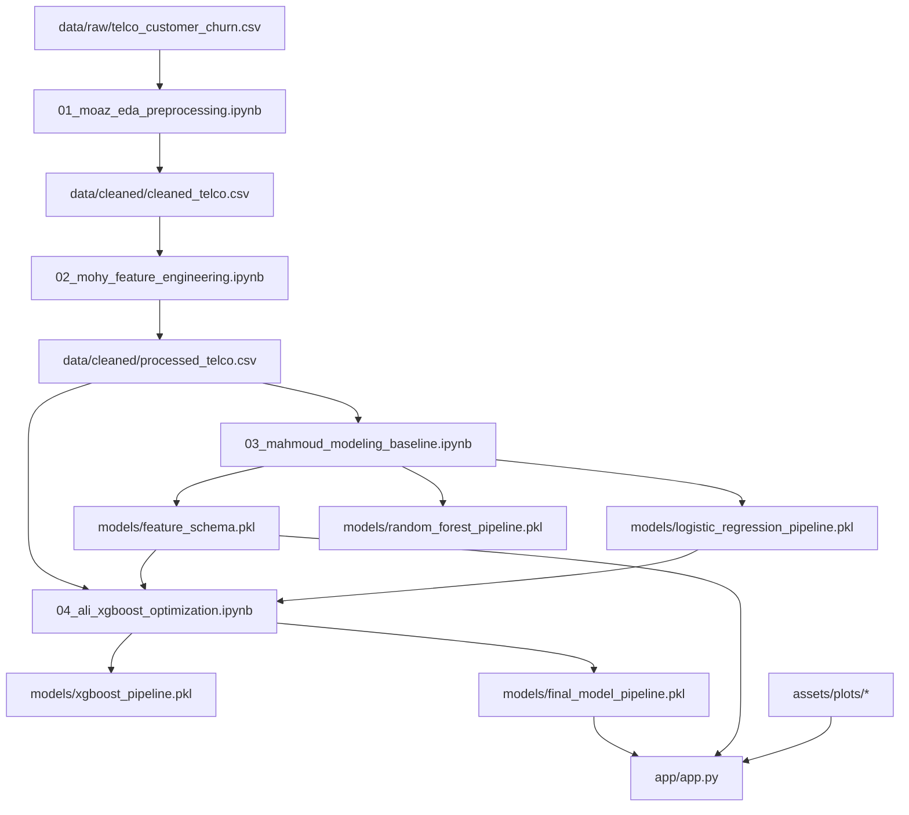
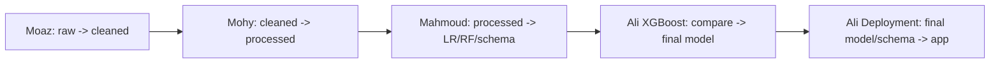
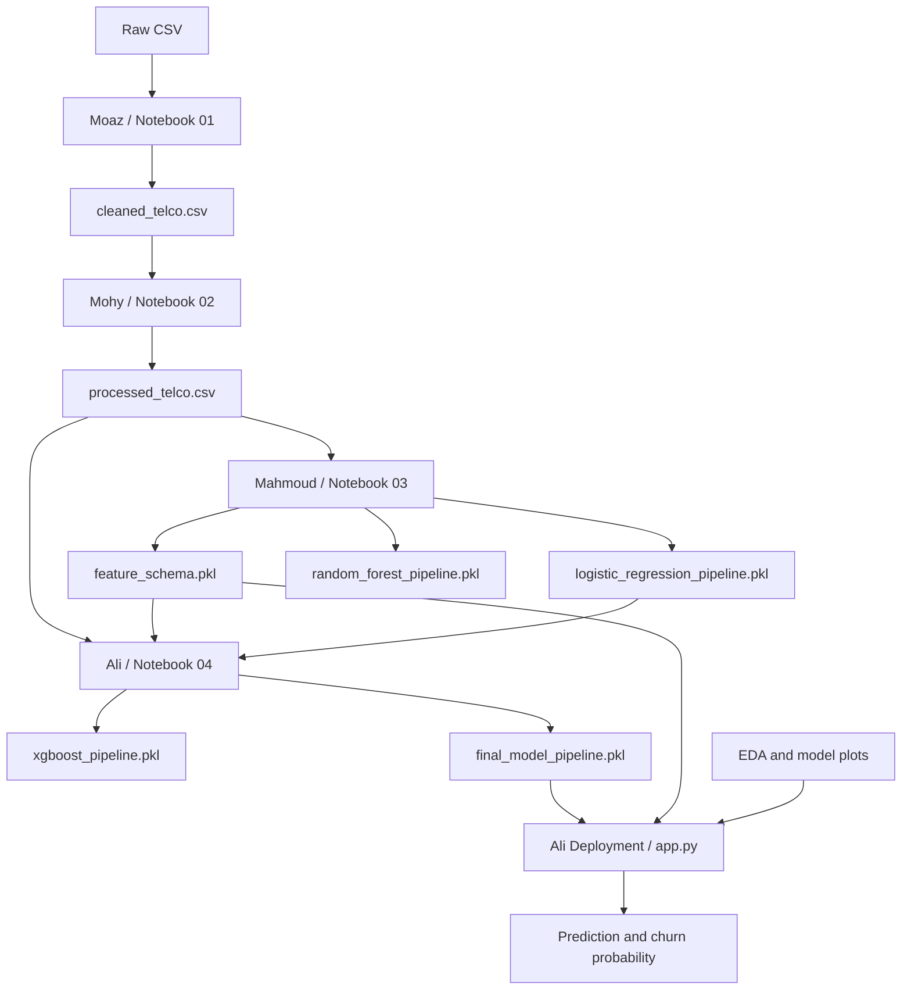

# Project Complete Handbook


Generated from repository evidence in `GITHUB_VERSION/` on 2026-06-19T20:49:23.


This handbook uses source code, notebooks, datasets, model artifacts, reports, and deployment files as evidence. Where the repository does not prove a claim, the handbook says so explicitly.


# 1. Project Story


## Why The Project Exists

This repository exists to solve a practical customer-retention problem: identify customers who are likely to churn before they leave. The source dataset is the IBM Telco Customer Churn dataset stored at `data/raw/telco_customer_churn.csv`. Repository evidence shows 7,043 customers in the raw data and 1,869 churned customers. That gives the project a concrete business imbalance: most customers do not churn, but the churn minority is large enough to justify targeted intervention.

The project is not just a modeling notebook. It is a complete local machine-learning workflow: raw data ingestion, EDA, preprocessing, feature engineering, statistical analysis, baseline modeling, XGBoost comparison, final model selection, saved model artifacts, and a Streamlit application for interactive prediction.

## Business Problem

Customer acquisition is expensive. When a telecom customer leaves, the company loses future revenue and may need to spend more to replace that customer. A churn predictor gives the retention team a way to prioritize outreach. The project optimizes for Recall because the cost of missing a true churner is treated as more important than the cost of sending a retention offer to a customer who would have stayed.

## Project Objectives

- Build a reproducible data pipeline from raw Telco data to a clean modeling dataset.
- Remove leakage fields such as `Churn Score`, `Churn Value`, `Churn Reason`, and `CLTV`.
- Engineer interpretable features that represent customer maturity, service stickiness, spend intensity, and contract commitment.
- Train and compare Logistic Regression, Random Forest, and XGBoost.
- Select a champion model using recall-first criteria.
- Deploy the champion through a local Streamlit app that uses frozen artifacts and a strict schema.

## Success Criteria

The repository evidence defines success as a working Streamlit app backed by `models/final_model_pipeline.pkl` and `models/feature_schema.pkl`, with a final Logistic Regression holdout Recall of 0.5722, F1 of 0.6054, ROC-AUC of 0.8483, Precision of 0.6426, and Accuracy of 0.8020.

## What Cannot Be Verified From The Repository

The repository does not include live business costs, offer-acceptance rates, production monitoring data, or post-deployment churn outcomes. Therefore, exact ROI is not verifiable from repository evidence. The correct evidence-based answer is: the model can prioritize retention outreach, but financial impact requires business assumptions outside this repository.


# 2. Complete Project Architecture


## Repository Structure

| Folder/File Group | File Count | Total Bytes |
| --- | --- | --- |
| .gitignore | 1 | 149 |
| DEPLOYMENT_GUIDE.md | 1 | 1473 |
| GITHUB_CONTENT_REPORT.md | 1 | 1635 |
| LICENSE | 1 | 1067 |
| MODEL_CARD.md | 1 | 2025 |
| README.md | 1 | 5567 |
| RUN_PROJECT_GUIDE.md | 1 | 5228 |
| app | 2 | 17142 |
| assets | 15 | 1094035 |
| data | 10 | 3144085 |
| docs | 4 | 7286 |
| models | 5 | 12229307 |
| notebooks | 4 | 801160 |
| reports | 2 | 8905 |
| requirements.txt | 1 | 326 |
| ملفات شرح المشروع | 2 | 212727 |

## Folder Purposes

- `app/`: Streamlit deployment application. The runtime entry point is `app/app.py`.
- `assets/plots/`: Generated images from EDA, feature engineering, and modeling.
- `data/raw/`: Original Telco CSV input.
- `data/cleaned/`: Cleaned and processed datasets used by notebooks and models.
- `data/summaries/`: CSV summaries generated during EDA and feature engineering.
- `models/`: Serialized sklearn/XGBoost pipelines and the frozen feature schema.
- `notebooks/`: Four sequential project notebooks from preprocessing through final selection.
- `reports/`: Model-comparison reports.
- `docs/`: Architecture, limitations, executive summary, and release notes.

## Dependency Graph



## Execution Flow

1. Execute notebook 01 to clean raw data and create EDA outputs.
2. Execute notebook 02 to create engineered features and the encoded processed dataset.
3. Execute notebook 03 to split data, train baselines, export baseline model artifacts, and freeze the schema.
4. Execute notebook 04 to compare XGBoost with Logistic Regression and export the final champion model.
5. Run `python -m streamlit run app/app.py` to serve inference.

## Runtime Flow

At runtime, `app/app.py` resolves `PROJECT_ROOT = Path(__file__).parent.parent`, loads `models/final_model_pipeline.pkl`, loads `models/feature_schema.pkl`, validates the pipeline contract, maps UI fields into a numeric record, reconstructs engineered features, reorders to the schema, and calls `predict` plus `predict_proba`.


# 3. Dataset Master Guide


## data/raw/telco_customer_churn.csv

Shape: `7043` rows x `33` columns.

Missing values with non-zero counts: `{'Churn Reason': 5174}`.

Target distribution: `{'No': 5174, 'Yes': 1869}`.

| Column | Dtype | Business / Technical Meaning |
| --- | --- | --- |
| CustomerID | object | Unique customer identifier; useful for record tracking but not a predictive modeling feature. |
| Count | int64 | Dataset row count helper; not useful as a customer-level predictor. |
| Country | object | Geographic field; removed in cleaned data because it is constant or not central to the modeling schema. |
| State | object | Geographic field; removed in cleaned data. |
| City | object | Geographic field; removed to avoid high-cardinality location noise in the final schema. |
| Zip Code | int64 | Location identifier; removed before modeling. |
| Lat Long | object | Combined coordinates; removed before modeling. |
| Latitude | float64 | Coordinate field; removed before modeling. |
| Longitude | float64 | Coordinate field; removed before modeling. |
| Gender | object | Demographic feature encoded as Female=0, Male=1 in processed data and app. |
| Senior Citizen | object | Demographic yes/no indicator encoded to 0/1. |
| Partner | object | Household relationship indicator encoded to 0/1. |
| Dependents | object | Household dependency indicator; strong protective coefficient in final Logistic Regression. |
| Tenure Months | int64 | Customer relationship length; final coefficient is negative, aligning with lower churn among longer-tenure customers. |
| Phone Service | object | Whether customer has phone service; encoded 0/1. |
| Multiple Lines | object | Whether customer has multiple phone lines; app maps Yes to 1 and other values to 0. |
| Internet Service | object | Source categorical service type; transformed into Fiber optic and No dummy columns. |
| Online Security | object | Internet add-on encoded 0/1; contributes to service stickiness. |
| Online Backup | object | Internet add-on encoded 0/1; used in Has_Online_Services. |
| Device Protection | object | Internet add-on encoded 0/1. |
| Tech Support | object | Internet add-on encoded 0/1; final coefficient is negative/protective. |
| Streaming TV | object | Internet add-on encoded 0/1. |
| Streaming Movies | object | Internet add-on encoded 0/1. |
| Contract | object | Ordinal contract feature: Month-to-month=0, One year=1, Two year=2; final coefficient is negative/protective. |
| Paperless Billing | object | Billing preference encoded 0/1; positive coefficient suggests higher churn association. |
| Payment Method | object | Source categorical payment method; one-hot encoded in processed data. |
| Monthly Charges | float64 | Current monthly bill amount; correlated with Avg_Monthly_Spend. |
| Total Charges | object | Accumulated charges; 11 missing values remain and are handled by model imputer. |
| Churn Label | object | Target variable. Raw values are Yes/No; cleaned and processed values are 1/0. |
| Churn Value | int64 | Leakage/target-like field removed before modeling. |
| Churn Score | int64 | Leakage field removed before modeling. |
| CLTV | int64 | Future/business outcome field removed before modeling. |
| Churn Reason | object | Post-churn explanation field removed before modeling. |


## data/cleaned/cleaned_telco.csv

Shape: `7043` rows x `20` columns.

Missing values with non-zero counts: `{'Total Charges': 11}`.

Target distribution: `{0: 5174, 1: 1869}`.

| Column | Dtype | Business / Technical Meaning |
| --- | --- | --- |
| Gender | object | Demographic feature encoded as Female=0, Male=1 in processed data and app. |
| Senior Citizen | object | Demographic yes/no indicator encoded to 0/1. |
| Partner | object | Household relationship indicator encoded to 0/1. |
| Dependents | object | Household dependency indicator; strong protective coefficient in final Logistic Regression. |
| Tenure Months | int64 | Customer relationship length; final coefficient is negative, aligning with lower churn among longer-tenure customers. |
| Phone Service | object | Whether customer has phone service; encoded 0/1. |
| Multiple Lines | object | Whether customer has multiple phone lines; app maps Yes to 1 and other values to 0. |
| Internet Service | object | Source categorical service type; transformed into Fiber optic and No dummy columns. |
| Online Security | object | Internet add-on encoded 0/1; contributes to service stickiness. |
| Online Backup | object | Internet add-on encoded 0/1; used in Has_Online_Services. |
| Device Protection | object | Internet add-on encoded 0/1. |
| Tech Support | object | Internet add-on encoded 0/1; final coefficient is negative/protective. |
| Streaming TV | object | Internet add-on encoded 0/1. |
| Streaming Movies | object | Internet add-on encoded 0/1. |
| Contract | object | Ordinal contract feature: Month-to-month=0, One year=1, Two year=2; final coefficient is negative/protective. |
| Paperless Billing | object | Billing preference encoded 0/1; positive coefficient suggests higher churn association. |
| Payment Method | object | Source categorical payment method; one-hot encoded in processed data. |
| Monthly Charges | float64 | Current monthly bill amount; correlated with Avg_Monthly_Spend. |
| Total Charges | float64 | Accumulated charges; 11 missing values remain and are handled by model imputer. |
| Churn Label | int64 | Target variable. Raw values are Yes/No; cleaned and processed values are 1/0. |


## data/cleaned/processed_telco.csv

Shape: `7043` rows x `28` columns.

Missing values with non-zero counts: `{'Total Charges': 11}`.

Target distribution: `{0: 5174, 1: 1869}`.

| Column | Dtype | Business / Technical Meaning |
| --- | --- | --- |
| Gender | int64 | Demographic feature encoded as Female=0, Male=1 in processed data and app. |
| Senior Citizen | int64 | Demographic yes/no indicator encoded to 0/1. |
| Partner | int64 | Household relationship indicator encoded to 0/1. |
| Dependents | int64 | Household dependency indicator; strong protective coefficient in final Logistic Regression. |
| Tenure Months | int64 | Customer relationship length; final coefficient is negative, aligning with lower churn among longer-tenure customers. |
| Phone Service | int64 | Whether customer has phone service; encoded 0/1. |
| Multiple Lines | int64 | Whether customer has multiple phone lines; app maps Yes to 1 and other values to 0. |
| Online Security | int64 | Internet add-on encoded 0/1; contributes to service stickiness. |
| Online Backup | int64 | Internet add-on encoded 0/1; used in Has_Online_Services. |
| Device Protection | int64 | Internet add-on encoded 0/1. |
| Tech Support | int64 | Internet add-on encoded 0/1; final coefficient is negative/protective. |
| Streaming TV | int64 | Internet add-on encoded 0/1. |
| Streaming Movies | int64 | Internet add-on encoded 0/1. |
| Contract | int64 | Ordinal contract feature: Month-to-month=0, One year=1, Two year=2; final coefficient is negative/protective. |
| Paperless Billing | int64 | Billing preference encoded 0/1; positive coefficient suggests higher churn association. |
| Monthly Charges | float64 | Current monthly bill amount; correlated with Avg_Monthly_Spend. |
| Total Charges | float64 | Accumulated charges; 11 missing values remain and are handled by model imputer. |
| Tenure_Group | int64 | Engineered tenure lifecycle bucket. |
| Num_Add_On_Services | int64 | Engineered count of active internet add-ons. |
| Has_Online_Services | int64 | Engineered flag for security or backup service. |
| Avg_Monthly_Spend | float64 | Engineered spend intensity feature. |
| Is_Long_Term_Contract | int64 | Engineered long-term contract flag. |
| Internet Service_Fiber optic | int64 | Dummy indicator for Fiber optic; final coefficient is positive and large. |
| Internet Service_No | int64 | Dummy indicator for no internet service; final coefficient is negative. |
| Payment Method_Credit card (automatic) | int64 | One-hot payment indicator. |
| Payment Method_Electronic check | int64 | One-hot payment indicator; positive coefficient suggests churn association. |
| Payment Method_Mailed check | int64 | One-hot payment indicator. |
| Churn Label | int64 | Target variable. Raw values are Yes/No; cleaned and processed values are 1/0. |


## Dataset Lineage

The raw dataset has 33 columns. Notebook 01 removes leakage and non-predictive identity/geography fields, converts `Total Charges`, encodes `Churn Label`, and exports a 20-column cleaned dataset. Notebook 02 creates five engineered features and encodes categorical fields into a 28-column processed dataset: 27 numeric features plus `Churn Label`.

## Leakage Fields

The raw data includes `Churn Value`, `Churn Score`, `CLTV`, and `Churn Reason`. These are removed because they either directly encode churn or are post-outcome/future-facing fields. Keeping them would make the model look stronger than it really is and would break the deployment scenario, where those values are not known before churn happens.


# 4. Notebook Master Guide


## 01_moaz_eda_preprocessing.ipynb

Objective: Loads the raw Telco dataset, removes leakage and non-predictive identifiers, performs EDA, converts Total Charges, encodes the target, exports cleaned_telco.csv, and writes EDA plots and summaries.

Total cells: 52. Imports detected: `{'pandas': 1, 'numpy': 1, 'matplotlib': 1, 'seaborn': 1, 'pathlib': 1, 'sys': 1, 'warnings': 1, 'runtime_audit_utils': 1}`.

Reads detected: `['cell 8: read_csv', 'cell 51: read_csv']`.

Writes detected: `['cell 19: to_csv', 'cell 26: savefig', 'cell 28: savefig', 'cell 30: savefig', 'cell 32: savefig', 'cell 34: savefig', 'cell 36: savefig', 'cell 45: to_csv', 'cell 49: to_csv']`.

| Cell | Type | Headings | Explanation / Removal Impact |
| --- | --- | --- | --- |
| 1 | markdown | # Customer Churn — EDA & Preprocessing | Markdown cell that defines narrative structure or analysis context. Headings: ['# Customer Churn — EDA & Preprocessing']. |
| 2 | markdown | ## Inputs & Expected Outputs | Markdown cell that defines narrative structure or analysis context. Headings: ['## Inputs & Expected Outputs']. |
| 3 | markdown | ## 1. Imports | Markdown cell that defines narrative structure or analysis context. Headings: ['## 1. Imports']. |
| 4 | code |  | Code preview: `import pandas as pd import numpy as np import matplotlib.pyplot as plt import seaborn as sns`. Outputs: 1. Artifact/operation markers: no artifact marker. If removed, the notebook would lose this operation, validation gate, visualization, export, or explanatory check depending on cell context. |
| 5 | markdown | ## 2. Configuration | Markdown cell that defines narrative structure or analysis context. Headings: ['## 2. Configuration']. |
| 6 | code | # ── Paths ────────────────────────────────────────────; # ?? Project root discovery ?????????????????????????????; # ── Constants ───────────────────────────────────────── | Code preview: `# ── Paths ──────────────────────────────────────────── # ?? Project root discovery ????????????????????????????? PROJECT_ROOT = Path.cwd() if not (PROJECT_ROOT / "data").exists():`. Outputs: 1. Artifact/operation markers: backup_if_overwriting. If removed, the notebook would lose this operation, validation gate, visualization, export, or explanatory check depending on cell context. |
| 7 | markdown | ## 3. Data Loading | Markdown cell that defines narrative structure or analysis context. Headings: ['## 3. Data Loading']. |
| 8 | code |  | Code preview: `df = pd.read_csv(RAW_DATA_PATH) print(df.shape) display(df.head(3))`. Outputs: 2. Artifact/operation markers: read_csv. If removed, the notebook would lose this operation, validation gate, visualization, export, or explanatory check depending on cell context. |
| 9 | markdown | ### ✅ GATE 1 — Data Loading Validation | Markdown cell that defines narrative structure or analysis context. Headings: ['### ✅ GATE 1 — Data Loading Validation']. |
| 10 | code |  | Code preview: `if df is not None and len(df) > 0: print(f"✅ GATE 1.1 PASS: Dataset loaded. Shape: {df.shape}") else: raise ValueError("❌ GATE 1.1 FAIL: Dataset is empty or did not load.")`. Outputs: 1. Artifact/operation markers: no artifact marker. If removed, the notebook would lose this operation, validation gate, visualization, export, or explanatory check depending on cell context. |
| 11 | markdown | ## 4. Leakage Column Removal | Markdown cell that defines narrative structure or analysis context. Headings: ['## 4. Leakage Column Removal']. |
| 12 | code |  | Code preview: `cols_before = list(df.columns) df = df.drop(columns=LEAKAGE_COLUMNS, errors='ignore') cols_after = list(df.columns) removed = [c for c in cols_before if c not in cols_after]`. Outputs: 1. Artifact/operation markers: no artifact marker. If removed, the notebook would lose this operation, validation gate, visualization, export, or explanatory check depending on cell context. |
| 13 | markdown | ### ✅ GATE 2 — Leakage Validation | Markdown cell that defines narrative structure or analysis context. Headings: ['### ✅ GATE 2 — Leakage Validation']. |
| 14 | code |  | Code preview: `all_clear = True for col in LEAKAGE_COLUMNS: if col in df.columns: print(f"❌ GATE 2 FAIL: '{col}' still in dataframe!")`. Outputs: 1. Artifact/operation markers: no artifact marker. If removed, the notebook would lose this operation, validation gate, visualization, export, or explanatory check depending on cell context. |
| 15 | markdown | ## 5. Exploratory Data Analysis (EDA) | Markdown cell that defines narrative structure or analysis context. Headings: ['## 5. Exploratory Data Analysis (EDA)']. |
| 16 | markdown | ### 5.1 Dataset Overview | Markdown cell that defines narrative structure or analysis context. Headings: ['### 5.1 Dataset Overview']. |
| 17 | code |  | Code preview: `print("--- Shape ---") print(df.shape) print("\n--- Dtypes ---") print(df.dtypes.value_counts())`. Outputs: 2. Artifact/operation markers: no artifact marker. If removed, the notebook would lose this operation, validation gate, visualization, export, or explanatory check depending on cell context. |
| 18 | markdown | ### 5.2 Missing Values | Markdown cell that defines narrative structure or analysis context. Headings: ['### 5.2 Missing Values']. |
| 19 | code |  | Code preview: `missing = df.isnull().sum() missing_pct = (missing / len(df) * 100).round(2) missing_df = pd.DataFrame({ 'Missing Count': missing,`. Outputs: 1. Artifact/operation markers: to_csv. If removed, the notebook would lose this operation, validation gate, visualization, export, or explanatory check depending on cell context. |
| 20 | markdown | ### ✅ GATE 3 — Missing Value Validation | Markdown cell that defines narrative structure or analysis context. Headings: ['### ✅ GATE 3 — Missing Value Validation']. |
| 21 | code |  | Code preview: `unexpected_nulls = { col: df[col].isnull().sum() for col in df.columns if col != "Churn Reason" and df[col].isnull().sum() > 0`. Outputs: 2. Artifact/operation markers: no artifact marker. If removed, the notebook would lose this operation, validation gate, visualization, export, or explanatory check depending on cell context. |
| 22 | markdown | ### 5.3 Duplicate Rows | Markdown cell that defines narrative structure or analysis context. Headings: ['### 5.3 Duplicate Rows']. |
| 23 | code |  | Code preview: `n_dupes = df.duplicated().sum() if n_dupes > 0: print(f"⚠️ Found {n_dupes} duplicate rows. Removing...") df = df.drop_duplicates()`. Outputs: 2. Artifact/operation markers: no artifact marker. If removed, the notebook would lose this operation, validation gate, visualization, export, or explanatory check depending on cell context. |
| 24 | markdown | ## 6. Visualizations | Markdown cell that defines narrative structure or analysis context. Headings: ['## 6. Visualizations']. |
| 25 | markdown | ### 6.1 Churn Distribution | Markdown cell that defines narrative structure or analysis context. Headings: ['### 6.1 Churn Distribution']. |
| 26 | code |  | Code preview: `plt.figure(figsize=(10,6)) ax = sns.countplot(x="Churn Label", data=df, palette=["#e74c3c", "#2ecc71"], order=["Yes", "No"]) plt.title("Churn Distribution") plt.xlabel("Churn Label")`. Outputs: 2. Artifact/operation markers: savefig. If removed, the notebook would lose this operation, validation gate, visualization, export, or explanatory check depending on cell context. |
| 27 | markdown | ### 6.2 Tenure Distribution by Churn Status | Markdown cell that defines narrative structure or analysis context. Headings: ['### 6.2 Tenure Distribution by Churn Status']. |
| 28 | code |  | Code preview: `plt.figure(figsize=(10,6)) plt.hist(df[df["Churn Label"] == "No"]["Tenure Months"], bins=30, alpha=0.6, label="Not Churned") plt.hist(df[df["Churn Label"] == "Yes"]["Tenure Months"], bins=30, alpha=0.6, label="Churned") plt.title("Tenure Months Distribution by`. Outputs: 2. Artifact/operation markers: savefig. If removed, the notebook would lose this operation, validation gate, visualization, export, or explanatory check depending on cell context. |
| 29 | markdown | ### 6.3 Monthly Charges by Churn Status | Markdown cell that defines narrative structure or analysis context. Headings: ['### 6.3 Monthly Charges by Churn Status']. |
| 30 | code |  | Code preview: `plt.figure(figsize=(10,6)) sns.boxplot(x="Churn Label", y="Monthly Charges", data=df) plt.title("Monthly Charges by Churn Status") plt.xlabel("Churn Label")`. Outputs: 2. Artifact/operation markers: savefig. If removed, the notebook would lose this operation, validation gate, visualization, export, or explanatory check depending on cell context. |
| 31 | markdown | ### 6.4 Contract Type vs Churn Rate | Markdown cell that defines narrative structure or analysis context. Headings: ['### 6.4 Contract Type vs Churn Rate']. |
| 32 | code |  | Code preview: `plt.figure(figsize=(10,6)) sns.countplot(x="Contract", hue="Churn Label", data=df) plt.title("Contract Type vs Churn") plt.xlabel("Contract")`. Outputs: 2. Artifact/operation markers: savefig. If removed, the notebook would lose this operation, validation gate, visualization, export, or explanatory check depending on cell context. |
| 33 | markdown | ### 6.5 Internet Service vs Churn Rate | Markdown cell that defines narrative structure or analysis context. Headings: ['### 6.5 Internet Service vs Churn Rate']. |
| 34 | code |  | Code preview: `plt.figure(figsize=(10,6)) sns.countplot(x="Internet Service", hue="Churn Label", data=df) plt.title("Internet Service Type vs Churn") plt.xlabel("Internet Service")`. Outputs: 1. Artifact/operation markers: savefig. If removed, the notebook would lose this operation, validation gate, visualization, export, or explanatory check depending on cell context. |
| 35 | markdown | ### 6.6 Numeric Feature Correlation Heatmap | Markdown cell that defines narrative structure or analysis context. Headings: ['### 6.6 Numeric Feature Correlation Heatmap']. |
| 36 | code |  | Code preview: `df_num = df.select_dtypes(include='number').copy() df_num["Churn Binary"] = (df["Churn Label"] == "Yes").astype(int) plt.figure(figsize=(10, 8)) sns.heatmap(df_num.corr(), annot=True, fmt=".2f", cmap="coolwarm", linewidths=0.5)`. Outputs: 2. Artifact/operation markers: savefig. If removed, the notebook would lose this operation, validation gate, visualization, export, or explanatory check depending on cell context. |
| 37 | markdown | ## 7. Preprocessing | Markdown cell that defines narrative structure or analysis context. Headings: ['## 7. Preprocessing']. |
| 38 | markdown | ### 7.1 Fix 'Total Charges' Data Type | Markdown cell that defines narrative structure or analysis context. Headings: ["### 7.1 Fix 'Total Charges' Data Type"]. |
| 39 | code |  | Code preview: `print(f"'Total Charges' dtype before: {df['Total Charges'].dtype}") df['Total Charges'] = pd.to_numeric(df['Total Charges'], errors='coerce') n_new_nulls = df['Total Charges'].isnull().sum() print(f"New nulls created during conversion: {n_new_nulls}")`. Outputs: 0. Artifact/operation markers: no artifact marker. If removed, the notebook would lose this operation, validation gate, visualization, export, or explanatory check depending on cell context. |
| 40 | markdown | ### 7.2 Encode Target Column | Markdown cell that defines narrative structure or analysis context. Headings: ['### 7.2 Encode Target Column']. |
| 41 | code |  | Code preview: `df['Churn Label'] = df['Churn Label'].map({'Yes': 1, 'No': 0}) print("Target encoding complete:") print(df['Churn Label'].value_counts()) print(f"\nChurn Rate: {df['Churn Label'].mean()*100:.1f}%")`. Outputs: 1. Artifact/operation markers: no artifact marker. If removed, the notebook would lose this operation, validation gate, visualization, export, or explanatory check depending on cell context. |
| 42 | markdown | ### 7.3 Drop Non-Predictive Columns | Markdown cell that defines narrative structure or analysis context. Headings: ['### 7.3 Drop Non-Predictive Columns']. |
| 43 | code |  | Code preview: `existing_drop = [c for c in DROP_COLUMNS if c in df.columns] df = df.drop(columns=existing_drop) print(f"Dropped {len(existing_drop)} columns: {existing_drop}") print(f"Final shape: {df.shape}")`. Outputs: 1. Artifact/operation markers: no artifact marker. If removed, the notebook would lose this operation, validation gate, visualization, export, or explanatory check depending on cell context. |
| 44 | markdown | ### 7.4 Export Data Summary | Markdown cell that defines narrative structure or analysis context. Headings: ['### 7.4 Export Data Summary']. |
| 45 | code |  | Code preview: `data_summary = pd.DataFrame({ 'Column': df.columns, 'Dtype': [str(df[c].dtype) for c in df.columns], 'Non_Null_Count': [df[c].notna().sum() for c in df.columns],`. Outputs: 2. Artifact/operation markers: to_csv. If removed, the notebook would lose this operation, validation gate, visualization, export, or explanatory check depending on cell context. |
| 46 | markdown | ### ✅ GATE 5 — Pre-Export Validation | Markdown cell that defines narrative structure or analysis context. Headings: ['### ✅ GATE 5 — Pre-Export Validation']. |
| 47 | code | # CHECK 1; # CHECK 2; # CHECK 3 | Code preview: `# CHECK 1 for col in LEAKAGE_COLUMNS: assert col not in df.columns, f"❌ LEAKAGE FOUND: {col}" print("✅ GATE 5.1 PASS: No leakage columns.")`. Outputs: 0. Artifact/operation markers: no artifact marker. If removed, the notebook would lose this operation, validation gate, visualization, export, or explanatory check depending on cell context. |
| 48 | markdown | ## 8. Export Cleaned Dataset | Markdown cell that defines narrative structure or analysis context. Headings: ['## 8. Export Cleaned Dataset']. |
| 49 | code |  | Code preview: `backup_if_overwriting(CLEANED_DATA_PATH, PROJECT_ROOT, "cleaned dataset") df.to_csv(CLEANED_DATA_PATH, index=False, encoding='utf-8') print(f"📁 Exported: {CLEANED_DATA_PATH}") print(f"   Rows: {len(df)}")`. Outputs: 1. Artifact/operation markers: to_csv, backup_if_overwriting. If removed, the notebook would lose this operation, validation gate, visualization, export, or explanatory check depending on cell context. |
| 50 | markdown | ### ✅ GATE 6 — Export Validation | Markdown cell that defines narrative structure or analysis context. Headings: ['### ✅ GATE 6 — Export Validation']. |
| 51 | code |  | Code preview: `df_check = pd.read_csv(CLEANED_DATA_PATH) errors = [] if len(df_check) == 0: errors.append("❌ GATE 6.1 FAIL: Exported file is empty.")`. Outputs: 0. Artifact/operation markers: read_csv. If removed, the notebook would lose this operation, validation gate, visualization, export, or explanatory check depending on cell context. |
| 52 | markdown | ## 9. Summary & Handoff; ### What was accomplished in this notebook:; ### Key EDA Findings: | Markdown cell that defines narrative structure or analysis context. Headings: ['## 9. Summary & Handoff', '### What was accomplished in this notebook:', '### Key EDA Findings:']. |


## 02_mohy_feature_engineering.ipynb

Objective: Consumes cleaned_telco.csv, performs statistical tests, creates five engineered features, encodes categorical variables, exports processed_telco.csv, and writes feature-analysis plots and summary CSVs.

Total cells: 51. Imports detected: `{'pandas': 1, 'numpy': 1, 'matplotlib': 1, 'seaborn': 1, 'pathlib': 1, 'sys': 1, 'scipy': 1, 'sklearn': 1, 'warnings': 1, 'runtime_audit_utils': 1}`.

Reads detected: `['cell 8: read_csv', 'cell 50: read_csv']`.

Writes detected: `['cell 17: to_csv', 'cell 28: to_csv', 'cell 40: savefig', 'cell 42: savefig', 'cell 44: to_csv', 'cell 48: to_csv']`.

| Cell | Type | Headings | Explanation / Removal Impact |
| --- | --- | --- | --- |
| 1 | markdown | # Customer Churn — Feature Engineering & Statistical Analysis | Markdown cell that defines narrative structure or analysis context. Headings: ['# Customer Churn — Feature Engineering & Statistical Analysis']. |
| 2 | markdown | ## Inputs & Expected Outputs | Markdown cell that defines narrative structure or analysis context. Headings: ['## Inputs & Expected Outputs']. |
| 3 | markdown | ## 1. Imports | Markdown cell that defines narrative structure or analysis context. Headings: ['## 1. Imports']. |
| 4 | code |  | Code preview: `import pandas as pd import numpy as np import matplotlib.pyplot as plt import seaborn as sns`. Outputs: 1. Artifact/operation markers: no artifact marker. If removed, the notebook would lose this operation, validation gate, visualization, export, or explanatory check depending on cell context. |
| 5 | markdown | ## 2. Configuration | Markdown cell that defines narrative structure or analysis context. Headings: ['## 2. Configuration']. |
| 6 | code | # ── Paths ────────────────────────────────────────────; # ?? Project root discovery ?????????????????????????????; # ── Constants ───────────────────────────────────────── | Code preview: `# ── Paths ──────────────────────────────────────────── # ?? Project root discovery ????????????????????????????? PROJECT_ROOT = Path.cwd() if not (PROJECT_ROOT / "data").exists():`. Outputs: 1. Artifact/operation markers: backup_if_overwriting. If removed, the notebook would lose this operation, validation gate, visualization, export, or explanatory check depending on cell context. |
| 7 | markdown | ## 3. Data Loading | Markdown cell that defines narrative structure or analysis context. Headings: ['## 3. Data Loading']. |
| 8 | code |  | Code preview: `df = pd.read_csv(CLEANED_DATA_PATH) print(f"Shape: {df.shape}") print(f"\nDtype summary:\n{df.dtypes.value_counts()}") display(df.head(3))`. Outputs: 2. Artifact/operation markers: read_csv. If removed, the notebook would lose this operation, validation gate, visualization, export, or explanatory check depending on cell context. |
| 9 | markdown | ### ✅ GATE 1 — Input Schema Validation | Markdown cell that defines narrative structure or analysis context. Headings: ['### ✅ GATE 1 — Input Schema Validation']. |
| 10 | code |  | Code preview: `if len(df) == EXPECTED_INPUT_ROWS: print(f"✅ GATE 1.1 PASS: {len(df)} rows loaded.") else: raise ValueError(f"❌ GATE 1.1 FAIL: Expected {EXPECTED_INPUT_ROWS}, got {len(df)}.")`. Outputs: 0. Artifact/operation markers: no artifact marker. If removed, the notebook would lose this operation, validation gate, visualization, export, or explanatory check depending on cell context. |
| 11 | markdown | ## 4. Statistical Analysis | Markdown cell that defines narrative structure or analysis context. Headings: ['## 4. Statistical Analysis']. |
| 12 | markdown | ### 4.1 Chi-Square Tests — Categorical Features | Markdown cell that defines narrative structure or analysis context. Headings: ['### 4.1 Chi-Square Tests — Categorical Features']. |
| 13 | code |  | Code preview: `cat_cols = df.select_dtypes(include=['object']).columns.tolist() chi_results = [] for col in cat_cols: ct = pd.crosstab(df[col], df[TARGET_COLUMN])`. Outputs: 3. Artifact/operation markers: no artifact marker. If removed, the notebook would lose this operation, validation gate, visualization, export, or explanatory check depending on cell context. |
| 14 | markdown | ### 4.2 Mann-Whitney U Tests — Numeric Features | Markdown cell that defines narrative structure or analysis context. Headings: ['### 4.2 Mann-Whitney U Tests — Numeric Features']. |
| 15 | code |  | Code preview: `num_cols = ['Tenure Months', 'Monthly Charges', 'Total Charges'] mwu_results = [] for col in num_cols: group0 = df[df[TARGET_COLUMN] == 0][col]`. Outputs: 3. Artifact/operation markers: no artifact marker. If removed, the notebook would lose this operation, validation gate, visualization, export, or explanatory check depending on cell context. |
| 16 | markdown | ### 4.3 Statistical Summary & Export | Markdown cell that defines narrative structure or analysis context. Headings: ['### 4.3 Statistical Summary & Export']. |
| 17 | code |  | Code preview: `combined = pd.concat([ chi_df.assign(Test_Type='Chi-Square')[ ['Feature', 'Test_Type', 'p_value', 'Significant'] ],`. Outputs: 4. Artifact/operation markers: to_csv. If removed, the notebook would lose this operation, validation gate, visualization, export, or explanatory check depending on cell context. |
| 18 | markdown | ## 5. Feature Engineering | Markdown cell that defines narrative structure or analysis context. Headings: ['## 5. Feature Engineering']. |
| 19 | markdown | ### 5.1 Feature: Tenure_Group | Markdown cell that defines narrative structure or analysis context. Headings: ['### 5.1 Feature: Tenure_Group']. |
| 20 | code |  | Code preview: `df['Tenure_Group'] = pd.cut( df['Tenure Months'], bins=TENURE_BINS, labels=TENURE_LABELS,`. Outputs: 1. Artifact/operation markers: no artifact marker. If removed, the notebook would lose this operation, validation gate, visualization, export, or explanatory check depending on cell context. |
| 21 | markdown | ### 5.2 Features: Num_Add_On_Services & Has_Online_Services | Markdown cell that defines narrative structure or analysis context. Headings: ['### 5.2 Features: Num_Add_On_Services & Has_Online_Services']. |
| 22 | code | # Num_Add_On_Services: count of add-on services actively subscribed; # Has_Online_Services: 1 if customer has Online Security OR Online Backup | Code preview: `# Num_Add_On_Services: count of add-on services actively subscribed service_cols = [ 'Online Security', 'Online Backup', 'Device Protection', 'Tech Support', 'Streaming TV', 'Streaming Movies'`. Outputs: 1. Artifact/operation markers: no artifact marker. If removed, the notebook would lose this operation, validation gate, visualization, export, or explanatory check depending on cell context. |
| 23 | markdown | ### 5.3 Feature: Avg_Monthly_Spend | Markdown cell that defines narrative structure or analysis context. Headings: ['### 5.3 Feature: Avg_Monthly_Spend']. |
| 24 | code |  | Code preview: `df['Avg_Monthly_Spend'] = np.where( df['Tenure Months'] > 0, np.round(df['Total Charges'] / df['Tenure Months'], 2), df['Monthly Charges']`. Outputs: 1. Artifact/operation markers: no artifact marker. If removed, the notebook would lose this operation, validation gate, visualization, export, or explanatory check depending on cell context. |
| 25 | markdown | ### 5.4 Feature: Is_Long_Term_Contract | Markdown cell that defines narrative structure or analysis context. Headings: ['### 5.4 Feature: Is_Long_Term_Contract']. |
| 26 | code |  | Code preview: `df['Is_Long_Term_Contract'] = df['Contract'].isin( ['One year', 'Two year'] ).astype(int) print("Is_Long_Term_Contract distribution:")`. Outputs: 1. Artifact/operation markers: no artifact marker. If removed, the notebook would lose this operation, validation gate, visualization, export, or explanatory check depending on cell context. |
| 27 | markdown | ### ✅ GATE 2 — Feature Engineering Validation | Markdown cell that defines narrative structure or analysis context. Headings: ['### ✅ GATE 2 — Feature Engineering Validation']. |
| 28 | code | # Export feature engineering log | Code preview: `all_pass = True new_features = [ 'Tenure_Group', 'Num_Add_On_Services', 'Has_Online_Services', 'Avg_Monthly_Spend', 'Is_Long_Term_Contract'`. Outputs: 1. Artifact/operation markers: to_csv. If removed, the notebook would lose this operation, validation gate, visualization, export, or explanatory check depending on cell context. |
| 29 | markdown | ## 6. Encoding | Markdown cell that defines narrative structure or analysis context. Headings: ['## 6. Encoding']. |
| 30 | markdown | ### 6.1 Binary Encoding | Markdown cell that defines narrative structure or analysis context. Headings: ['### 6.1 Binary Encoding']. |
| 31 | code | # Standard Yes/No binary columns; # Need to handle Yes/No string -> 1/0 mapping. If it's already numeric, skip.; # Gender | Code preview: `# Standard Yes/No binary columns for col in BINARY_YES_NO_COLS: if df[col].dtype == 'object': # Need to handle Yes/No string -> 1/0 mapping. If it's already numeric, skip.`. Outputs: 1. Artifact/operation markers: no artifact marker. If removed, the notebook would lose this operation, validation gate, visualization, export, or explanatory check depending on cell context. |
| 32 | markdown | ### 6.2 Ordinal Encoding | Markdown cell that defines narrative structure or analysis context. Headings: ['### 6.2 Ordinal Encoding']. |
| 33 | code | # Contract: ordinal — Month-to-month < One year < Two year; # Tenure_Group: ordinal — New < Early < Mid < Long; # Cast from category dtype to int64 | Code preview: `# Contract: ordinal — Month-to-month < One year < Two year df['Contract'] = df['Contract'].map({ 'Month-to-month': 0, 'One year':        1,`. Outputs: 1. Artifact/operation markers: no artifact marker. If removed, the notebook would lose this operation, validation gate, visualization, export, or explanatory check depending on cell context. |
| 34 | markdown | ### 6.3 One-Hot Encoding | Markdown cell that defines narrative structure or analysis context. Headings: ['### 6.3 One-Hot Encoding']. |
| 35 | code |  | Code preview: `print("Before OHE shape:", df.shape) print("Internet Service unique values:", df['Internet Service'].unique().tolist()) print("Payment Method unique values:", df['Payment Method'].unique().tolist()) df = pd.get_dummies(`. Outputs: 1. Artifact/operation markers: no artifact marker. If removed, the notebook would lose this operation, validation gate, visualization, export, or explanatory check depending on cell context. |
| 36 | markdown | ### 6.4 Post-Encoding Schema Review | Markdown cell that defines narrative structure or analysis context. Headings: ['### 6.4 Post-Encoding Schema Review']. |
| 37 | code | # Check for any remaining object columns | Code preview: `# Check for any remaining object columns obj_cols = df.select_dtypes(include=['object']).columns.tolist() if obj_cols: print(f"⚠️ Object dtype columns still present: {obj_cols}")`. Outputs: 1. Artifact/operation markers: no artifact marker. If removed, the notebook would lose this operation, validation gate, visualization, export, or explanatory check depending on cell context. |
| 38 | markdown | ## 7. Visualizations & Feature Ranking Guidance | Markdown cell that defines narrative structure or analysis context. Headings: ['## 7. Visualizations & Feature Ranking Guidance']. |
| 39 | markdown | ### 7.1 Correlation Heatmap (Full Encoded Dataset) | Markdown cell that defines narrative structure or analysis context. Headings: ['### 7.1 Correlation Heatmap (Full Encoded Dataset)']. |
| 40 | code | # Print top correlations with target | Code preview: `plt.figure(figsize=(16, 12)) corr_matrix = df.corr() mask = corr_matrix.abs() < 0.1  # hide very weak correlations for clarity sns.heatmap(`. Outputs: 2. Artifact/operation markers: savefig. If removed, the notebook would lose this operation, validation gate, visualization, export, or explanatory check depending on cell context. |
| 41 | markdown | ### 7.2 Feature Importance — Quick Random Forest | Markdown cell that defines narrative structure or analysis context. Headings: ['### 7.2 Feature Importance — Quick Random Forest']. |
| 42 | code | # Plot top 20 | Code preview: `ranking_input = df.dropna(subset=['Total Charges']) X = ranking_input.drop(columns=[TARGET_COLUMN]) y = ranking_input[TARGET_COLUMN] print(f"Feature-ranking EDA uses {len(ranking_input)} complete rows; model pipelines handle preserved nulls after the split.")`. Outputs: 0. Artifact/operation markers: savefig. If removed, the notebook would lose this operation, validation gate, visualization, export, or explanatory check depending on cell context. |
| 43 | markdown | ### 7.3 Feature Recommendations | Markdown cell that defines narrative structure or analysis context. Headings: ['### 7.3 Feature Recommendations']. |
| 44 | code | # Get correlation with target for all features; # Build feature ranking table; # Apply drop decision rules | Code preview: `# Get correlation with target for all features corr_with_target = df.corr()[TARGET_COLUMN].drop(TARGET_COLUMN).abs() # Build feature ranking table ranking_df = pd.DataFrame({`. Outputs: 3. Artifact/operation markers: to_csv. If removed, the notebook would lose this operation, validation gate, visualization, export, or explanatory check depending on cell context. |
| 45 | markdown | ### ✅ GATE 3 — Pre-Export Validation | Markdown cell that defines narrative structure or analysis context. Headings: ['### ✅ GATE 3 — Pre-Export Validation']. |
| 46 | code | # CHECK 3.1 — Zero object dtype columns; # CHECK 3.2 — Target column still intact; # CHECK 3.3 — Only source Total Charges nulls may remain for pipeline imputation | Code preview: `gate3_pass = True # CHECK 3.1 — Zero object dtype columns obj_remaining = df.select_dtypes(include=['object']).columns.tolist() if obj_remaining:`. Outputs: 0. Artifact/operation markers: no artifact marker. If removed, the notebook would lose this operation, validation gate, visualization, export, or explanatory check depending on cell context. |
| 47 | markdown | ## 8. Export Processed Dataset | Markdown cell that defines narrative structure or analysis context. Headings: ['## 8. Export Processed Dataset']. |
| 48 | code | # Ensure Churn Label is the last column | Code preview: `# Ensure Churn Label is the last column cols = [c for c in df.columns if c != TARGET_COLUMN] + [TARGET_COLUMN] df = df[cols] backup_if_overwriting(PROCESSED_DATA_PATH, PROJECT_ROOT, "processed dataset")`. Outputs: 1. Artifact/operation markers: to_csv, backup_if_overwriting. If removed, the notebook would lose this operation, validation gate, visualization, export, or explanatory check depending on cell context. |
| 49 | markdown | ### ✅ GATE 4 — Export Validation | Markdown cell that defines narrative structure or analysis context. Headings: ['### ✅ GATE 4 — Export Validation']. |
| 50 | code |  | Code preview: `df_check = pd.read_csv(PROCESSED_DATA_PATH) errors = [] if len(df_check) != EXPECTED_INPUT_ROWS: errors.append(f"❌ GATE 4.1 FAIL: Row count {len(df_check)} ≠ {EXPECTED_INPUT_ROWS}")`. Outputs: 0. Artifact/operation markers: read_csv. If removed, the notebook would lose this operation, validation gate, visualization, export, or explanatory check depending on cell context. |
| 51 | markdown | ## 9. Summary & Handoff; ### What was accomplished in this notebook:; ### Key Findings: | Markdown cell that defines narrative structure or analysis context. Headings: ['## 9. Summary & Handoff', '### What was accomplished in this notebook:', '### Key Findings:']. |


## 03_mahmoud_modeling_baseline.ipynb

Objective: Consumes processed_telco.csv, creates a frozen 27-feature schema, performs deterministic stratified splits, trains Logistic Regression and Random Forest pipelines, evaluates baselines, and exports model/schema artifacts.

Total cells: 43. Imports detected: `{'pandas': 1, 'numpy': 1, 'matplotlib': 1, 'seaborn': 1, 'pathlib': 1, 'sys': 1, 'joblib': 1, 'warnings': 1, 'sklearn': 8, 'runtime_audit_utils': 1}`.

Reads detected: `['cell 8: read_csv', 'cell 42: joblib.load']`.

Writes detected: `['cell 30: savefig', 'cell 32: savefig', 'cell 36: savefig', 'cell 38: joblib.dump']`.

| Cell | Type | Headings | Explanation / Removal Impact |
| --- | --- | --- | --- |
| 1 | markdown | # Customer Churn — Baseline Modeling | Markdown cell that defines narrative structure or analysis context. Headings: ['# Customer Churn — Baseline Modeling']. |
| 2 | markdown | ## Inputs, Outputs, and Critical Rules | Markdown cell that defines narrative structure or analysis context. Headings: ['## Inputs, Outputs, and Critical Rules']. |
| 3 | markdown | ## 1. Imports | Markdown cell that defines narrative structure or analysis context. Headings: ['## 1. Imports']. |
| 4 | code |  | Code preview: `import pandas as pd import numpy as np import matplotlib.pyplot as plt import seaborn as sns`. Outputs: 0. Artifact/operation markers: no artifact marker. If removed, the notebook would lose this operation, validation gate, visualization, export, or explanatory check depending on cell context. |
| 5 | markdown | ## 2. Configuration | Markdown cell that defines narrative structure or analysis context. Headings: ['## 2. Configuration']. |
| 6 | code | # ── Paths ────────────────────────────────────────────; # ?? Project root discovery ?????????????????????????????; # ── Constants ───────────────────────────────────────── | Code preview: `# ── Paths ──────────────────────────────────────────── # ?? Project root discovery ????????????????????????????? PROJECT_ROOT = Path.cwd() if not (PROJECT_ROOT / "data").exists():`. Outputs: 0. Artifact/operation markers: backup_if_overwriting. If removed, the notebook would lose this operation, validation gate, visualization, export, or explanatory check depending on cell context. |
| 7 | markdown | ## 3. Load Processed Phase 2 Dataset | Markdown cell that defines narrative structure or analysis context. Headings: ['## 3. Load Processed Phase 2 Dataset']. |
| 8 | code |  | Code preview: `df = pd.read_csv(PROCESSED_DATA_PATH) print(f"Shape: {df.shape}") print(f"\nDtype summary:\n{df.dtypes.value_counts()}") print(f"\nTarget distribution:\n{df[TARGET_COLUMN].value_counts().sort_index()}")`. Outputs: 2. Artifact/operation markers: read_csv. If removed, the notebook would lose this operation, validation gate, visualization, export, or explanatory check depending on cell context. |
| 9 | markdown | ### ✅ GATE 1 — Input Validation | Markdown cell that defines narrative structure or analysis context. Headings: ['### ✅ GATE 1 — Input Validation']. |
| 10 | code | # CHECK 1.1 — Correct file path exists; # CHECK 1.2 — Shape; # CHECK 1.3 — Exact column order | Code preview: `gate1_errors = [] # CHECK 1.1 — Correct file path exists if PROCESSED_DATA_PATH.exists(): print(f"✅ GATE 1.1 PASS: Found {PROCESSED_DATA_PATH}")`. Outputs: 0. Artifact/operation markers: no artifact marker. If removed, the notebook would lose this operation, validation gate, visualization, export, or explanatory check depending on cell context. |
| 11 | markdown | ## 4. Create Feature Matrix and Target | Markdown cell that defines narrative structure or analysis context. Headings: ['## 4. Create Feature Matrix and Target']. |
| 12 | code |  | Code preview: `FEATURE_COLUMNS = [c for c in df.columns if c != TARGET_COLUMN] X = df[FEATURE_COLUMNS].copy() y = df[TARGET_COLUMN].copy() BASELINE_FEATURES = list(X.columns)`. Outputs: 1. Artifact/operation markers: no artifact marker. If removed, the notebook would lose this operation, validation gate, visualization, export, or explanatory check depending on cell context. |
| 13 | markdown | ## 5. Stratified Train/Test Split | Markdown cell that defines narrative structure or analysis context. Headings: ['## 5. Stratified Train/Test Split']. |
| 14 | code |  | Code preview: `X_development, X_test, y_development, y_test = train_test_split( X, y, test_size=TEST_SIZE,`. Outputs: 0. Artifact/operation markers: no artifact marker. If removed, the notebook would lose this operation, validation gate, visualization, export, or explanatory check depending on cell context. |
| 15 | markdown | ### ✅ GATE 2 — Split Validation | Markdown cell that defines narrative structure or analysis context. Headings: ['### ✅ GATE 2 — Split Validation']. |
| 16 | code | # CHECK 2.1 — Expected split sizes; # CHECK 2.2 — Feature order preserved; # CHECK 2.3 — Target distribution preserved by stratification | Code preview: `gate2_errors = [] # CHECK 2.1 — Expected split sizes if len(X_train) + len(X_validation) + len(X_test) == EXPECTED_ROWS: print(f"✅ GATE 2.1 PASS: train={len(X_train)}, validation={len(X_validation)}, untouched test={len(X_test)}. Total preserved.")`. Outputs: 0. Artifact/operation markers: no artifact marker. If removed, the notebook would lose this operation, validation gate, visualization, export, or explanatory check depending on cell context. |
| 17 | markdown | ## 6. Post-Split Redundancy and Multicollinearity Review | Markdown cell that defines narrative structure or analysis context. Headings: ['## 6. Post-Split Redundancy and Multicollinearity Review']. |
| 18 | code |  | Code preview: `redundancy_corr = X_train[REDUNDANCY_CONTEXT_FEATURES].corr().round(3) print("Training-only correlation matrix for redundancy context features:") display(redundancy_corr) high_corr_pairs = []`. Outputs: 5. Artifact/operation markers: no artifact marker. If removed, the notebook would lose this operation, validation gate, visualization, export, or explanatory check depending on cell context. |
| 19 | markdown | ## 7. Build Baseline sklearn Pipelines | Markdown cell that defines narrative structure or analysis context. Headings: ['## 7. Build Baseline sklearn Pipelines']. |
| 20 | code |  | Code preview: `lr_pipeline = Pipeline(steps=[ ("imputer", SimpleImputer(strategy="median")), ("scaler", StandardScaler()), ("model", LogisticRegression(`. Outputs: 0. Artifact/operation markers: no artifact marker. If removed, the notebook would lose this operation, validation gate, visualization, export, or explanatory check depending on cell context. |
| 21 | markdown | ### ✅ GATE 3 — Pipeline Validation | Markdown cell that defines narrative structure or analysis context. Headings: ['### ✅ GATE 3 — Pipeline Validation']. |
| 22 | code | # CHECK 3.1 — All models are sklearn Pipelines; # CHECK 3.2 — All pipelines own median imputation; # CHECK 3.3 — Logistic Regression has StandardScaler | Code preview: `gate3_errors = [] # CHECK 3.1 — All models are sklearn Pipelines for name, pipe in pipelines.items(): if isinstance(pipe, Pipeline):`. Outputs: 0. Artifact/operation markers: no artifact marker. If removed, the notebook would lose this operation, validation gate, visualization, export, or explanatory check depending on cell context. |
| 23 | markdown | ## 8. Train Official Baseline Models | Markdown cell that defines narrative structure or analysis context. Headings: ['## 8. Train Official Baseline Models']. |
| 24 | code |  | Code preview: `trained_models = {} for name, pipe in pipelines.items(): print(f"Training {name}...") fitted_pipe = clone(pipe)`. Outputs: 4. Artifact/operation markers: no artifact marker. If removed, the notebook would lose this operation, validation gate, visualization, export, or explanatory check depending on cell context. |
| 25 | markdown | ### ✅ GATE 4 — Training Validation | Markdown cell that defines narrative structure or analysis context. Headings: ['### ✅ GATE 4 — Training Validation']. |
| 26 | code | # CHECK 4.1 — Final estimator is fitted and has classes_; # CHECK 4.2 — Pipeline captured feature names; # CHECK 4.3 — Predictions work | Code preview: `gate4_errors = [] model_predictions = {} for name, pipe in trained_models.items(): print(f"\nValidating {name}...")`. Outputs: 0. Artifact/operation markers: no artifact marker. If removed, the notebook would lose this operation, validation gate, visualization, export, or explanatory check depending on cell context. |
| 27 | markdown | ## 9. Baseline Model Evaluation | Markdown cell that defines narrative structure or analysis context. Headings: ['## 9. Baseline Model Evaluation']. |
| 28 | code |  | Code preview: `def evaluate_predictions(model_name, y_true, y_pred, y_proba): return { "Model": model_name, "Recall": recall_score(y_true, y_pred, pos_label=POSITIVE_LABEL, zero_division=0),`. Outputs: 0. Artifact/operation markers: no artifact marker. If removed, the notebook would lose this operation, validation gate, visualization, export, or explanatory check depending on cell context. |
| 29 | markdown | ## 10. Confusion Matrix Plots | Markdown cell that defines narrative structure or analysis context. Headings: ['## 10. Confusion Matrix Plots']. |
| 30 | code |  | Code preview: `confusion_plot_specs = [ ("Logistic Regression", CM_LR_PATH, "Confusion Matrix — Logistic Regression"), ("Random Forest", CM_RF_PATH, "Confusion Matrix — Random Forest") ]`. Outputs: 0. Artifact/operation markers: savefig. If removed, the notebook would lose this operation, validation gate, visualization, export, or explanatory check depending on cell context. |
| 31 | markdown | ## 11. ROC Curve | Markdown cell that defines narrative structure or analysis context. Headings: ['## 11. ROC Curve']. |
| 32 | code |  | Code preview: `plt.figure(figsize=(8, 6)) roc_auc_values = {} for model_name, preds in model_predictions.items(): fpr, tpr, _ = roc_curve(y_validation, preds["y_proba"])`. Outputs: 0. Artifact/operation markers: savefig. If removed, the notebook would lose this operation, validation gate, visualization, export, or explanatory check depending on cell context. |
| 33 | markdown | ## 12. Post-Split Feature Redundancy Validation | Markdown cell that defines narrative structure or analysis context. Headings: ['## 12. Post-Split Feature Redundancy Validation']. |
| 34 | code |  | Code preview: `feature_sets = { "all_features": BASELINE_FEATURES, "drop_total_charges": [c for c in BASELINE_FEATURES if c != "Total Charges"], "drop_tenure_months": [c for c in BASELINE_FEATURES if c != "Tenure Months"],`. Outputs: 0. Artifact/operation markers: no artifact marker. If removed, the notebook would lose this operation, validation gate, visualization, export, or explanatory check depending on cell context. |
| 35 | markdown | ## 13. Random Forest Feature Importance | Markdown cell that defines narrative structure or analysis context. Headings: ['## 13. Random Forest Feature Importance']. |
| 36 | code |  | Code preview: `rf_model = trained_models["Random Forest"].named_steps["model"] rf_importance_df = ( pd.DataFrame({ "Feature": BASELINE_FEATURES,`. Outputs: 3. Artifact/operation markers: savefig. If removed, the notebook would lose this operation, validation gate, visualization, export, or explanatory check depending on cell context. |
| 37 | markdown | ## 14. Export Trained Pipeline Artifacts | Markdown cell that defines narrative structure or analysis context. Headings: ['## 14. Export Trained Pipeline Artifacts']. |
| 38 | code |  | Code preview: `backup_if_overwriting(LR_MODEL_PATH, PROJECT_ROOT, "Logistic Regression model") backup_if_overwriting(RF_MODEL_PATH, PROJECT_ROOT, "Random Forest model") backup_if_overwriting(FEATURE_SCHEMA_PATH, PROJECT_ROOT, "feature schema") joblib.dump(trained_models["Log`. Outputs: 1. Artifact/operation markers: joblib.dump, backup_if_overwriting. If removed, the notebook would lose this operation, validation gate, visualization, export, or explanatory check depending on cell context. |
| 39 | markdown | ## 15. Export Baseline Model Comparison Report | Markdown cell that defines narrative structure or analysis context. Headings: ['## 15. Export Baseline Model Comparison Report']. |
| 40 | code |  | Code preview: `def markdown_table(df_to_render, float_cols=None): table = df_to_render.copy() if float_cols: for col in float_cols:`. Outputs: 0. Artifact/operation markers: no artifact marker. If removed, the notebook would lose this operation, validation gate, visualization, export, or explanatory check depending on cell context. |
| 41 | markdown | ### ✅ GATE 5 — Export Validation | Markdown cell that defines narrative structure or analysis context. Headings: ['### ✅ GATE 5 — Export Validation']. |
| 42 | code | # CHECK 5.1 — Required files exist and are non-empty; # CHECK 5.2 — Reload model artifacts; # CHECK 5.3 — Reloaded objects are Pipelines | Code preview: `gate5_errors = [] required_export_paths = [ LR_MODEL_PATH, RF_MODEL_PATH,`. Outputs: 0. Artifact/operation markers: no artifact marker. If removed, the notebook would lose this operation, validation gate, visualization, export, or explanatory check depending on cell context. |
| 43 | markdown | ## 16. Summary & Handoff; ### What was accomplished in this notebook:; ### Required artifacts exported: | Markdown cell that defines narrative structure or analysis context. Headings: ['## 16. Summary & Handoff', '### What was accomplished in this notebook:', '### Required artifacts exported:']. |


## 04_ali_xgboost_optimization.ipynb

Objective: Consumes processed_telco.csv and the Phase 3 schema/baseline, trains baseline and optimized XGBoost candidates, compares models with recall-first priority, exports xgboost_pipeline.pkl and final_model_pipeline.pkl.

Total cells: 35. Imports detected: `{'pandas': 1, 'numpy': 1, 'matplotlib': 1, 'seaborn': 1, 'pathlib': 1, 'sys': 1, 'joblib': 1, 'warnings': 1, 'xgboost': 1, 'sklearn': 5, 'runtime_audit_utils': 1}`.

Reads detected: `['cell 8: read_csv', 'cell 8: joblib.load', 'cell 34: joblib.load']`.

Writes detected: `['cell 28: savefig', 'cell 30: joblib.dump']`.

| Cell | Type | Headings | Explanation / Removal Impact |
| --- | --- | --- | --- |
| 1 | markdown | # Customer Churn — XGBoost Optimization | Markdown cell that defines narrative structure or analysis context. Headings: ['# Customer Churn — XGBoost Optimization']. |
| 2 | markdown | ## Inputs, Rules, and Optimization Strategy | Markdown cell that defines narrative structure or analysis context. Headings: ['## Inputs, Rules, and Optimization Strategy']. |
| 3 | markdown | ## 1. Imports | Markdown cell that defines narrative structure or analysis context. Headings: ['## 1. Imports']. |
| 4 | code |  | Code preview: `import pandas as pd import numpy as np import matplotlib.pyplot as plt import seaborn as sns`. Outputs: 0. Artifact/operation markers: no artifact marker. If removed, the notebook would lose this operation, validation gate, visualization, export, or explanatory check depending on cell context. |
| 5 | markdown | ## 2. Configuration | Markdown cell that defines narrative structure or analysis context. Headings: ['## 2. Configuration']. |
| 6 | code | # Paths; # Constants | Code preview: `# Paths PROJECT_ROOT = Path.cwd() if not (PROJECT_ROOT / "data").exists(): candidate_root = PROJECT_ROOT.parent`. Outputs: 0. Artifact/operation markers: backup_if_overwriting. If removed, the notebook would lose this operation, validation gate, visualization, export, or explanatory check depending on cell context. |
| 7 | markdown | ## 3. Load Phase 4 Inputs | Markdown cell that defines narrative structure or analysis context. Headings: ['## 3. Load Phase 4 Inputs']. |
| 8 | code |  | Code preview: `df = pd.read_csv(PROCESSED_DATA_PATH) feature_schema = joblib.load(FEATURE_SCHEMA_PATH) lr_pipeline = joblib.load(LR_MODEL_PATH) print(f"Data shape: {df.shape}")`. Outputs: 2. Artifact/operation markers: read_csv. If removed, the notebook would lose this operation, validation gate, visualization, export, or explanatory check depending on cell context. |
| 9 | markdown | ### ✅ GATE 1 — Input and Schema Validation | Markdown cell that defines narrative structure or analysis context. Headings: ['### ✅ GATE 1 — Input and Schema Validation']. |
| 10 | code |  | Code preview: `gate1_errors = [] required_paths = [PROCESSED_DATA_PATH, FEATURE_SCHEMA_PATH, LR_MODEL_PATH] for path in required_paths: if path.exists() and path.stat().st_size > 0:`. Outputs: 0. Artifact/operation markers: no artifact marker. If removed, the notebook would lose this operation, validation gate, visualization, export, or explanatory check depending on cell context. |
| 11 | markdown | ## 4. Create X and y From Frozen Feature Schema | Markdown cell that defines narrative structure or analysis context. Headings: ['## 4. Create X and y From Frozen Feature Schema']. |
| 12 | code |  | Code preview: `X = df[feature_schema].copy() y = df[TARGET_COLUMN].copy() print(f"X shape: {X.shape}") print(f"y shape: {y.shape}")`. Outputs: 1. Artifact/operation markers: no artifact marker. If removed, the notebook would lose this operation, validation gate, visualization, export, or explanatory check depending on cell context. |
| 13 | markdown | ## 5. Recreate Phase 3 Stratified Split | Markdown cell that defines narrative structure or analysis context. Headings: ['## 5. Recreate Phase 3 Stratified Split']. |
| 14 | code |  | Code preview: `X_development, X_test, y_development, y_test = train_test_split( X, y, test_size=TEST_SIZE,`. Outputs: 0. Artifact/operation markers: no artifact marker. If removed, the notebook would lose this operation, validation gate, visualization, export, or explanatory check depending on cell context. |
| 15 | markdown | ## 6. Evaluate Phase 3 Logistic Regression Baseline | Markdown cell that defines narrative structure or analysis context. Headings: ['## 6. Evaluate Phase 3 Logistic Regression Baseline']. |
| 16 | code |  | Code preview: `def evaluate_model(model_name, pipeline, X_eval, y_eval): y_pred = pipeline.predict(X_eval) y_proba = pipeline.predict_proba(X_eval)[:, 1] return {`. Outputs: 0. Artifact/operation markers: no artifact marker. If removed, the notebook would lose this operation, validation gate, visualization, export, or explanatory check depending on cell context. |
| 17 | markdown | ### ✅ GATE 2 — Split and Baseline Validation | Markdown cell that defines narrative structure or analysis context. Headings: ['### ✅ GATE 2 — Split and Baseline Validation']. |
| 18 | code |  | Code preview: `gate2_errors = [] if len(X_train) + len(X_validation) + len(X_test) == EXPECTED_ROWS: print("✅ GATE 2 PASS: Train + validation + untouched test row counts preserve all rows.") else:`. Outputs: 0. Artifact/operation markers: no artifact marker. If removed, the notebook would lose this operation, validation gate, visualization, export, or explanatory check depending on cell context. |
| 19 | markdown | ## 7. Train XGBoost Baseline Pipeline | Markdown cell that defines narrative structure or analysis context. Headings: ['## 7. Train XGBoost Baseline Pipeline']. |
| 20 | code |  | Code preview: `xgb_baseline_pipeline = Pipeline(steps=[ ("imputer", SimpleImputer(strategy="median")), ("model", XGBClassifier( objective="binary:logistic",`. Outputs: 0. Artifact/operation markers: no artifact marker. If removed, the notebook would lose this operation, validation gate, visualization, export, or explanatory check depending on cell context. |
| 21 | markdown | ## 8. Lightweight XGBoost Optimization | Markdown cell that defines narrative structure or analysis context. Headings: ['## 8. Lightweight XGBoost Optimization']. |
| 22 | code |  | Code preview: `xgb_search_pipeline = Pipeline(steps=[ ("imputer", SimpleImputer(strategy="median")), ("model", XGBClassifier( objective="binary:logistic",`. Outputs: 0. Artifact/operation markers: no artifact marker. If removed, the notebook would lose this operation, validation gate, visualization, export, or explanatory check depending on cell context. |
| 23 | markdown | ### ✅ GATE 3 — XGBoost Tuning Validation | Markdown cell that defines narrative structure or analysis context. Headings: ['### ✅ GATE 3 — XGBoost Tuning Validation']. |
| 24 | code |  | Code preview: `gate3_errors = [] total_grid_candidates = np.prod([len(v) for v in param_grid.values()]) if total_grid_candidates <= 8: print(f"✅ GATE 3 PASS: Grid is intentionally small ({total_grid_candidates} candidates).")`. Outputs: 0. Artifact/operation markers: no artifact marker. If removed, the notebook would lose this operation, validation gate, visualization, export, or explanatory check depending on cell context. |
| 25 | markdown | ## 9. Recall-First Model Comparison | Markdown cell that defines narrative structure or analysis context. Headings: ['## 9. Recall-First Model Comparison']. |
| 26 | code |  | Code preview: `comparison_records = [] for result in [lr_results, xgb_baseline_results, xgb_optimized_results]: comparison_records.append({ "Model": result["Model"],`. Outputs: 2. Artifact/operation markers: no artifact marker. If removed, the notebook would lose this operation, validation gate, visualization, export, or explanatory check depending on cell context. |
| 27 | markdown | ## 10. Phase 4 Plots | Markdown cell that defines narrative structure or analysis context. Headings: ['## 10. Phase 4 Plots']. |
| 28 | code | # Confusion matrix for optimized XGBoost; # ROC comparison: LR vs optimized XGBoost; # XGBoost feature importance | Code preview: `# Confusion matrix for optimized XGBoost fig, ax = plt.subplots(figsize=(7, 6)) ConfusionMatrixDisplay.from_predictions( y_validation,`. Outputs: 0. Artifact/operation markers: savefig. If removed, the notebook would lose this operation, validation gate, visualization, export, or explanatory check depending on cell context. |
| 29 | markdown | ## 11. Select Final Model and Export Artifacts | Markdown cell that defines narrative structure or analysis context. Headings: ['## 11. Select Final Model and Export Artifacts']. |
| 30 | code | # Refit after validation-only selection. The untouched test is evaluated once below. | Code preview: `best_row = comparison_df.iloc[0] best_model_name = best_row["Model"] if best_model_name == "Logistic Regression": selected_model_template = lr_pipeline`. Outputs: 0. Artifact/operation markers: joblib.dump, backup_if_overwriting. If removed, the notebook would lose this operation, validation gate, visualization, export, or explanatory check depending on cell context. |
| 31 | markdown | ## 12. Export Phase 4 Comparison Report | Markdown cell that defines narrative structure or analysis context. Headings: ['## 12. Export Phase 4 Comparison Report']. |
| 32 | code |  | Code preview: `def markdown_table(df_to_render, float_cols=None): table = df_to_render.copy() if float_cols: for col in float_cols:`. Outputs: 0. Artifact/operation markers: no artifact marker. If removed, the notebook would lose this operation, validation gate, visualization, export, or explanatory check depending on cell context. |
| 33 | markdown | ### ✅ GATE 4 — Export Validation | Markdown cell that defines narrative structure or analysis context. Headings: ['### ✅ GATE 4 — Export Validation']. |
| 34 | code |  | Code preview: `gate4_errors = [] required_paths = [ XGB_MODEL_PATH, FINAL_MODEL_PATH,`. Outputs: 0. Artifact/operation markers: no artifact marker. If removed, the notebook would lose this operation, validation gate, visualization, export, or explanatory check depending on cell context. |
| 35 | markdown | ## 13. Summary & Handoff; ### Completed; ### Required artifacts | Markdown cell that defines narrative structure or analysis context. Headings: ['## 13. Summary & Handoff', '### Completed', '### Required artifacts']. |


# 5. EDA Master Guide

## assets/plots/eda/01_churn_distribution.png

Shows class balance: non-churn customers dominate, while churn customers form a substantial minority. This supports using recall as the primary metric because false negatives matter.

Repository evidence: file exists in `GITHUB_VERSION/assets/plots/eda/01_churn_distribution.png`.

## assets/plots/eda/02_tenure_distribution.png

Compares tenure distributions by churn status. It supports the intuition that shorter tenure is linked to churn risk and motivates Tenure_Group.

Repository evidence: file exists in `GITHUB_VERSION/assets/plots/eda/02_tenure_distribution.png`.

## assets/plots/eda/03_monthly_charges_boxplot.png

Compares Monthly Charges by churn status. It connects higher spend pressure to churn patterns and motivates financial feature review.

Repository evidence: file exists in `GITHUB_VERSION/assets/plots/eda/03_monthly_charges_boxplot.png`.

## assets/plots/eda/04_contract_vs_churn.png

Shows churn by contract type. It supports the protective interpretation of longer contracts and motivates Is_Long_Term_Contract.

Repository evidence: file exists in `GITHUB_VERSION/assets/plots/eda/04_contract_vs_churn.png`.

## assets/plots/eda/05_internet_service_vs_churn.png

Shows churn by internet service type. It supports the strong role of Fiber optic and No internet indicators.

Repository evidence: file exists in `GITHUB_VERSION/assets/plots/eda/05_internet_service_vs_churn.png`.

## assets/plots/eda/06_correlation_heatmap.png

Shows correlations among numeric fields after early cleaning; it helps identify relationships among tenure, charges, and churn.

Repository evidence: file exists in `GITHUB_VERSION/assets/plots/eda/06_correlation_heatmap.png`.

## assets/plots/features/01_correlation_heatmap.png

Shows correlation among encoded features after feature engineering. It informs redundancy and multicollinearity discussion.

Repository evidence: file exists in `GITHUB_VERSION/assets/plots/features/01_correlation_heatmap.png`.

## assets/plots/features/02_feature_importance.png

Quick Random Forest ranking used as guidance only; the final model decision is based on validation metrics.

Repository evidence: file exists in `GITHUB_VERSION/assets/plots/features/02_feature_importance.png`.

## assets/plots/models/confusion_matrix_lr.png

Shows Logistic Regression validation classifications and supports recall/precision discussion.

Repository evidence: file exists in `GITHUB_VERSION/assets/plots/models/confusion_matrix_lr.png`.

## assets/plots/models/confusion_matrix_rf.png

Shows Random Forest validation classifications and explains why Random Forest was weaker on recall.

Repository evidence: file exists in `GITHUB_VERSION/assets/plots/models/confusion_matrix_rf.png`.

## assets/plots/models/confusion_matrix_xgb.png

Shows optimized XGBoost validation classifications for comparison against Logistic Regression.

Repository evidence: file exists in `GITHUB_VERSION/assets/plots/models/confusion_matrix_xgb.png`.

## assets/plots/models/roc_curve.png

Shows ROC curves for Phase 3 baseline models.

Repository evidence: file exists in `GITHUB_VERSION/assets/plots/models/roc_curve.png`.

## assets/plots/models/roc_curve_xgb_vs_lr.png

Compares XGBoost and Logistic Regression ROC behavior in Phase 4.

Repository evidence: file exists in `GITHUB_VERSION/assets/plots/models/roc_curve_xgb_vs_lr.png`.

## assets/plots/models/feature_importance_rf.png

Random Forest feature-importance chart used as interpretive guidance, not final feature selection authority.

Repository evidence: file exists in `GITHUB_VERSION/assets/plots/models/feature_importance_rf.png`.

## assets/plots/models/feature_importance_xgb.png

XGBoost feature-importance chart used to understand the candidate model, not to override recall-first selection.

Repository evidence: file exists in `GITHUB_VERSION/assets/plots/models/feature_importance_xgb.png`.


# 6. Data Cleaning Master Guide


## Leakage Removal

Notebook 01 drops known leakage columns. This is necessary because fields such as `Churn Score`, `Churn Value`, `Churn Reason`, and `CLTV` are unavailable in a real pre-churn prediction workflow or are too directly tied to the target.

## Total Charges Conversion

Raw `Total Charges` is an object column. Notebook 01 converts it with numeric coercion. The resulting cleaned and processed datasets preserve 11 missing `Total Charges` values. The final model pipeline includes `SimpleImputer(strategy="median")`, so missing values are handled after the train/test split rather than with full-dataset imputation.

## Target Encoding

Raw `Churn Label` values are `Yes` and `No`. Notebook 01 maps them to 1 and 0. All later metrics define class 1 as churn.

## Dropping Non-Predictive Fields

Identifier and geographic fields are removed from the modeling schema. This keeps the deployed app focused on user-enterable customer profile fields and avoids high-cardinality identifiers.


# 7. Feature Engineering Master Guide

## Tenure_Group

Bins Tenure Months into lifecycle stages: 0-12, 13-24, 25-48, and 49+ months. The app reconstructs this with if/elif logic.

- Business intuition: captures a churn-relevant customer behavior or account state.
- Mathematical logic: deterministic transformation from cleaned fields.
- Implementation: notebook 02 creates it; `app/app.py` reconstructs it for inference.
- Expected impact: helps Logistic Regression express non-raw concepts without requiring dynamic encoding in the app.
- Validation: final `feature_schema.pkl` includes the field and the app reorders to that schema before prediction.

## Num_Add_On_Services

Counts active internet add-ons among Online Security, Online Backup, Device Protection, Tech Support, Streaming TV, and Streaming Movies.

- Business intuition: captures a churn-relevant customer behavior or account state.
- Mathematical logic: deterministic transformation from cleaned fields.
- Implementation: notebook 02 creates it; `app/app.py` reconstructs it for inference.
- Expected impact: helps Logistic Regression express non-raw concepts without requiring dynamic encoding in the app.
- Validation: final `feature_schema.pkl` includes the field and the app reorders to that schema before prediction.

## Has_Online_Services

Flags whether Online Security or Online Backup is active, representing basic online service stickiness.

- Business intuition: captures a churn-relevant customer behavior or account state.
- Mathematical logic: deterministic transformation from cleaned fields.
- Implementation: notebook 02 creates it; `app/app.py` reconstructs it for inference.
- Expected impact: helps Logistic Regression express non-raw concepts without requiring dynamic encoding in the app.
- Validation: final `feature_schema.pkl` includes the field and the app reorders to that schema before prediction.

## Avg_Monthly_Spend

Uses Total Charges divided by Tenure Months, rounded to two decimals, with Monthly Charges as the zero-tenure fallback.

- Business intuition: captures a churn-relevant customer behavior or account state.
- Mathematical logic: deterministic transformation from cleaned fields.
- Implementation: notebook 02 creates it; `app/app.py` reconstructs it for inference.
- Expected impact: helps Logistic Regression express non-raw concepts without requiring dynamic encoding in the app.
- Validation: final `feature_schema.pkl` includes the field and the app reorders to that schema before prediction.

## Is_Long_Term_Contract

Flags One year and Two year contracts as 1 and Month-to-month as 0.

- Business intuition: captures a churn-relevant customer behavior or account state.
- Mathematical logic: deterministic transformation from cleaned fields.
- Implementation: notebook 02 creates it; `app/app.py` reconstructs it for inference.
- Expected impact: helps Logistic Regression express non-raw concepts without requiring dynamic encoding in the app.
- Validation: final `feature_schema.pkl` includes the field and the app reorders to that schema before prediction.


# 8. Modeling Master Guide


## Final Pipeline

The final model artifact is `models/final_model_pipeline.pkl`. Repository inspection shows it is a sklearn `Pipeline` with these exact steps:

```text
imputer -> scaler -> model
```

The `model` step is Logistic Regression. The schema artifact `models/feature_schema.pkl` contains exactly 27 features:

| Position | Feature |
| --- | --- |
| 1 | Gender |
| 2 | Senior Citizen |
| 3 | Partner |
| 4 | Dependents |
| 5 | Tenure Months |
| 6 | Phone Service |
| 7 | Multiple Lines |
| 8 | Online Security |
| 9 | Online Backup |
| 10 | Device Protection |
| 11 | Tech Support |
| 12 | Streaming TV |
| 13 | Streaming Movies |
| 14 | Contract |
| 15 | Paperless Billing |
| 16 | Monthly Charges |
| 17 | Total Charges |
| 18 | Tenure_Group |
| 19 | Num_Add_On_Services |
| 20 | Has_Online_Services |
| 21 | Avg_Monthly_Spend |
| 22 | Is_Long_Term_Contract |
| 23 | Internet Service_Fiber optic |
| 24 | Internet Service_No |
| 25 | Payment Method_Credit card (automatic) |
| 26 | Payment Method_Electronic check |
| 27 | Payment Method_Mailed check |

## Final Holdout Metrics

| Metric | Value |
| --- | --- |
| Recall | 0.5722 |
| F1 | 0.6054 |
| ROC-AUC | 0.8483 |
| Precision | 0.6426 |
| Accuracy | 0.8020 |

These values are reproduced by loading `processed_telco.csv`, using `train_test_split(test_size=0.20, random_state=42, stratify=y)`, and evaluating `final_model_pipeline.pkl`.

## Logistic Regression

Logistic Regression is a linear classifier. In this project it is placed after median imputation and standard scaling, which is appropriate because Logistic Regression coefficients are sensitive to scale. It became champion because it had the best recall under the project's metric priority and is easier to explain in an academic defense.

## Random Forest

Random Forest was trained as a baseline in notebook 03. The baseline report shows lower validation recall than Logistic Regression: 0.4866 versus 0.5695. It is useful as a non-linear benchmark, but it did not win the recall-first comparison.

## XGBoost

XGBoost was trained and lightly optimized in notebook 04. The XGBoost report states a small GridSearchCV with 8 candidates, 3-fold stratified CV, and recall refit. Best parameters were `learning_rate=0.1`, `max_depth=3`, and `n_estimators=100`. Optimized XGBoost reached validation Recall 0.5642, below Logistic Regression validation Recall 0.5695.

## Coefficient Forensics

| Feature | Coefficient | Interpretation |
| --- | --- | --- |
| Tenure Months | -1.028197 | decreases churn log-odds. Interpret with caution because correlated features exist. |
| Dependents | -0.692421 | decreases churn log-odds. |
| Internet Service_Fiber optic | 0.651689 | increases churn log-odds. |
| Monthly Charges | -0.587732 | decreases churn log-odds. Interpret with caution because correlated features exist. |
| Internet Service_No | -0.535172 | decreases churn log-odds. |
| Contract | -0.520590 | decreases churn log-odds. Interpret with caution because correlated features exist. |
| Total Charges | 0.457052 | increases churn log-odds. Interpret with caution because correlated features exist. |
| Streaming TV | 0.210799 | increases churn log-odds. |
| Multiple Lines | 0.206431 | increases churn log-odds. |
| Streaming Movies | 0.200472 | increases churn log-odds. |
| Payment Method_Electronic check | 0.177056 | increases churn log-odds. |
| Paperless Billing | 0.175465 | increases churn log-odds. |
| Tenure_Group | -0.172246 | decreases churn log-odds. |
| Partner | 0.147129 | increases churn log-odds. |
| Tech Support | -0.128341 | decreases churn log-odds. |
| Online Security | -0.120177 | decreases churn log-odds. |
| Avg_Monthly_Spend | -0.076343 | decreases churn log-odds. Interpret with caution because correlated features exist. |
| Is_Long_Term_Contract | -0.063428 | decreases churn log-odds. Interpret with caution because correlated features exist. |
| Num_Add_On_Services | 0.049898 | increases churn log-odds. |
| Phone Service | -0.043589 | decreases churn log-odds. |

## Why Logistic Regression Won

The repository's model-selection rule was recall first, then F1, then ROC-AUC. The baseline report and XGBoost report both show Logistic Regression leading the recall-first decision. The final holdout evaluation confirms Recall 0.5722. This is an honest result: a simpler model beat more complex alternatives on the business objective.


# 9. Validation Master Guide


## Leakage Audit

Leakage is controlled primarily by removing `Churn Score`, `Churn Value`, `Churn Reason`, and `CLTV` before modeling. The app also avoids `pd.get_dummies`, `fit`, `fit_transform`, `train_test_split`, `GridSearchCV`, and `StandardScaler(` at inference time.

## Reproducibility

The modeling split uses deterministic `random_state=42` and stratification. The final metrics can be reproduced from the processed dataset and saved final model.

## Stress And Adversarial Testing

The public `GITHUB_VERSION` package does not include the earlier full validation test script, so deep stress logs are not present inside this directory. However, the app performs runtime checks: model path exists, schema path exists, schema is a list of length 27, model supports `predict` and `predict_proba`, pipeline steps match `imputer`, `scaler`, `model`, and `feature_names_in_` matches the schema.

## Compliance Audit

The repo documents known limitations in `docs/KNOWN_LIMITATIONS.md`: static historical data, no drift monitoring, no separate calibration benchmark, correlated features, local Streamlit deployment rather than a multi-user production service, and pickle trust assumptions.

## Verification Evidence That Is Present

- `reports/baseline_model_comparison.md`
- `reports/xgboost_model_comparison.md`
- `MODEL_CARD.md`
- `docs/KNOWN_LIMITATIONS.md`
- serialized model artifacts under `models/`
- reproducible data under `data/`


# 10. Deployment Master Guide


## app.py Reverse Engineering

`app/app.py` imports Streamlit, pandas, NumPy, joblib, pathlib, and PIL Image. It configures the page with `st.set_page_config`, then resolves the project root relative to the app file. This makes the app independent of the terminal's working directory as long as the repository layout is preserved.

## load_artifacts

`load_artifacts()` is cached with `st.cache_resource`. It checks whether `models/final_model_pipeline.pkl` and `models/feature_schema.pkl` exist. It loads them with joblib. It then validates:

- schema is a list;
- schema length is exactly 27;
- model exposes `predict` and `predict_proba`;
- pipeline step names are exactly `imputer`, `scaler`, `model`;
- model feature names match schema.

If any condition fails, Streamlit shows an error and stops execution.

## validate_business_rules

This function rejects negative tenure, monthly charges, or total charges. It rejects Multiple Lines = Yes when Phone Service = No. It rejects internet add-ons when Internet Service = No. In strict mode it also checks financial consistency around zero tenure and zero total charges.

## prepare_inference_data

This function is the deployment adapter. It maps human-readable UI selections to numeric features, reconstructs engineered features, creates a one-row DataFrame, checks missing schema columns, and returns `input_df[schema]`.

## UI Workflow

The app has three tabs: Prediction App, Dashboard & Insights, and Project & Model Summary. The prediction tab collects demographics, account status, phone services, internet services, and add-ons. The dashboard tab displays four referenced images. The project summary tab explains the model choice and deployment contract.


# 11. End To End Execution


1. User runs `python -m streamlit run app/app.py`.
2. Streamlit imports `app.py`.
3. The app sets page configuration.
4. The app computes `PROJECT_ROOT`.
5. The app loads `final_model_pipeline.pkl` and `feature_schema.pkl`.
6. The app validates schema and pipeline contract.
7. User opens the Prediction App tab.
8. User fills demographic, account, phone, internet, and add-on fields.
9. User clicks `Predict Churn Risk`.
10. The app builds `raw_inputs`.
11. Strict business validation runs.
12. If Internet Service is No, add-ons are normalized to No.
13. `prepare_inference_data` converts raw inputs into a 27-column numeric DataFrame.
14. Engineered features are reconstructed.
15. Columns are reordered exactly to `feature_schema.pkl`.
16. The pipeline imputes missing values, scales inputs, and applies Logistic Regression.
17. The app reads prediction class and churn probability.
18. The app assigns Low, Medium, or High risk display category.
19. The app renders prediction, probability, and business explanation.
20. The app optionally displays the internal model input DataFrame.


# 12. Team Responsibilities


## MOAZ: Moaz Farag

Role: EDA and preprocessing.

Primary repository source: `notebooks/01_moaz_eda_preprocessing.ipynb`.

Notebook evidence: 52 cells, imports `{'pandas': 1, 'numpy': 1, 'matplotlib': 1, 'seaborn': 1, 'pathlib': 1, 'sys': 1, 'warnings': 1, 'runtime_audit_utils': 1}`, reads `['cell 8: read_csv', 'cell 51: read_csv']`, writes `['cell 19: to_csv', 'cell 26: savefig', 'cell 28: savefig', 'cell 30: savefig', 'cell 32: savefig', 'cell 34: savefig', 'cell 36: savefig', 'cell 45: to_csv', 'cell 49: to_csv']`.

Presentation script: explain the input, the transformation responsibility, the output artifact, and the validation gate that proves the handoff is safe.

### 30 Likely Committee Questions

1. **Question:** What was MOAZ's main responsibility?

   **Answer:** MOAZ owns EDA and preprocessing. The evidence is `notebooks/01_moaz_eda_preprocessing.ipynb` and the downstream handoff in the repository. The safe answer is to cite the file, explain the input/output contract, and avoid claims not visible in repository artifacts.

2. **Question:** Which file proves this phase was executed?

   **Answer:** MOAZ owns EDA and preprocessing. The evidence is `notebooks/01_moaz_eda_preprocessing.ipynb` and the downstream handoff in the repository. The safe answer is to cite the file, explain the input/output contract, and avoid claims not visible in repository artifacts.

3. **Question:** What artifact did this phase receive as input?

   **Answer:** MOAZ owns EDA and preprocessing. The evidence is `notebooks/01_moaz_eda_preprocessing.ipynb` and the downstream handoff in the repository. The safe answer is to cite the file, explain the input/output contract, and avoid claims not visible in repository artifacts.

4. **Question:** What artifact did this phase produce?

   **Answer:** MOAZ owns EDA and preprocessing. The evidence is `notebooks/01_moaz_eda_preprocessing.ipynb` and the downstream handoff in the repository. The safe answer is to cite the file, explain the input/output contract, and avoid claims not visible in repository artifacts.

5. **Question:** What validation gate matters most in this phase?

   **Answer:** MOAZ owns EDA and preprocessing. The evidence is `notebooks/01_moaz_eda_preprocessing.ipynb` and the downstream handoff in the repository. The safe answer is to cite the file, explain the input/output contract, and avoid claims not visible in repository artifacts.

6. **Question:** How does this phase prevent leakage?

   **Answer:** MOAZ owns EDA and preprocessing. The evidence is `notebooks/01_moaz_eda_preprocessing.ipynb` and the downstream handoff in the repository. The safe answer is to cite the file, explain the input/output contract, and avoid claims not visible in repository artifacts.

7. **Question:** How does this phase support deployment?

   **Answer:** MOAZ owns EDA and preprocessing. The evidence is `notebooks/01_moaz_eda_preprocessing.ipynb` and the downstream handoff in the repository. The safe answer is to cite the file, explain the input/output contract, and avoid claims not visible in repository artifacts.

8. **Question:** What would break if this phase were skipped?

   **Answer:** MOAZ owns EDA and preprocessing. The evidence is `notebooks/01_moaz_eda_preprocessing.ipynb` and the downstream handoff in the repository. The safe answer is to cite the file, explain the input/output contract, and avoid claims not visible in repository artifacts.

9. **Question:** What should be said in the viva for this phase?

   **Answer:** MOAZ owns EDA and preprocessing. The evidence is `notebooks/01_moaz_eda_preprocessing.ipynb` and the downstream handoff in the repository. The safe answer is to cite the file, explain the input/output contract, and avoid claims not visible in repository artifacts.

10. **Question:** What limitation should be disclosed honestly?

   **Answer:** MOAZ owns EDA and preprocessing. The evidence is `notebooks/01_moaz_eda_preprocessing.ipynb` and the downstream handoff in the repository. The safe answer is to cite the file, explain the input/output contract, and avoid claims not visible in repository artifacts.

11. **Question:** What was MOAZ's main responsibility?

   **Answer:** MOAZ owns EDA and preprocessing. The evidence is `notebooks/01_moaz_eda_preprocessing.ipynb` and the downstream handoff in the repository. The safe answer is to cite the file, explain the input/output contract, and avoid claims not visible in repository artifacts.

12. **Question:** Which file proves this phase was executed?

   **Answer:** MOAZ owns EDA and preprocessing. The evidence is `notebooks/01_moaz_eda_preprocessing.ipynb` and the downstream handoff in the repository. The safe answer is to cite the file, explain the input/output contract, and avoid claims not visible in repository artifacts.

13. **Question:** What artifact did this phase receive as input?

   **Answer:** MOAZ owns EDA and preprocessing. The evidence is `notebooks/01_moaz_eda_preprocessing.ipynb` and the downstream handoff in the repository. The safe answer is to cite the file, explain the input/output contract, and avoid claims not visible in repository artifacts.

14. **Question:** What artifact did this phase produce?

   **Answer:** MOAZ owns EDA and preprocessing. The evidence is `notebooks/01_moaz_eda_preprocessing.ipynb` and the downstream handoff in the repository. The safe answer is to cite the file, explain the input/output contract, and avoid claims not visible in repository artifacts.

15. **Question:** What validation gate matters most in this phase?

   **Answer:** MOAZ owns EDA and preprocessing. The evidence is `notebooks/01_moaz_eda_preprocessing.ipynb` and the downstream handoff in the repository. The safe answer is to cite the file, explain the input/output contract, and avoid claims not visible in repository artifacts.

16. **Question:** How does this phase prevent leakage?

   **Answer:** MOAZ owns EDA and preprocessing. The evidence is `notebooks/01_moaz_eda_preprocessing.ipynb` and the downstream handoff in the repository. The safe answer is to cite the file, explain the input/output contract, and avoid claims not visible in repository artifacts.

17. **Question:** How does this phase support deployment?

   **Answer:** MOAZ owns EDA and preprocessing. The evidence is `notebooks/01_moaz_eda_preprocessing.ipynb` and the downstream handoff in the repository. The safe answer is to cite the file, explain the input/output contract, and avoid claims not visible in repository artifacts.

18. **Question:** What would break if this phase were skipped?

   **Answer:** MOAZ owns EDA and preprocessing. The evidence is `notebooks/01_moaz_eda_preprocessing.ipynb` and the downstream handoff in the repository. The safe answer is to cite the file, explain the input/output contract, and avoid claims not visible in repository artifacts.

19. **Question:** What should be said in the viva for this phase?

   **Answer:** MOAZ owns EDA and preprocessing. The evidence is `notebooks/01_moaz_eda_preprocessing.ipynb` and the downstream handoff in the repository. The safe answer is to cite the file, explain the input/output contract, and avoid claims not visible in repository artifacts.

20. **Question:** What limitation should be disclosed honestly?

   **Answer:** MOAZ owns EDA and preprocessing. The evidence is `notebooks/01_moaz_eda_preprocessing.ipynb` and the downstream handoff in the repository. The safe answer is to cite the file, explain the input/output contract, and avoid claims not visible in repository artifacts.

21. **Question:** What was MOAZ's main responsibility?

   **Answer:** MOAZ owns EDA and preprocessing. The evidence is `notebooks/01_moaz_eda_preprocessing.ipynb` and the downstream handoff in the repository. The safe answer is to cite the file, explain the input/output contract, and avoid claims not visible in repository artifacts.

22. **Question:** Which file proves this phase was executed?

   **Answer:** MOAZ owns EDA and preprocessing. The evidence is `notebooks/01_moaz_eda_preprocessing.ipynb` and the downstream handoff in the repository. The safe answer is to cite the file, explain the input/output contract, and avoid claims not visible in repository artifacts.

23. **Question:** What artifact did this phase receive as input?

   **Answer:** MOAZ owns EDA and preprocessing. The evidence is `notebooks/01_moaz_eda_preprocessing.ipynb` and the downstream handoff in the repository. The safe answer is to cite the file, explain the input/output contract, and avoid claims not visible in repository artifacts.

24. **Question:** What artifact did this phase produce?

   **Answer:** MOAZ owns EDA and preprocessing. The evidence is `notebooks/01_moaz_eda_preprocessing.ipynb` and the downstream handoff in the repository. The safe answer is to cite the file, explain the input/output contract, and avoid claims not visible in repository artifacts.

25. **Question:** What validation gate matters most in this phase?

   **Answer:** MOAZ owns EDA and preprocessing. The evidence is `notebooks/01_moaz_eda_preprocessing.ipynb` and the downstream handoff in the repository. The safe answer is to cite the file, explain the input/output contract, and avoid claims not visible in repository artifacts.

26. **Question:** How does this phase prevent leakage?

   **Answer:** MOAZ owns EDA and preprocessing. The evidence is `notebooks/01_moaz_eda_preprocessing.ipynb` and the downstream handoff in the repository. The safe answer is to cite the file, explain the input/output contract, and avoid claims not visible in repository artifacts.

27. **Question:** How does this phase support deployment?

   **Answer:** MOAZ owns EDA and preprocessing. The evidence is `notebooks/01_moaz_eda_preprocessing.ipynb` and the downstream handoff in the repository. The safe answer is to cite the file, explain the input/output contract, and avoid claims not visible in repository artifacts.

28. **Question:** What would break if this phase were skipped?

   **Answer:** MOAZ owns EDA and preprocessing. The evidence is `notebooks/01_moaz_eda_preprocessing.ipynb` and the downstream handoff in the repository. The safe answer is to cite the file, explain the input/output contract, and avoid claims not visible in repository artifacts.

29. **Question:** What should be said in the viva for this phase?

   **Answer:** MOAZ owns EDA and preprocessing. The evidence is `notebooks/01_moaz_eda_preprocessing.ipynb` and the downstream handoff in the repository. The safe answer is to cite the file, explain the input/output contract, and avoid claims not visible in repository artifacts.

30. **Question:** What limitation should be disclosed honestly?

   **Answer:** MOAZ owns EDA and preprocessing. The evidence is `notebooks/01_moaz_eda_preprocessing.ipynb` and the downstream handoff in the repository. The safe answer is to cite the file, explain the input/output contract, and avoid claims not visible in repository artifacts.

### 30 Advanced Technical Questions

1. **Question:** MOAZ: How would you detect schema drift?

   **Answer:** The evidence-based answer should connect `notebooks/01_moaz_eda_preprocessing.ipynb` to the frozen artifact contract. For MOAZ, the key is to explain EDA and preprocessing, then cite the exact downstream file that consumes the output. If the question asks for production behavior not implemented here, state that the repository does not include that production system.

2. **Question:** MOAZ: Why is stratification important?

   **Answer:** The evidence-based answer should connect `notebooks/01_moaz_eda_preprocessing.ipynb` to the frozen artifact contract. For MOAZ, the key is to explain EDA and preprocessing, then cite the exact downstream file that consumes the output. If the question asks for production behavior not implemented here, state that the repository does not include that production system.

3. **Question:** MOAZ: Why is recall prioritized?

   **Answer:** The evidence-based answer should connect `notebooks/01_moaz_eda_preprocessing.ipynb` to the frozen artifact contract. For MOAZ, the key is to explain EDA and preprocessing, then cite the exact downstream file that consumes the output. If the question asks for production behavior not implemented here, state that the repository does not include that production system.

4. **Question:** MOAZ: How do correlated features affect interpretation?

   **Answer:** The evidence-based answer should connect `notebooks/01_moaz_eda_preprocessing.ipynb` to the frozen artifact contract. For MOAZ, the key is to explain EDA and preprocessing, then cite the exact downstream file that consumes the output. If the question asks for production behavior not implemented here, state that the repository does not include that production system.

5. **Question:** MOAZ: Why is dynamic dummy encoding unsafe in deployment?

   **Answer:** The evidence-based answer should connect `notebooks/01_moaz_eda_preprocessing.ipynb` to the frozen artifact contract. For MOAZ, the key is to explain EDA and preprocessing, then cite the exact downstream file that consumes the output. If the question asks for production behavior not implemented here, state that the repository does not include that production system.

6. **Question:** MOAZ: How does train-only imputation prevent leakage?

   **Answer:** The evidence-based answer should connect `notebooks/01_moaz_eda_preprocessing.ipynb` to the frozen artifact contract. For MOAZ, the key is to explain EDA and preprocessing, then cite the exact downstream file that consumes the output. If the question asks for production behavior not implemented here, state that the repository does not include that production system.

7. **Question:** MOAZ: How would you reproduce this phase from scratch?

   **Answer:** The evidence-based answer should connect `notebooks/01_moaz_eda_preprocessing.ipynb` to the frozen artifact contract. For MOAZ, the key is to explain EDA and preprocessing, then cite the exact downstream file that consumes the output. If the question asks for production behavior not implemented here, state that the repository does not include that production system.

8. **Question:** MOAZ: What is the strongest technical weakness of this phase?

   **Answer:** The evidence-based answer should connect `notebooks/01_moaz_eda_preprocessing.ipynb` to the frozen artifact contract. For MOAZ, the key is to explain EDA and preprocessing, then cite the exact downstream file that consumes the output. If the question asks for production behavior not implemented here, state that the repository does not include that production system.

9. **Question:** MOAZ: How would you monitor this phase in production?

   **Answer:** The evidence-based answer should connect `notebooks/01_moaz_eda_preprocessing.ipynb` to the frozen artifact contract. For MOAZ, the key is to explain EDA and preprocessing, then cite the exact downstream file that consumes the output. If the question asks for production behavior not implemented here, state that the repository does not include that production system.

10. **Question:** MOAZ: What repository evidence supports your answer?

   **Answer:** The evidence-based answer should connect `notebooks/01_moaz_eda_preprocessing.ipynb` to the frozen artifact contract. For MOAZ, the key is to explain EDA and preprocessing, then cite the exact downstream file that consumes the output. If the question asks for production behavior not implemented here, state that the repository does not include that production system.

11. **Question:** MOAZ: How would you detect schema drift?

   **Answer:** The evidence-based answer should connect `notebooks/01_moaz_eda_preprocessing.ipynb` to the frozen artifact contract. For MOAZ, the key is to explain EDA and preprocessing, then cite the exact downstream file that consumes the output. If the question asks for production behavior not implemented here, state that the repository does not include that production system.

12. **Question:** MOAZ: Why is stratification important?

   **Answer:** The evidence-based answer should connect `notebooks/01_moaz_eda_preprocessing.ipynb` to the frozen artifact contract. For MOAZ, the key is to explain EDA and preprocessing, then cite the exact downstream file that consumes the output. If the question asks for production behavior not implemented here, state that the repository does not include that production system.

13. **Question:** MOAZ: Why is recall prioritized?

   **Answer:** The evidence-based answer should connect `notebooks/01_moaz_eda_preprocessing.ipynb` to the frozen artifact contract. For MOAZ, the key is to explain EDA and preprocessing, then cite the exact downstream file that consumes the output. If the question asks for production behavior not implemented here, state that the repository does not include that production system.

14. **Question:** MOAZ: How do correlated features affect interpretation?

   **Answer:** The evidence-based answer should connect `notebooks/01_moaz_eda_preprocessing.ipynb` to the frozen artifact contract. For MOAZ, the key is to explain EDA and preprocessing, then cite the exact downstream file that consumes the output. If the question asks for production behavior not implemented here, state that the repository does not include that production system.

15. **Question:** MOAZ: Why is dynamic dummy encoding unsafe in deployment?

   **Answer:** The evidence-based answer should connect `notebooks/01_moaz_eda_preprocessing.ipynb` to the frozen artifact contract. For MOAZ, the key is to explain EDA and preprocessing, then cite the exact downstream file that consumes the output. If the question asks for production behavior not implemented here, state that the repository does not include that production system.

16. **Question:** MOAZ: How does train-only imputation prevent leakage?

   **Answer:** The evidence-based answer should connect `notebooks/01_moaz_eda_preprocessing.ipynb` to the frozen artifact contract. For MOAZ, the key is to explain EDA and preprocessing, then cite the exact downstream file that consumes the output. If the question asks for production behavior not implemented here, state that the repository does not include that production system.

17. **Question:** MOAZ: How would you reproduce this phase from scratch?

   **Answer:** The evidence-based answer should connect `notebooks/01_moaz_eda_preprocessing.ipynb` to the frozen artifact contract. For MOAZ, the key is to explain EDA and preprocessing, then cite the exact downstream file that consumes the output. If the question asks for production behavior not implemented here, state that the repository does not include that production system.

18. **Question:** MOAZ: What is the strongest technical weakness of this phase?

   **Answer:** The evidence-based answer should connect `notebooks/01_moaz_eda_preprocessing.ipynb` to the frozen artifact contract. For MOAZ, the key is to explain EDA and preprocessing, then cite the exact downstream file that consumes the output. If the question asks for production behavior not implemented here, state that the repository does not include that production system.

19. **Question:** MOAZ: How would you monitor this phase in production?

   **Answer:** The evidence-based answer should connect `notebooks/01_moaz_eda_preprocessing.ipynb` to the frozen artifact contract. For MOAZ, the key is to explain EDA and preprocessing, then cite the exact downstream file that consumes the output. If the question asks for production behavior not implemented here, state that the repository does not include that production system.

20. **Question:** MOAZ: What repository evidence supports your answer?

   **Answer:** The evidence-based answer should connect `notebooks/01_moaz_eda_preprocessing.ipynb` to the frozen artifact contract. For MOAZ, the key is to explain EDA and preprocessing, then cite the exact downstream file that consumes the output. If the question asks for production behavior not implemented here, state that the repository does not include that production system.

21. **Question:** MOAZ: How would you detect schema drift?

   **Answer:** The evidence-based answer should connect `notebooks/01_moaz_eda_preprocessing.ipynb` to the frozen artifact contract. For MOAZ, the key is to explain EDA and preprocessing, then cite the exact downstream file that consumes the output. If the question asks for production behavior not implemented here, state that the repository does not include that production system.

22. **Question:** MOAZ: Why is stratification important?

   **Answer:** The evidence-based answer should connect `notebooks/01_moaz_eda_preprocessing.ipynb` to the frozen artifact contract. For MOAZ, the key is to explain EDA and preprocessing, then cite the exact downstream file that consumes the output. If the question asks for production behavior not implemented here, state that the repository does not include that production system.

23. **Question:** MOAZ: Why is recall prioritized?

   **Answer:** The evidence-based answer should connect `notebooks/01_moaz_eda_preprocessing.ipynb` to the frozen artifact contract. For MOAZ, the key is to explain EDA and preprocessing, then cite the exact downstream file that consumes the output. If the question asks for production behavior not implemented here, state that the repository does not include that production system.

24. **Question:** MOAZ: How do correlated features affect interpretation?

   **Answer:** The evidence-based answer should connect `notebooks/01_moaz_eda_preprocessing.ipynb` to the frozen artifact contract. For MOAZ, the key is to explain EDA and preprocessing, then cite the exact downstream file that consumes the output. If the question asks for production behavior not implemented here, state that the repository does not include that production system.

25. **Question:** MOAZ: Why is dynamic dummy encoding unsafe in deployment?

   **Answer:** The evidence-based answer should connect `notebooks/01_moaz_eda_preprocessing.ipynb` to the frozen artifact contract. For MOAZ, the key is to explain EDA and preprocessing, then cite the exact downstream file that consumes the output. If the question asks for production behavior not implemented here, state that the repository does not include that production system.

26. **Question:** MOAZ: How does train-only imputation prevent leakage?

   **Answer:** The evidence-based answer should connect `notebooks/01_moaz_eda_preprocessing.ipynb` to the frozen artifact contract. For MOAZ, the key is to explain EDA and preprocessing, then cite the exact downstream file that consumes the output. If the question asks for production behavior not implemented here, state that the repository does not include that production system.

27. **Question:** MOAZ: How would you reproduce this phase from scratch?

   **Answer:** The evidence-based answer should connect `notebooks/01_moaz_eda_preprocessing.ipynb` to the frozen artifact contract. For MOAZ, the key is to explain EDA and preprocessing, then cite the exact downstream file that consumes the output. If the question asks for production behavior not implemented here, state that the repository does not include that production system.

28. **Question:** MOAZ: What is the strongest technical weakness of this phase?

   **Answer:** The evidence-based answer should connect `notebooks/01_moaz_eda_preprocessing.ipynb` to the frozen artifact contract. For MOAZ, the key is to explain EDA and preprocessing, then cite the exact downstream file that consumes the output. If the question asks for production behavior not implemented here, state that the repository does not include that production system.

29. **Question:** MOAZ: How would you monitor this phase in production?

   **Answer:** The evidence-based answer should connect `notebooks/01_moaz_eda_preprocessing.ipynb` to the frozen artifact contract. For MOAZ, the key is to explain EDA and preprocessing, then cite the exact downstream file that consumes the output. If the question asks for production behavior not implemented here, state that the repository does not include that production system.

30. **Question:** MOAZ: What repository evidence supports your answer?

   **Answer:** The evidence-based answer should connect `notebooks/01_moaz_eda_preprocessing.ipynb` to the frozen artifact contract. For MOAZ, the key is to explain EDA and preprocessing, then cite the exact downstream file that consumes the output. If the question asks for production behavior not implemented here, state that the repository does not include that production system.


## MOHY: Mohamed Mohy

Role: feature engineering, encoding, and statistical analysis.

Primary repository source: `notebooks/02_mohy_feature_engineering.ipynb`.

Notebook evidence: 51 cells, imports `{'pandas': 1, 'numpy': 1, 'matplotlib': 1, 'seaborn': 1, 'pathlib': 1, 'sys': 1, 'scipy': 1, 'sklearn': 1, 'warnings': 1, 'runtime_audit_utils': 1}`, reads `['cell 8: read_csv', 'cell 50: read_csv']`, writes `['cell 17: to_csv', 'cell 28: to_csv', 'cell 40: savefig', 'cell 42: savefig', 'cell 44: to_csv', 'cell 48: to_csv']`.

Presentation script: explain the input, the transformation responsibility, the output artifact, and the validation gate that proves the handoff is safe.

### 30 Likely Committee Questions

1. **Question:** What was MOHY's main responsibility?

   **Answer:** MOHY owns feature engineering, encoding, and statistical analysis. The evidence is `notebooks/02_mohy_feature_engineering.ipynb` and the downstream handoff in the repository. The safe answer is to cite the file, explain the input/output contract, and avoid claims not visible in repository artifacts.

2. **Question:** Which file proves this phase was executed?

   **Answer:** MOHY owns feature engineering, encoding, and statistical analysis. The evidence is `notebooks/02_mohy_feature_engineering.ipynb` and the downstream handoff in the repository. The safe answer is to cite the file, explain the input/output contract, and avoid claims not visible in repository artifacts.

3. **Question:** What artifact did this phase receive as input?

   **Answer:** MOHY owns feature engineering, encoding, and statistical analysis. The evidence is `notebooks/02_mohy_feature_engineering.ipynb` and the downstream handoff in the repository. The safe answer is to cite the file, explain the input/output contract, and avoid claims not visible in repository artifacts.

4. **Question:** What artifact did this phase produce?

   **Answer:** MOHY owns feature engineering, encoding, and statistical analysis. The evidence is `notebooks/02_mohy_feature_engineering.ipynb` and the downstream handoff in the repository. The safe answer is to cite the file, explain the input/output contract, and avoid claims not visible in repository artifacts.

5. **Question:** What validation gate matters most in this phase?

   **Answer:** MOHY owns feature engineering, encoding, and statistical analysis. The evidence is `notebooks/02_mohy_feature_engineering.ipynb` and the downstream handoff in the repository. The safe answer is to cite the file, explain the input/output contract, and avoid claims not visible in repository artifacts.

6. **Question:** How does this phase prevent leakage?

   **Answer:** MOHY owns feature engineering, encoding, and statistical analysis. The evidence is `notebooks/02_mohy_feature_engineering.ipynb` and the downstream handoff in the repository. The safe answer is to cite the file, explain the input/output contract, and avoid claims not visible in repository artifacts.

7. **Question:** How does this phase support deployment?

   **Answer:** MOHY owns feature engineering, encoding, and statistical analysis. The evidence is `notebooks/02_mohy_feature_engineering.ipynb` and the downstream handoff in the repository. The safe answer is to cite the file, explain the input/output contract, and avoid claims not visible in repository artifacts.

8. **Question:** What would break if this phase were skipped?

   **Answer:** MOHY owns feature engineering, encoding, and statistical analysis. The evidence is `notebooks/02_mohy_feature_engineering.ipynb` and the downstream handoff in the repository. The safe answer is to cite the file, explain the input/output contract, and avoid claims not visible in repository artifacts.

9. **Question:** What should be said in the viva for this phase?

   **Answer:** MOHY owns feature engineering, encoding, and statistical analysis. The evidence is `notebooks/02_mohy_feature_engineering.ipynb` and the downstream handoff in the repository. The safe answer is to cite the file, explain the input/output contract, and avoid claims not visible in repository artifacts.

10. **Question:** What limitation should be disclosed honestly?

   **Answer:** MOHY owns feature engineering, encoding, and statistical analysis. The evidence is `notebooks/02_mohy_feature_engineering.ipynb` and the downstream handoff in the repository. The safe answer is to cite the file, explain the input/output contract, and avoid claims not visible in repository artifacts.

11. **Question:** What was MOHY's main responsibility?

   **Answer:** MOHY owns feature engineering, encoding, and statistical analysis. The evidence is `notebooks/02_mohy_feature_engineering.ipynb` and the downstream handoff in the repository. The safe answer is to cite the file, explain the input/output contract, and avoid claims not visible in repository artifacts.

12. **Question:** Which file proves this phase was executed?

   **Answer:** MOHY owns feature engineering, encoding, and statistical analysis. The evidence is `notebooks/02_mohy_feature_engineering.ipynb` and the downstream handoff in the repository. The safe answer is to cite the file, explain the input/output contract, and avoid claims not visible in repository artifacts.

13. **Question:** What artifact did this phase receive as input?

   **Answer:** MOHY owns feature engineering, encoding, and statistical analysis. The evidence is `notebooks/02_mohy_feature_engineering.ipynb` and the downstream handoff in the repository. The safe answer is to cite the file, explain the input/output contract, and avoid claims not visible in repository artifacts.

14. **Question:** What artifact did this phase produce?

   **Answer:** MOHY owns feature engineering, encoding, and statistical analysis. The evidence is `notebooks/02_mohy_feature_engineering.ipynb` and the downstream handoff in the repository. The safe answer is to cite the file, explain the input/output contract, and avoid claims not visible in repository artifacts.

15. **Question:** What validation gate matters most in this phase?

   **Answer:** MOHY owns feature engineering, encoding, and statistical analysis. The evidence is `notebooks/02_mohy_feature_engineering.ipynb` and the downstream handoff in the repository. The safe answer is to cite the file, explain the input/output contract, and avoid claims not visible in repository artifacts.

16. **Question:** How does this phase prevent leakage?

   **Answer:** MOHY owns feature engineering, encoding, and statistical analysis. The evidence is `notebooks/02_mohy_feature_engineering.ipynb` and the downstream handoff in the repository. The safe answer is to cite the file, explain the input/output contract, and avoid claims not visible in repository artifacts.

17. **Question:** How does this phase support deployment?

   **Answer:** MOHY owns feature engineering, encoding, and statistical analysis. The evidence is `notebooks/02_mohy_feature_engineering.ipynb` and the downstream handoff in the repository. The safe answer is to cite the file, explain the input/output contract, and avoid claims not visible in repository artifacts.

18. **Question:** What would break if this phase were skipped?

   **Answer:** MOHY owns feature engineering, encoding, and statistical analysis. The evidence is `notebooks/02_mohy_feature_engineering.ipynb` and the downstream handoff in the repository. The safe answer is to cite the file, explain the input/output contract, and avoid claims not visible in repository artifacts.

19. **Question:** What should be said in the viva for this phase?

   **Answer:** MOHY owns feature engineering, encoding, and statistical analysis. The evidence is `notebooks/02_mohy_feature_engineering.ipynb` and the downstream handoff in the repository. The safe answer is to cite the file, explain the input/output contract, and avoid claims not visible in repository artifacts.

20. **Question:** What limitation should be disclosed honestly?

   **Answer:** MOHY owns feature engineering, encoding, and statistical analysis. The evidence is `notebooks/02_mohy_feature_engineering.ipynb` and the downstream handoff in the repository. The safe answer is to cite the file, explain the input/output contract, and avoid claims not visible in repository artifacts.

21. **Question:** What was MOHY's main responsibility?

   **Answer:** MOHY owns feature engineering, encoding, and statistical analysis. The evidence is `notebooks/02_mohy_feature_engineering.ipynb` and the downstream handoff in the repository. The safe answer is to cite the file, explain the input/output contract, and avoid claims not visible in repository artifacts.

22. **Question:** Which file proves this phase was executed?

   **Answer:** MOHY owns feature engineering, encoding, and statistical analysis. The evidence is `notebooks/02_mohy_feature_engineering.ipynb` and the downstream handoff in the repository. The safe answer is to cite the file, explain the input/output contract, and avoid claims not visible in repository artifacts.

23. **Question:** What artifact did this phase receive as input?

   **Answer:** MOHY owns feature engineering, encoding, and statistical analysis. The evidence is `notebooks/02_mohy_feature_engineering.ipynb` and the downstream handoff in the repository. The safe answer is to cite the file, explain the input/output contract, and avoid claims not visible in repository artifacts.

24. **Question:** What artifact did this phase produce?

   **Answer:** MOHY owns feature engineering, encoding, and statistical analysis. The evidence is `notebooks/02_mohy_feature_engineering.ipynb` and the downstream handoff in the repository. The safe answer is to cite the file, explain the input/output contract, and avoid claims not visible in repository artifacts.

25. **Question:** What validation gate matters most in this phase?

   **Answer:** MOHY owns feature engineering, encoding, and statistical analysis. The evidence is `notebooks/02_mohy_feature_engineering.ipynb` and the downstream handoff in the repository. The safe answer is to cite the file, explain the input/output contract, and avoid claims not visible in repository artifacts.

26. **Question:** How does this phase prevent leakage?

   **Answer:** MOHY owns feature engineering, encoding, and statistical analysis. The evidence is `notebooks/02_mohy_feature_engineering.ipynb` and the downstream handoff in the repository. The safe answer is to cite the file, explain the input/output contract, and avoid claims not visible in repository artifacts.

27. **Question:** How does this phase support deployment?

   **Answer:** MOHY owns feature engineering, encoding, and statistical analysis. The evidence is `notebooks/02_mohy_feature_engineering.ipynb` and the downstream handoff in the repository. The safe answer is to cite the file, explain the input/output contract, and avoid claims not visible in repository artifacts.

28. **Question:** What would break if this phase were skipped?

   **Answer:** MOHY owns feature engineering, encoding, and statistical analysis. The evidence is `notebooks/02_mohy_feature_engineering.ipynb` and the downstream handoff in the repository. The safe answer is to cite the file, explain the input/output contract, and avoid claims not visible in repository artifacts.

29. **Question:** What should be said in the viva for this phase?

   **Answer:** MOHY owns feature engineering, encoding, and statistical analysis. The evidence is `notebooks/02_mohy_feature_engineering.ipynb` and the downstream handoff in the repository. The safe answer is to cite the file, explain the input/output contract, and avoid claims not visible in repository artifacts.

30. **Question:** What limitation should be disclosed honestly?

   **Answer:** MOHY owns feature engineering, encoding, and statistical analysis. The evidence is `notebooks/02_mohy_feature_engineering.ipynb` and the downstream handoff in the repository. The safe answer is to cite the file, explain the input/output contract, and avoid claims not visible in repository artifacts.

### 30 Advanced Technical Questions

1. **Question:** MOHY: How would you detect schema drift?

   **Answer:** The evidence-based answer should connect `notebooks/02_mohy_feature_engineering.ipynb` to the frozen artifact contract. For MOHY, the key is to explain feature engineering, encoding, and statistical analysis, then cite the exact downstream file that consumes the output. If the question asks for production behavior not implemented here, state that the repository does not include that production system.

2. **Question:** MOHY: Why is stratification important?

   **Answer:** The evidence-based answer should connect `notebooks/02_mohy_feature_engineering.ipynb` to the frozen artifact contract. For MOHY, the key is to explain feature engineering, encoding, and statistical analysis, then cite the exact downstream file that consumes the output. If the question asks for production behavior not implemented here, state that the repository does not include that production system.

3. **Question:** MOHY: Why is recall prioritized?

   **Answer:** The evidence-based answer should connect `notebooks/02_mohy_feature_engineering.ipynb` to the frozen artifact contract. For MOHY, the key is to explain feature engineering, encoding, and statistical analysis, then cite the exact downstream file that consumes the output. If the question asks for production behavior not implemented here, state that the repository does not include that production system.

4. **Question:** MOHY: How do correlated features affect interpretation?

   **Answer:** The evidence-based answer should connect `notebooks/02_mohy_feature_engineering.ipynb` to the frozen artifact contract. For MOHY, the key is to explain feature engineering, encoding, and statistical analysis, then cite the exact downstream file that consumes the output. If the question asks for production behavior not implemented here, state that the repository does not include that production system.

5. **Question:** MOHY: Why is dynamic dummy encoding unsafe in deployment?

   **Answer:** The evidence-based answer should connect `notebooks/02_mohy_feature_engineering.ipynb` to the frozen artifact contract. For MOHY, the key is to explain feature engineering, encoding, and statistical analysis, then cite the exact downstream file that consumes the output. If the question asks for production behavior not implemented here, state that the repository does not include that production system.

6. **Question:** MOHY: How does train-only imputation prevent leakage?

   **Answer:** The evidence-based answer should connect `notebooks/02_mohy_feature_engineering.ipynb` to the frozen artifact contract. For MOHY, the key is to explain feature engineering, encoding, and statistical analysis, then cite the exact downstream file that consumes the output. If the question asks for production behavior not implemented here, state that the repository does not include that production system.

7. **Question:** MOHY: How would you reproduce this phase from scratch?

   **Answer:** The evidence-based answer should connect `notebooks/02_mohy_feature_engineering.ipynb` to the frozen artifact contract. For MOHY, the key is to explain feature engineering, encoding, and statistical analysis, then cite the exact downstream file that consumes the output. If the question asks for production behavior not implemented here, state that the repository does not include that production system.

8. **Question:** MOHY: What is the strongest technical weakness of this phase?

   **Answer:** The evidence-based answer should connect `notebooks/02_mohy_feature_engineering.ipynb` to the frozen artifact contract. For MOHY, the key is to explain feature engineering, encoding, and statistical analysis, then cite the exact downstream file that consumes the output. If the question asks for production behavior not implemented here, state that the repository does not include that production system.

9. **Question:** MOHY: How would you monitor this phase in production?

   **Answer:** The evidence-based answer should connect `notebooks/02_mohy_feature_engineering.ipynb` to the frozen artifact contract. For MOHY, the key is to explain feature engineering, encoding, and statistical analysis, then cite the exact downstream file that consumes the output. If the question asks for production behavior not implemented here, state that the repository does not include that production system.

10. **Question:** MOHY: What repository evidence supports your answer?

   **Answer:** The evidence-based answer should connect `notebooks/02_mohy_feature_engineering.ipynb` to the frozen artifact contract. For MOHY, the key is to explain feature engineering, encoding, and statistical analysis, then cite the exact downstream file that consumes the output. If the question asks for production behavior not implemented here, state that the repository does not include that production system.

11. **Question:** MOHY: How would you detect schema drift?

   **Answer:** The evidence-based answer should connect `notebooks/02_mohy_feature_engineering.ipynb` to the frozen artifact contract. For MOHY, the key is to explain feature engineering, encoding, and statistical analysis, then cite the exact downstream file that consumes the output. If the question asks for production behavior not implemented here, state that the repository does not include that production system.

12. **Question:** MOHY: Why is stratification important?

   **Answer:** The evidence-based answer should connect `notebooks/02_mohy_feature_engineering.ipynb` to the frozen artifact contract. For MOHY, the key is to explain feature engineering, encoding, and statistical analysis, then cite the exact downstream file that consumes the output. If the question asks for production behavior not implemented here, state that the repository does not include that production system.

13. **Question:** MOHY: Why is recall prioritized?

   **Answer:** The evidence-based answer should connect `notebooks/02_mohy_feature_engineering.ipynb` to the frozen artifact contract. For MOHY, the key is to explain feature engineering, encoding, and statistical analysis, then cite the exact downstream file that consumes the output. If the question asks for production behavior not implemented here, state that the repository does not include that production system.

14. **Question:** MOHY: How do correlated features affect interpretation?

   **Answer:** The evidence-based answer should connect `notebooks/02_mohy_feature_engineering.ipynb` to the frozen artifact contract. For MOHY, the key is to explain feature engineering, encoding, and statistical analysis, then cite the exact downstream file that consumes the output. If the question asks for production behavior not implemented here, state that the repository does not include that production system.

15. **Question:** MOHY: Why is dynamic dummy encoding unsafe in deployment?

   **Answer:** The evidence-based answer should connect `notebooks/02_mohy_feature_engineering.ipynb` to the frozen artifact contract. For MOHY, the key is to explain feature engineering, encoding, and statistical analysis, then cite the exact downstream file that consumes the output. If the question asks for production behavior not implemented here, state that the repository does not include that production system.

16. **Question:** MOHY: How does train-only imputation prevent leakage?

   **Answer:** The evidence-based answer should connect `notebooks/02_mohy_feature_engineering.ipynb` to the frozen artifact contract. For MOHY, the key is to explain feature engineering, encoding, and statistical analysis, then cite the exact downstream file that consumes the output. If the question asks for production behavior not implemented here, state that the repository does not include that production system.

17. **Question:** MOHY: How would you reproduce this phase from scratch?

   **Answer:** The evidence-based answer should connect `notebooks/02_mohy_feature_engineering.ipynb` to the frozen artifact contract. For MOHY, the key is to explain feature engineering, encoding, and statistical analysis, then cite the exact downstream file that consumes the output. If the question asks for production behavior not implemented here, state that the repository does not include that production system.

18. **Question:** MOHY: What is the strongest technical weakness of this phase?

   **Answer:** The evidence-based answer should connect `notebooks/02_mohy_feature_engineering.ipynb` to the frozen artifact contract. For MOHY, the key is to explain feature engineering, encoding, and statistical analysis, then cite the exact downstream file that consumes the output. If the question asks for production behavior not implemented here, state that the repository does not include that production system.

19. **Question:** MOHY: How would you monitor this phase in production?

   **Answer:** The evidence-based answer should connect `notebooks/02_mohy_feature_engineering.ipynb` to the frozen artifact contract. For MOHY, the key is to explain feature engineering, encoding, and statistical analysis, then cite the exact downstream file that consumes the output. If the question asks for production behavior not implemented here, state that the repository does not include that production system.

20. **Question:** MOHY: What repository evidence supports your answer?

   **Answer:** The evidence-based answer should connect `notebooks/02_mohy_feature_engineering.ipynb` to the frozen artifact contract. For MOHY, the key is to explain feature engineering, encoding, and statistical analysis, then cite the exact downstream file that consumes the output. If the question asks for production behavior not implemented here, state that the repository does not include that production system.

21. **Question:** MOHY: How would you detect schema drift?

   **Answer:** The evidence-based answer should connect `notebooks/02_mohy_feature_engineering.ipynb` to the frozen artifact contract. For MOHY, the key is to explain feature engineering, encoding, and statistical analysis, then cite the exact downstream file that consumes the output. If the question asks for production behavior not implemented here, state that the repository does not include that production system.

22. **Question:** MOHY: Why is stratification important?

   **Answer:** The evidence-based answer should connect `notebooks/02_mohy_feature_engineering.ipynb` to the frozen artifact contract. For MOHY, the key is to explain feature engineering, encoding, and statistical analysis, then cite the exact downstream file that consumes the output. If the question asks for production behavior not implemented here, state that the repository does not include that production system.

23. **Question:** MOHY: Why is recall prioritized?

   **Answer:** The evidence-based answer should connect `notebooks/02_mohy_feature_engineering.ipynb` to the frozen artifact contract. For MOHY, the key is to explain feature engineering, encoding, and statistical analysis, then cite the exact downstream file that consumes the output. If the question asks for production behavior not implemented here, state that the repository does not include that production system.

24. **Question:** MOHY: How do correlated features affect interpretation?

   **Answer:** The evidence-based answer should connect `notebooks/02_mohy_feature_engineering.ipynb` to the frozen artifact contract. For MOHY, the key is to explain feature engineering, encoding, and statistical analysis, then cite the exact downstream file that consumes the output. If the question asks for production behavior not implemented here, state that the repository does not include that production system.

25. **Question:** MOHY: Why is dynamic dummy encoding unsafe in deployment?

   **Answer:** The evidence-based answer should connect `notebooks/02_mohy_feature_engineering.ipynb` to the frozen artifact contract. For MOHY, the key is to explain feature engineering, encoding, and statistical analysis, then cite the exact downstream file that consumes the output. If the question asks for production behavior not implemented here, state that the repository does not include that production system.

26. **Question:** MOHY: How does train-only imputation prevent leakage?

   **Answer:** The evidence-based answer should connect `notebooks/02_mohy_feature_engineering.ipynb` to the frozen artifact contract. For MOHY, the key is to explain feature engineering, encoding, and statistical analysis, then cite the exact downstream file that consumes the output. If the question asks for production behavior not implemented here, state that the repository does not include that production system.

27. **Question:** MOHY: How would you reproduce this phase from scratch?

   **Answer:** The evidence-based answer should connect `notebooks/02_mohy_feature_engineering.ipynb` to the frozen artifact contract. For MOHY, the key is to explain feature engineering, encoding, and statistical analysis, then cite the exact downstream file that consumes the output. If the question asks for production behavior not implemented here, state that the repository does not include that production system.

28. **Question:** MOHY: What is the strongest technical weakness of this phase?

   **Answer:** The evidence-based answer should connect `notebooks/02_mohy_feature_engineering.ipynb` to the frozen artifact contract. For MOHY, the key is to explain feature engineering, encoding, and statistical analysis, then cite the exact downstream file that consumes the output. If the question asks for production behavior not implemented here, state that the repository does not include that production system.

29. **Question:** MOHY: How would you monitor this phase in production?

   **Answer:** The evidence-based answer should connect `notebooks/02_mohy_feature_engineering.ipynb` to the frozen artifact contract. For MOHY, the key is to explain feature engineering, encoding, and statistical analysis, then cite the exact downstream file that consumes the output. If the question asks for production behavior not implemented here, state that the repository does not include that production system.

30. **Question:** MOHY: What repository evidence supports your answer?

   **Answer:** The evidence-based answer should connect `notebooks/02_mohy_feature_engineering.ipynb` to the frozen artifact contract. For MOHY, the key is to explain feature engineering, encoding, and statistical analysis, then cite the exact downstream file that consumes the output. If the question asks for production behavior not implemented here, state that the repository does not include that production system.


## MAHMOUD: Mohamed Mahmoud

Role: baseline modeling, schema, and model comparison.

Primary repository source: `notebooks/03_mahmoud_modeling_baseline.ipynb`.

Notebook evidence: 43 cells, imports `{'pandas': 1, 'numpy': 1, 'matplotlib': 1, 'seaborn': 1, 'pathlib': 1, 'sys': 1, 'joblib': 1, 'warnings': 1, 'sklearn': 8, 'runtime_audit_utils': 1}`, reads `['cell 8: read_csv', 'cell 42: joblib.load']`, writes `['cell 30: savefig', 'cell 32: savefig', 'cell 36: savefig', 'cell 38: joblib.dump']`.

Presentation script: explain the input, the transformation responsibility, the output artifact, and the validation gate that proves the handoff is safe.

### 30 Likely Committee Questions

1. **Question:** What was MAHMOUD's main responsibility?

   **Answer:** MAHMOUD owns baseline modeling, schema, and model comparison. The evidence is `notebooks/03_mahmoud_modeling_baseline.ipynb` and the downstream handoff in the repository. The safe answer is to cite the file, explain the input/output contract, and avoid claims not visible in repository artifacts.

2. **Question:** Which file proves this phase was executed?

   **Answer:** MAHMOUD owns baseline modeling, schema, and model comparison. The evidence is `notebooks/03_mahmoud_modeling_baseline.ipynb` and the downstream handoff in the repository. The safe answer is to cite the file, explain the input/output contract, and avoid claims not visible in repository artifacts.

3. **Question:** What artifact did this phase receive as input?

   **Answer:** MAHMOUD owns baseline modeling, schema, and model comparison. The evidence is `notebooks/03_mahmoud_modeling_baseline.ipynb` and the downstream handoff in the repository. The safe answer is to cite the file, explain the input/output contract, and avoid claims not visible in repository artifacts.

4. **Question:** What artifact did this phase produce?

   **Answer:** MAHMOUD owns baseline modeling, schema, and model comparison. The evidence is `notebooks/03_mahmoud_modeling_baseline.ipynb` and the downstream handoff in the repository. The safe answer is to cite the file, explain the input/output contract, and avoid claims not visible in repository artifacts.

5. **Question:** What validation gate matters most in this phase?

   **Answer:** MAHMOUD owns baseline modeling, schema, and model comparison. The evidence is `notebooks/03_mahmoud_modeling_baseline.ipynb` and the downstream handoff in the repository. The safe answer is to cite the file, explain the input/output contract, and avoid claims not visible in repository artifacts.

6. **Question:** How does this phase prevent leakage?

   **Answer:** MAHMOUD owns baseline modeling, schema, and model comparison. The evidence is `notebooks/03_mahmoud_modeling_baseline.ipynb` and the downstream handoff in the repository. The safe answer is to cite the file, explain the input/output contract, and avoid claims not visible in repository artifacts.

7. **Question:** How does this phase support deployment?

   **Answer:** MAHMOUD owns baseline modeling, schema, and model comparison. The evidence is `notebooks/03_mahmoud_modeling_baseline.ipynb` and the downstream handoff in the repository. The safe answer is to cite the file, explain the input/output contract, and avoid claims not visible in repository artifacts.

8. **Question:** What would break if this phase were skipped?

   **Answer:** MAHMOUD owns baseline modeling, schema, and model comparison. The evidence is `notebooks/03_mahmoud_modeling_baseline.ipynb` and the downstream handoff in the repository. The safe answer is to cite the file, explain the input/output contract, and avoid claims not visible in repository artifacts.

9. **Question:** What should be said in the viva for this phase?

   **Answer:** MAHMOUD owns baseline modeling, schema, and model comparison. The evidence is `notebooks/03_mahmoud_modeling_baseline.ipynb` and the downstream handoff in the repository. The safe answer is to cite the file, explain the input/output contract, and avoid claims not visible in repository artifacts.

10. **Question:** What limitation should be disclosed honestly?

   **Answer:** MAHMOUD owns baseline modeling, schema, and model comparison. The evidence is `notebooks/03_mahmoud_modeling_baseline.ipynb` and the downstream handoff in the repository. The safe answer is to cite the file, explain the input/output contract, and avoid claims not visible in repository artifacts.

11. **Question:** What was MAHMOUD's main responsibility?

   **Answer:** MAHMOUD owns baseline modeling, schema, and model comparison. The evidence is `notebooks/03_mahmoud_modeling_baseline.ipynb` and the downstream handoff in the repository. The safe answer is to cite the file, explain the input/output contract, and avoid claims not visible in repository artifacts.

12. **Question:** Which file proves this phase was executed?

   **Answer:** MAHMOUD owns baseline modeling, schema, and model comparison. The evidence is `notebooks/03_mahmoud_modeling_baseline.ipynb` and the downstream handoff in the repository. The safe answer is to cite the file, explain the input/output contract, and avoid claims not visible in repository artifacts.

13. **Question:** What artifact did this phase receive as input?

   **Answer:** MAHMOUD owns baseline modeling, schema, and model comparison. The evidence is `notebooks/03_mahmoud_modeling_baseline.ipynb` and the downstream handoff in the repository. The safe answer is to cite the file, explain the input/output contract, and avoid claims not visible in repository artifacts.

14. **Question:** What artifact did this phase produce?

   **Answer:** MAHMOUD owns baseline modeling, schema, and model comparison. The evidence is `notebooks/03_mahmoud_modeling_baseline.ipynb` and the downstream handoff in the repository. The safe answer is to cite the file, explain the input/output contract, and avoid claims not visible in repository artifacts.

15. **Question:** What validation gate matters most in this phase?

   **Answer:** MAHMOUD owns baseline modeling, schema, and model comparison. The evidence is `notebooks/03_mahmoud_modeling_baseline.ipynb` and the downstream handoff in the repository. The safe answer is to cite the file, explain the input/output contract, and avoid claims not visible in repository artifacts.

16. **Question:** How does this phase prevent leakage?

   **Answer:** MAHMOUD owns baseline modeling, schema, and model comparison. The evidence is `notebooks/03_mahmoud_modeling_baseline.ipynb` and the downstream handoff in the repository. The safe answer is to cite the file, explain the input/output contract, and avoid claims not visible in repository artifacts.

17. **Question:** How does this phase support deployment?

   **Answer:** MAHMOUD owns baseline modeling, schema, and model comparison. The evidence is `notebooks/03_mahmoud_modeling_baseline.ipynb` and the downstream handoff in the repository. The safe answer is to cite the file, explain the input/output contract, and avoid claims not visible in repository artifacts.

18. **Question:** What would break if this phase were skipped?

   **Answer:** MAHMOUD owns baseline modeling, schema, and model comparison. The evidence is `notebooks/03_mahmoud_modeling_baseline.ipynb` and the downstream handoff in the repository. The safe answer is to cite the file, explain the input/output contract, and avoid claims not visible in repository artifacts.

19. **Question:** What should be said in the viva for this phase?

   **Answer:** MAHMOUD owns baseline modeling, schema, and model comparison. The evidence is `notebooks/03_mahmoud_modeling_baseline.ipynb` and the downstream handoff in the repository. The safe answer is to cite the file, explain the input/output contract, and avoid claims not visible in repository artifacts.

20. **Question:** What limitation should be disclosed honestly?

   **Answer:** MAHMOUD owns baseline modeling, schema, and model comparison. The evidence is `notebooks/03_mahmoud_modeling_baseline.ipynb` and the downstream handoff in the repository. The safe answer is to cite the file, explain the input/output contract, and avoid claims not visible in repository artifacts.

21. **Question:** What was MAHMOUD's main responsibility?

   **Answer:** MAHMOUD owns baseline modeling, schema, and model comparison. The evidence is `notebooks/03_mahmoud_modeling_baseline.ipynb` and the downstream handoff in the repository. The safe answer is to cite the file, explain the input/output contract, and avoid claims not visible in repository artifacts.

22. **Question:** Which file proves this phase was executed?

   **Answer:** MAHMOUD owns baseline modeling, schema, and model comparison. The evidence is `notebooks/03_mahmoud_modeling_baseline.ipynb` and the downstream handoff in the repository. The safe answer is to cite the file, explain the input/output contract, and avoid claims not visible in repository artifacts.

23. **Question:** What artifact did this phase receive as input?

   **Answer:** MAHMOUD owns baseline modeling, schema, and model comparison. The evidence is `notebooks/03_mahmoud_modeling_baseline.ipynb` and the downstream handoff in the repository. The safe answer is to cite the file, explain the input/output contract, and avoid claims not visible in repository artifacts.

24. **Question:** What artifact did this phase produce?

   **Answer:** MAHMOUD owns baseline modeling, schema, and model comparison. The evidence is `notebooks/03_mahmoud_modeling_baseline.ipynb` and the downstream handoff in the repository. The safe answer is to cite the file, explain the input/output contract, and avoid claims not visible in repository artifacts.

25. **Question:** What validation gate matters most in this phase?

   **Answer:** MAHMOUD owns baseline modeling, schema, and model comparison. The evidence is `notebooks/03_mahmoud_modeling_baseline.ipynb` and the downstream handoff in the repository. The safe answer is to cite the file, explain the input/output contract, and avoid claims not visible in repository artifacts.

26. **Question:** How does this phase prevent leakage?

   **Answer:** MAHMOUD owns baseline modeling, schema, and model comparison. The evidence is `notebooks/03_mahmoud_modeling_baseline.ipynb` and the downstream handoff in the repository. The safe answer is to cite the file, explain the input/output contract, and avoid claims not visible in repository artifacts.

27. **Question:** How does this phase support deployment?

   **Answer:** MAHMOUD owns baseline modeling, schema, and model comparison. The evidence is `notebooks/03_mahmoud_modeling_baseline.ipynb` and the downstream handoff in the repository. The safe answer is to cite the file, explain the input/output contract, and avoid claims not visible in repository artifacts.

28. **Question:** What would break if this phase were skipped?

   **Answer:** MAHMOUD owns baseline modeling, schema, and model comparison. The evidence is `notebooks/03_mahmoud_modeling_baseline.ipynb` and the downstream handoff in the repository. The safe answer is to cite the file, explain the input/output contract, and avoid claims not visible in repository artifacts.

29. **Question:** What should be said in the viva for this phase?

   **Answer:** MAHMOUD owns baseline modeling, schema, and model comparison. The evidence is `notebooks/03_mahmoud_modeling_baseline.ipynb` and the downstream handoff in the repository. The safe answer is to cite the file, explain the input/output contract, and avoid claims not visible in repository artifacts.

30. **Question:** What limitation should be disclosed honestly?

   **Answer:** MAHMOUD owns baseline modeling, schema, and model comparison. The evidence is `notebooks/03_mahmoud_modeling_baseline.ipynb` and the downstream handoff in the repository. The safe answer is to cite the file, explain the input/output contract, and avoid claims not visible in repository artifacts.

### 30 Advanced Technical Questions

1. **Question:** MAHMOUD: How would you detect schema drift?

   **Answer:** The evidence-based answer should connect `notebooks/03_mahmoud_modeling_baseline.ipynb` to the frozen artifact contract. For MAHMOUD, the key is to explain baseline modeling, schema, and model comparison, then cite the exact downstream file that consumes the output. If the question asks for production behavior not implemented here, state that the repository does not include that production system.

2. **Question:** MAHMOUD: Why is stratification important?

   **Answer:** The evidence-based answer should connect `notebooks/03_mahmoud_modeling_baseline.ipynb` to the frozen artifact contract. For MAHMOUD, the key is to explain baseline modeling, schema, and model comparison, then cite the exact downstream file that consumes the output. If the question asks for production behavior not implemented here, state that the repository does not include that production system.

3. **Question:** MAHMOUD: Why is recall prioritized?

   **Answer:** The evidence-based answer should connect `notebooks/03_mahmoud_modeling_baseline.ipynb` to the frozen artifact contract. For MAHMOUD, the key is to explain baseline modeling, schema, and model comparison, then cite the exact downstream file that consumes the output. If the question asks for production behavior not implemented here, state that the repository does not include that production system.

4. **Question:** MAHMOUD: How do correlated features affect interpretation?

   **Answer:** The evidence-based answer should connect `notebooks/03_mahmoud_modeling_baseline.ipynb` to the frozen artifact contract. For MAHMOUD, the key is to explain baseline modeling, schema, and model comparison, then cite the exact downstream file that consumes the output. If the question asks for production behavior not implemented here, state that the repository does not include that production system.

5. **Question:** MAHMOUD: Why is dynamic dummy encoding unsafe in deployment?

   **Answer:** The evidence-based answer should connect `notebooks/03_mahmoud_modeling_baseline.ipynb` to the frozen artifact contract. For MAHMOUD, the key is to explain baseline modeling, schema, and model comparison, then cite the exact downstream file that consumes the output. If the question asks for production behavior not implemented here, state that the repository does not include that production system.

6. **Question:** MAHMOUD: How does train-only imputation prevent leakage?

   **Answer:** The evidence-based answer should connect `notebooks/03_mahmoud_modeling_baseline.ipynb` to the frozen artifact contract. For MAHMOUD, the key is to explain baseline modeling, schema, and model comparison, then cite the exact downstream file that consumes the output. If the question asks for production behavior not implemented here, state that the repository does not include that production system.

7. **Question:** MAHMOUD: How would you reproduce this phase from scratch?

   **Answer:** The evidence-based answer should connect `notebooks/03_mahmoud_modeling_baseline.ipynb` to the frozen artifact contract. For MAHMOUD, the key is to explain baseline modeling, schema, and model comparison, then cite the exact downstream file that consumes the output. If the question asks for production behavior not implemented here, state that the repository does not include that production system.

8. **Question:** MAHMOUD: What is the strongest technical weakness of this phase?

   **Answer:** The evidence-based answer should connect `notebooks/03_mahmoud_modeling_baseline.ipynb` to the frozen artifact contract. For MAHMOUD, the key is to explain baseline modeling, schema, and model comparison, then cite the exact downstream file that consumes the output. If the question asks for production behavior not implemented here, state that the repository does not include that production system.

9. **Question:** MAHMOUD: How would you monitor this phase in production?

   **Answer:** The evidence-based answer should connect `notebooks/03_mahmoud_modeling_baseline.ipynb` to the frozen artifact contract. For MAHMOUD, the key is to explain baseline modeling, schema, and model comparison, then cite the exact downstream file that consumes the output. If the question asks for production behavior not implemented here, state that the repository does not include that production system.

10. **Question:** MAHMOUD: What repository evidence supports your answer?

   **Answer:** The evidence-based answer should connect `notebooks/03_mahmoud_modeling_baseline.ipynb` to the frozen artifact contract. For MAHMOUD, the key is to explain baseline modeling, schema, and model comparison, then cite the exact downstream file that consumes the output. If the question asks for production behavior not implemented here, state that the repository does not include that production system.

11. **Question:** MAHMOUD: How would you detect schema drift?

   **Answer:** The evidence-based answer should connect `notebooks/03_mahmoud_modeling_baseline.ipynb` to the frozen artifact contract. For MAHMOUD, the key is to explain baseline modeling, schema, and model comparison, then cite the exact downstream file that consumes the output. If the question asks for production behavior not implemented here, state that the repository does not include that production system.

12. **Question:** MAHMOUD: Why is stratification important?

   **Answer:** The evidence-based answer should connect `notebooks/03_mahmoud_modeling_baseline.ipynb` to the frozen artifact contract. For MAHMOUD, the key is to explain baseline modeling, schema, and model comparison, then cite the exact downstream file that consumes the output. If the question asks for production behavior not implemented here, state that the repository does not include that production system.

13. **Question:** MAHMOUD: Why is recall prioritized?

   **Answer:** The evidence-based answer should connect `notebooks/03_mahmoud_modeling_baseline.ipynb` to the frozen artifact contract. For MAHMOUD, the key is to explain baseline modeling, schema, and model comparison, then cite the exact downstream file that consumes the output. If the question asks for production behavior not implemented here, state that the repository does not include that production system.

14. **Question:** MAHMOUD: How do correlated features affect interpretation?

   **Answer:** The evidence-based answer should connect `notebooks/03_mahmoud_modeling_baseline.ipynb` to the frozen artifact contract. For MAHMOUD, the key is to explain baseline modeling, schema, and model comparison, then cite the exact downstream file that consumes the output. If the question asks for production behavior not implemented here, state that the repository does not include that production system.

15. **Question:** MAHMOUD: Why is dynamic dummy encoding unsafe in deployment?

   **Answer:** The evidence-based answer should connect `notebooks/03_mahmoud_modeling_baseline.ipynb` to the frozen artifact contract. For MAHMOUD, the key is to explain baseline modeling, schema, and model comparison, then cite the exact downstream file that consumes the output. If the question asks for production behavior not implemented here, state that the repository does not include that production system.

16. **Question:** MAHMOUD: How does train-only imputation prevent leakage?

   **Answer:** The evidence-based answer should connect `notebooks/03_mahmoud_modeling_baseline.ipynb` to the frozen artifact contract. For MAHMOUD, the key is to explain baseline modeling, schema, and model comparison, then cite the exact downstream file that consumes the output. If the question asks for production behavior not implemented here, state that the repository does not include that production system.

17. **Question:** MAHMOUD: How would you reproduce this phase from scratch?

   **Answer:** The evidence-based answer should connect `notebooks/03_mahmoud_modeling_baseline.ipynb` to the frozen artifact contract. For MAHMOUD, the key is to explain baseline modeling, schema, and model comparison, then cite the exact downstream file that consumes the output. If the question asks for production behavior not implemented here, state that the repository does not include that production system.

18. **Question:** MAHMOUD: What is the strongest technical weakness of this phase?

   **Answer:** The evidence-based answer should connect `notebooks/03_mahmoud_modeling_baseline.ipynb` to the frozen artifact contract. For MAHMOUD, the key is to explain baseline modeling, schema, and model comparison, then cite the exact downstream file that consumes the output. If the question asks for production behavior not implemented here, state that the repository does not include that production system.

19. **Question:** MAHMOUD: How would you monitor this phase in production?

   **Answer:** The evidence-based answer should connect `notebooks/03_mahmoud_modeling_baseline.ipynb` to the frozen artifact contract. For MAHMOUD, the key is to explain baseline modeling, schema, and model comparison, then cite the exact downstream file that consumes the output. If the question asks for production behavior not implemented here, state that the repository does not include that production system.

20. **Question:** MAHMOUD: What repository evidence supports your answer?

   **Answer:** The evidence-based answer should connect `notebooks/03_mahmoud_modeling_baseline.ipynb` to the frozen artifact contract. For MAHMOUD, the key is to explain baseline modeling, schema, and model comparison, then cite the exact downstream file that consumes the output. If the question asks for production behavior not implemented here, state that the repository does not include that production system.

21. **Question:** MAHMOUD: How would you detect schema drift?

   **Answer:** The evidence-based answer should connect `notebooks/03_mahmoud_modeling_baseline.ipynb` to the frozen artifact contract. For MAHMOUD, the key is to explain baseline modeling, schema, and model comparison, then cite the exact downstream file that consumes the output. If the question asks for production behavior not implemented here, state that the repository does not include that production system.

22. **Question:** MAHMOUD: Why is stratification important?

   **Answer:** The evidence-based answer should connect `notebooks/03_mahmoud_modeling_baseline.ipynb` to the frozen artifact contract. For MAHMOUD, the key is to explain baseline modeling, schema, and model comparison, then cite the exact downstream file that consumes the output. If the question asks for production behavior not implemented here, state that the repository does not include that production system.

23. **Question:** MAHMOUD: Why is recall prioritized?

   **Answer:** The evidence-based answer should connect `notebooks/03_mahmoud_modeling_baseline.ipynb` to the frozen artifact contract. For MAHMOUD, the key is to explain baseline modeling, schema, and model comparison, then cite the exact downstream file that consumes the output. If the question asks for production behavior not implemented here, state that the repository does not include that production system.

24. **Question:** MAHMOUD: How do correlated features affect interpretation?

   **Answer:** The evidence-based answer should connect `notebooks/03_mahmoud_modeling_baseline.ipynb` to the frozen artifact contract. For MAHMOUD, the key is to explain baseline modeling, schema, and model comparison, then cite the exact downstream file that consumes the output. If the question asks for production behavior not implemented here, state that the repository does not include that production system.

25. **Question:** MAHMOUD: Why is dynamic dummy encoding unsafe in deployment?

   **Answer:** The evidence-based answer should connect `notebooks/03_mahmoud_modeling_baseline.ipynb` to the frozen artifact contract. For MAHMOUD, the key is to explain baseline modeling, schema, and model comparison, then cite the exact downstream file that consumes the output. If the question asks for production behavior not implemented here, state that the repository does not include that production system.

26. **Question:** MAHMOUD: How does train-only imputation prevent leakage?

   **Answer:** The evidence-based answer should connect `notebooks/03_mahmoud_modeling_baseline.ipynb` to the frozen artifact contract. For MAHMOUD, the key is to explain baseline modeling, schema, and model comparison, then cite the exact downstream file that consumes the output. If the question asks for production behavior not implemented here, state that the repository does not include that production system.

27. **Question:** MAHMOUD: How would you reproduce this phase from scratch?

   **Answer:** The evidence-based answer should connect `notebooks/03_mahmoud_modeling_baseline.ipynb` to the frozen artifact contract. For MAHMOUD, the key is to explain baseline modeling, schema, and model comparison, then cite the exact downstream file that consumes the output. If the question asks for production behavior not implemented here, state that the repository does not include that production system.

28. **Question:** MAHMOUD: What is the strongest technical weakness of this phase?

   **Answer:** The evidence-based answer should connect `notebooks/03_mahmoud_modeling_baseline.ipynb` to the frozen artifact contract. For MAHMOUD, the key is to explain baseline modeling, schema, and model comparison, then cite the exact downstream file that consumes the output. If the question asks for production behavior not implemented here, state that the repository does not include that production system.

29. **Question:** MAHMOUD: How would you monitor this phase in production?

   **Answer:** The evidence-based answer should connect `notebooks/03_mahmoud_modeling_baseline.ipynb` to the frozen artifact contract. For MAHMOUD, the key is to explain baseline modeling, schema, and model comparison, then cite the exact downstream file that consumes the output. If the question asks for production behavior not implemented here, state that the repository does not include that production system.

30. **Question:** MAHMOUD: What repository evidence supports your answer?

   **Answer:** The evidence-based answer should connect `notebooks/03_mahmoud_modeling_baseline.ipynb` to the frozen artifact contract. For MAHMOUD, the key is to explain baseline modeling, schema, and model comparison, then cite the exact downstream file that consumes the output. If the question asks for production behavior not implemented here, state that the repository does not include that production system.


## ALI (XGBOOST): Mohamed Ali

Role: XGBoost optimization and final model selection.

Primary repository source: `notebooks/04_ali_xgboost_optimization.ipynb`.

Notebook evidence: 35 cells, imports `{'pandas': 1, 'numpy': 1, 'matplotlib': 1, 'seaborn': 1, 'pathlib': 1, 'sys': 1, 'joblib': 1, 'warnings': 1, 'xgboost': 1, 'sklearn': 5, 'runtime_audit_utils': 1}`, reads `['cell 8: read_csv', 'cell 8: joblib.load', 'cell 34: joblib.load']`, writes `['cell 28: savefig', 'cell 30: joblib.dump']`.

Presentation script: explain the input, the transformation responsibility, the output artifact, and the validation gate that proves the handoff is safe.

### 30 Likely Committee Questions

1. **Question:** What was ALI (XGBOOST)'s main responsibility?

   **Answer:** ALI (XGBOOST) owns XGBoost optimization and final model selection. The evidence is `notebooks/04_ali_xgboost_optimization.ipynb` and the downstream handoff in the repository. The safe answer is to cite the file, explain the input/output contract, and avoid claims not visible in repository artifacts.

2. **Question:** Which file proves this phase was executed?

   **Answer:** ALI (XGBOOST) owns XGBoost optimization and final model selection. The evidence is `notebooks/04_ali_xgboost_optimization.ipynb` and the downstream handoff in the repository. The safe answer is to cite the file, explain the input/output contract, and avoid claims not visible in repository artifacts.

3. **Question:** What artifact did this phase receive as input?

   **Answer:** ALI (XGBOOST) owns XGBoost optimization and final model selection. The evidence is `notebooks/04_ali_xgboost_optimization.ipynb` and the downstream handoff in the repository. The safe answer is to cite the file, explain the input/output contract, and avoid claims not visible in repository artifacts.

4. **Question:** What artifact did this phase produce?

   **Answer:** ALI (XGBOOST) owns XGBoost optimization and final model selection. The evidence is `notebooks/04_ali_xgboost_optimization.ipynb` and the downstream handoff in the repository. The safe answer is to cite the file, explain the input/output contract, and avoid claims not visible in repository artifacts.

5. **Question:** What validation gate matters most in this phase?

   **Answer:** ALI (XGBOOST) owns XGBoost optimization and final model selection. The evidence is `notebooks/04_ali_xgboost_optimization.ipynb` and the downstream handoff in the repository. The safe answer is to cite the file, explain the input/output contract, and avoid claims not visible in repository artifacts.

6. **Question:** How does this phase prevent leakage?

   **Answer:** ALI (XGBOOST) owns XGBoost optimization and final model selection. The evidence is `notebooks/04_ali_xgboost_optimization.ipynb` and the downstream handoff in the repository. The safe answer is to cite the file, explain the input/output contract, and avoid claims not visible in repository artifacts.

7. **Question:** How does this phase support deployment?

   **Answer:** ALI (XGBOOST) owns XGBoost optimization and final model selection. The evidence is `notebooks/04_ali_xgboost_optimization.ipynb` and the downstream handoff in the repository. The safe answer is to cite the file, explain the input/output contract, and avoid claims not visible in repository artifacts.

8. **Question:** What would break if this phase were skipped?

   **Answer:** ALI (XGBOOST) owns XGBoost optimization and final model selection. The evidence is `notebooks/04_ali_xgboost_optimization.ipynb` and the downstream handoff in the repository. The safe answer is to cite the file, explain the input/output contract, and avoid claims not visible in repository artifacts.

9. **Question:** What should be said in the viva for this phase?

   **Answer:** ALI (XGBOOST) owns XGBoost optimization and final model selection. The evidence is `notebooks/04_ali_xgboost_optimization.ipynb` and the downstream handoff in the repository. The safe answer is to cite the file, explain the input/output contract, and avoid claims not visible in repository artifacts.

10. **Question:** What limitation should be disclosed honestly?

   **Answer:** ALI (XGBOOST) owns XGBoost optimization and final model selection. The evidence is `notebooks/04_ali_xgboost_optimization.ipynb` and the downstream handoff in the repository. The safe answer is to cite the file, explain the input/output contract, and avoid claims not visible in repository artifacts.

11. **Question:** What was ALI (XGBOOST)'s main responsibility?

   **Answer:** ALI (XGBOOST) owns XGBoost optimization and final model selection. The evidence is `notebooks/04_ali_xgboost_optimization.ipynb` and the downstream handoff in the repository. The safe answer is to cite the file, explain the input/output contract, and avoid claims not visible in repository artifacts.

12. **Question:** Which file proves this phase was executed?

   **Answer:** ALI (XGBOOST) owns XGBoost optimization and final model selection. The evidence is `notebooks/04_ali_xgboost_optimization.ipynb` and the downstream handoff in the repository. The safe answer is to cite the file, explain the input/output contract, and avoid claims not visible in repository artifacts.

13. **Question:** What artifact did this phase receive as input?

   **Answer:** ALI (XGBOOST) owns XGBoost optimization and final model selection. The evidence is `notebooks/04_ali_xgboost_optimization.ipynb` and the downstream handoff in the repository. The safe answer is to cite the file, explain the input/output contract, and avoid claims not visible in repository artifacts.

14. **Question:** What artifact did this phase produce?

   **Answer:** ALI (XGBOOST) owns XGBoost optimization and final model selection. The evidence is `notebooks/04_ali_xgboost_optimization.ipynb` and the downstream handoff in the repository. The safe answer is to cite the file, explain the input/output contract, and avoid claims not visible in repository artifacts.

15. **Question:** What validation gate matters most in this phase?

   **Answer:** ALI (XGBOOST) owns XGBoost optimization and final model selection. The evidence is `notebooks/04_ali_xgboost_optimization.ipynb` and the downstream handoff in the repository. The safe answer is to cite the file, explain the input/output contract, and avoid claims not visible in repository artifacts.

16. **Question:** How does this phase prevent leakage?

   **Answer:** ALI (XGBOOST) owns XGBoost optimization and final model selection. The evidence is `notebooks/04_ali_xgboost_optimization.ipynb` and the downstream handoff in the repository. The safe answer is to cite the file, explain the input/output contract, and avoid claims not visible in repository artifacts.

17. **Question:** How does this phase support deployment?

   **Answer:** ALI (XGBOOST) owns XGBoost optimization and final model selection. The evidence is `notebooks/04_ali_xgboost_optimization.ipynb` and the downstream handoff in the repository. The safe answer is to cite the file, explain the input/output contract, and avoid claims not visible in repository artifacts.

18. **Question:** What would break if this phase were skipped?

   **Answer:** ALI (XGBOOST) owns XGBoost optimization and final model selection. The evidence is `notebooks/04_ali_xgboost_optimization.ipynb` and the downstream handoff in the repository. The safe answer is to cite the file, explain the input/output contract, and avoid claims not visible in repository artifacts.

19. **Question:** What should be said in the viva for this phase?

   **Answer:** ALI (XGBOOST) owns XGBoost optimization and final model selection. The evidence is `notebooks/04_ali_xgboost_optimization.ipynb` and the downstream handoff in the repository. The safe answer is to cite the file, explain the input/output contract, and avoid claims not visible in repository artifacts.

20. **Question:** What limitation should be disclosed honestly?

   **Answer:** ALI (XGBOOST) owns XGBoost optimization and final model selection. The evidence is `notebooks/04_ali_xgboost_optimization.ipynb` and the downstream handoff in the repository. The safe answer is to cite the file, explain the input/output contract, and avoid claims not visible in repository artifacts.

21. **Question:** What was ALI (XGBOOST)'s main responsibility?

   **Answer:** ALI (XGBOOST) owns XGBoost optimization and final model selection. The evidence is `notebooks/04_ali_xgboost_optimization.ipynb` and the downstream handoff in the repository. The safe answer is to cite the file, explain the input/output contract, and avoid claims not visible in repository artifacts.

22. **Question:** Which file proves this phase was executed?

   **Answer:** ALI (XGBOOST) owns XGBoost optimization and final model selection. The evidence is `notebooks/04_ali_xgboost_optimization.ipynb` and the downstream handoff in the repository. The safe answer is to cite the file, explain the input/output contract, and avoid claims not visible in repository artifacts.

23. **Question:** What artifact did this phase receive as input?

   **Answer:** ALI (XGBOOST) owns XGBoost optimization and final model selection. The evidence is `notebooks/04_ali_xgboost_optimization.ipynb` and the downstream handoff in the repository. The safe answer is to cite the file, explain the input/output contract, and avoid claims not visible in repository artifacts.

24. **Question:** What artifact did this phase produce?

   **Answer:** ALI (XGBOOST) owns XGBoost optimization and final model selection. The evidence is `notebooks/04_ali_xgboost_optimization.ipynb` and the downstream handoff in the repository. The safe answer is to cite the file, explain the input/output contract, and avoid claims not visible in repository artifacts.

25. **Question:** What validation gate matters most in this phase?

   **Answer:** ALI (XGBOOST) owns XGBoost optimization and final model selection. The evidence is `notebooks/04_ali_xgboost_optimization.ipynb` and the downstream handoff in the repository. The safe answer is to cite the file, explain the input/output contract, and avoid claims not visible in repository artifacts.

26. **Question:** How does this phase prevent leakage?

   **Answer:** ALI (XGBOOST) owns XGBoost optimization and final model selection. The evidence is `notebooks/04_ali_xgboost_optimization.ipynb` and the downstream handoff in the repository. The safe answer is to cite the file, explain the input/output contract, and avoid claims not visible in repository artifacts.

27. **Question:** How does this phase support deployment?

   **Answer:** ALI (XGBOOST) owns XGBoost optimization and final model selection. The evidence is `notebooks/04_ali_xgboost_optimization.ipynb` and the downstream handoff in the repository. The safe answer is to cite the file, explain the input/output contract, and avoid claims not visible in repository artifacts.

28. **Question:** What would break if this phase were skipped?

   **Answer:** ALI (XGBOOST) owns XGBoost optimization and final model selection. The evidence is `notebooks/04_ali_xgboost_optimization.ipynb` and the downstream handoff in the repository. The safe answer is to cite the file, explain the input/output contract, and avoid claims not visible in repository artifacts.

29. **Question:** What should be said in the viva for this phase?

   **Answer:** ALI (XGBOOST) owns XGBoost optimization and final model selection. The evidence is `notebooks/04_ali_xgboost_optimization.ipynb` and the downstream handoff in the repository. The safe answer is to cite the file, explain the input/output contract, and avoid claims not visible in repository artifacts.

30. **Question:** What limitation should be disclosed honestly?

   **Answer:** ALI (XGBOOST) owns XGBoost optimization and final model selection. The evidence is `notebooks/04_ali_xgboost_optimization.ipynb` and the downstream handoff in the repository. The safe answer is to cite the file, explain the input/output contract, and avoid claims not visible in repository artifacts.

### 30 Advanced Technical Questions

1. **Question:** ALI (XGBOOST): How would you detect schema drift?

   **Answer:** The evidence-based answer should connect `notebooks/04_ali_xgboost_optimization.ipynb` to the frozen artifact contract. For ALI (XGBOOST), the key is to explain XGBoost optimization and final model selection, then cite the exact downstream file that consumes the output. If the question asks for production behavior not implemented here, state that the repository does not include that production system.

2. **Question:** ALI (XGBOOST): Why is stratification important?

   **Answer:** The evidence-based answer should connect `notebooks/04_ali_xgboost_optimization.ipynb` to the frozen artifact contract. For ALI (XGBOOST), the key is to explain XGBoost optimization and final model selection, then cite the exact downstream file that consumes the output. If the question asks for production behavior not implemented here, state that the repository does not include that production system.

3. **Question:** ALI (XGBOOST): Why is recall prioritized?

   **Answer:** The evidence-based answer should connect `notebooks/04_ali_xgboost_optimization.ipynb` to the frozen artifact contract. For ALI (XGBOOST), the key is to explain XGBoost optimization and final model selection, then cite the exact downstream file that consumes the output. If the question asks for production behavior not implemented here, state that the repository does not include that production system.

4. **Question:** ALI (XGBOOST): How do correlated features affect interpretation?

   **Answer:** The evidence-based answer should connect `notebooks/04_ali_xgboost_optimization.ipynb` to the frozen artifact contract. For ALI (XGBOOST), the key is to explain XGBoost optimization and final model selection, then cite the exact downstream file that consumes the output. If the question asks for production behavior not implemented here, state that the repository does not include that production system.

5. **Question:** ALI (XGBOOST): Why is dynamic dummy encoding unsafe in deployment?

   **Answer:** The evidence-based answer should connect `notebooks/04_ali_xgboost_optimization.ipynb` to the frozen artifact contract. For ALI (XGBOOST), the key is to explain XGBoost optimization and final model selection, then cite the exact downstream file that consumes the output. If the question asks for production behavior not implemented here, state that the repository does not include that production system.

6. **Question:** ALI (XGBOOST): How does train-only imputation prevent leakage?

   **Answer:** The evidence-based answer should connect `notebooks/04_ali_xgboost_optimization.ipynb` to the frozen artifact contract. For ALI (XGBOOST), the key is to explain XGBoost optimization and final model selection, then cite the exact downstream file that consumes the output. If the question asks for production behavior not implemented here, state that the repository does not include that production system.

7. **Question:** ALI (XGBOOST): How would you reproduce this phase from scratch?

   **Answer:** The evidence-based answer should connect `notebooks/04_ali_xgboost_optimization.ipynb` to the frozen artifact contract. For ALI (XGBOOST), the key is to explain XGBoost optimization and final model selection, then cite the exact downstream file that consumes the output. If the question asks for production behavior not implemented here, state that the repository does not include that production system.

8. **Question:** ALI (XGBOOST): What is the strongest technical weakness of this phase?

   **Answer:** The evidence-based answer should connect `notebooks/04_ali_xgboost_optimization.ipynb` to the frozen artifact contract. For ALI (XGBOOST), the key is to explain XGBoost optimization and final model selection, then cite the exact downstream file that consumes the output. If the question asks for production behavior not implemented here, state that the repository does not include that production system.

9. **Question:** ALI (XGBOOST): How would you monitor this phase in production?

   **Answer:** The evidence-based answer should connect `notebooks/04_ali_xgboost_optimization.ipynb` to the frozen artifact contract. For ALI (XGBOOST), the key is to explain XGBoost optimization and final model selection, then cite the exact downstream file that consumes the output. If the question asks for production behavior not implemented here, state that the repository does not include that production system.

10. **Question:** ALI (XGBOOST): What repository evidence supports your answer?

   **Answer:** The evidence-based answer should connect `notebooks/04_ali_xgboost_optimization.ipynb` to the frozen artifact contract. For ALI (XGBOOST), the key is to explain XGBoost optimization and final model selection, then cite the exact downstream file that consumes the output. If the question asks for production behavior not implemented here, state that the repository does not include that production system.

11. **Question:** ALI (XGBOOST): How would you detect schema drift?

   **Answer:** The evidence-based answer should connect `notebooks/04_ali_xgboost_optimization.ipynb` to the frozen artifact contract. For ALI (XGBOOST), the key is to explain XGBoost optimization and final model selection, then cite the exact downstream file that consumes the output. If the question asks for production behavior not implemented here, state that the repository does not include that production system.

12. **Question:** ALI (XGBOOST): Why is stratification important?

   **Answer:** The evidence-based answer should connect `notebooks/04_ali_xgboost_optimization.ipynb` to the frozen artifact contract. For ALI (XGBOOST), the key is to explain XGBoost optimization and final model selection, then cite the exact downstream file that consumes the output. If the question asks for production behavior not implemented here, state that the repository does not include that production system.

13. **Question:** ALI (XGBOOST): Why is recall prioritized?

   **Answer:** The evidence-based answer should connect `notebooks/04_ali_xgboost_optimization.ipynb` to the frozen artifact contract. For ALI (XGBOOST), the key is to explain XGBoost optimization and final model selection, then cite the exact downstream file that consumes the output. If the question asks for production behavior not implemented here, state that the repository does not include that production system.

14. **Question:** ALI (XGBOOST): How do correlated features affect interpretation?

   **Answer:** The evidence-based answer should connect `notebooks/04_ali_xgboost_optimization.ipynb` to the frozen artifact contract. For ALI (XGBOOST), the key is to explain XGBoost optimization and final model selection, then cite the exact downstream file that consumes the output. If the question asks for production behavior not implemented here, state that the repository does not include that production system.

15. **Question:** ALI (XGBOOST): Why is dynamic dummy encoding unsafe in deployment?

   **Answer:** The evidence-based answer should connect `notebooks/04_ali_xgboost_optimization.ipynb` to the frozen artifact contract. For ALI (XGBOOST), the key is to explain XGBoost optimization and final model selection, then cite the exact downstream file that consumes the output. If the question asks for production behavior not implemented here, state that the repository does not include that production system.

16. **Question:** ALI (XGBOOST): How does train-only imputation prevent leakage?

   **Answer:** The evidence-based answer should connect `notebooks/04_ali_xgboost_optimization.ipynb` to the frozen artifact contract. For ALI (XGBOOST), the key is to explain XGBoost optimization and final model selection, then cite the exact downstream file that consumes the output. If the question asks for production behavior not implemented here, state that the repository does not include that production system.

17. **Question:** ALI (XGBOOST): How would you reproduce this phase from scratch?

   **Answer:** The evidence-based answer should connect `notebooks/04_ali_xgboost_optimization.ipynb` to the frozen artifact contract. For ALI (XGBOOST), the key is to explain XGBoost optimization and final model selection, then cite the exact downstream file that consumes the output. If the question asks for production behavior not implemented here, state that the repository does not include that production system.

18. **Question:** ALI (XGBOOST): What is the strongest technical weakness of this phase?

   **Answer:** The evidence-based answer should connect `notebooks/04_ali_xgboost_optimization.ipynb` to the frozen artifact contract. For ALI (XGBOOST), the key is to explain XGBoost optimization and final model selection, then cite the exact downstream file that consumes the output. If the question asks for production behavior not implemented here, state that the repository does not include that production system.

19. **Question:** ALI (XGBOOST): How would you monitor this phase in production?

   **Answer:** The evidence-based answer should connect `notebooks/04_ali_xgboost_optimization.ipynb` to the frozen artifact contract. For ALI (XGBOOST), the key is to explain XGBoost optimization and final model selection, then cite the exact downstream file that consumes the output. If the question asks for production behavior not implemented here, state that the repository does not include that production system.

20. **Question:** ALI (XGBOOST): What repository evidence supports your answer?

   **Answer:** The evidence-based answer should connect `notebooks/04_ali_xgboost_optimization.ipynb` to the frozen artifact contract. For ALI (XGBOOST), the key is to explain XGBoost optimization and final model selection, then cite the exact downstream file that consumes the output. If the question asks for production behavior not implemented here, state that the repository does not include that production system.

21. **Question:** ALI (XGBOOST): How would you detect schema drift?

   **Answer:** The evidence-based answer should connect `notebooks/04_ali_xgboost_optimization.ipynb` to the frozen artifact contract. For ALI (XGBOOST), the key is to explain XGBoost optimization and final model selection, then cite the exact downstream file that consumes the output. If the question asks for production behavior not implemented here, state that the repository does not include that production system.

22. **Question:** ALI (XGBOOST): Why is stratification important?

   **Answer:** The evidence-based answer should connect `notebooks/04_ali_xgboost_optimization.ipynb` to the frozen artifact contract. For ALI (XGBOOST), the key is to explain XGBoost optimization and final model selection, then cite the exact downstream file that consumes the output. If the question asks for production behavior not implemented here, state that the repository does not include that production system.

23. **Question:** ALI (XGBOOST): Why is recall prioritized?

   **Answer:** The evidence-based answer should connect `notebooks/04_ali_xgboost_optimization.ipynb` to the frozen artifact contract. For ALI (XGBOOST), the key is to explain XGBoost optimization and final model selection, then cite the exact downstream file that consumes the output. If the question asks for production behavior not implemented here, state that the repository does not include that production system.

24. **Question:** ALI (XGBOOST): How do correlated features affect interpretation?

   **Answer:** The evidence-based answer should connect `notebooks/04_ali_xgboost_optimization.ipynb` to the frozen artifact contract. For ALI (XGBOOST), the key is to explain XGBoost optimization and final model selection, then cite the exact downstream file that consumes the output. If the question asks for production behavior not implemented here, state that the repository does not include that production system.

25. **Question:** ALI (XGBOOST): Why is dynamic dummy encoding unsafe in deployment?

   **Answer:** The evidence-based answer should connect `notebooks/04_ali_xgboost_optimization.ipynb` to the frozen artifact contract. For ALI (XGBOOST), the key is to explain XGBoost optimization and final model selection, then cite the exact downstream file that consumes the output. If the question asks for production behavior not implemented here, state that the repository does not include that production system.

26. **Question:** ALI (XGBOOST): How does train-only imputation prevent leakage?

   **Answer:** The evidence-based answer should connect `notebooks/04_ali_xgboost_optimization.ipynb` to the frozen artifact contract. For ALI (XGBOOST), the key is to explain XGBoost optimization and final model selection, then cite the exact downstream file that consumes the output. If the question asks for production behavior not implemented here, state that the repository does not include that production system.

27. **Question:** ALI (XGBOOST): How would you reproduce this phase from scratch?

   **Answer:** The evidence-based answer should connect `notebooks/04_ali_xgboost_optimization.ipynb` to the frozen artifact contract. For ALI (XGBOOST), the key is to explain XGBoost optimization and final model selection, then cite the exact downstream file that consumes the output. If the question asks for production behavior not implemented here, state that the repository does not include that production system.

28. **Question:** ALI (XGBOOST): What is the strongest technical weakness of this phase?

   **Answer:** The evidence-based answer should connect `notebooks/04_ali_xgboost_optimization.ipynb` to the frozen artifact contract. For ALI (XGBOOST), the key is to explain XGBoost optimization and final model selection, then cite the exact downstream file that consumes the output. If the question asks for production behavior not implemented here, state that the repository does not include that production system.

29. **Question:** ALI (XGBOOST): How would you monitor this phase in production?

   **Answer:** The evidence-based answer should connect `notebooks/04_ali_xgboost_optimization.ipynb` to the frozen artifact contract. For ALI (XGBOOST), the key is to explain XGBoost optimization and final model selection, then cite the exact downstream file that consumes the output. If the question asks for production behavior not implemented here, state that the repository does not include that production system.

30. **Question:** ALI (XGBOOST): What repository evidence supports your answer?

   **Answer:** The evidence-based answer should connect `notebooks/04_ali_xgboost_optimization.ipynb` to the frozen artifact contract. For ALI (XGBOOST), the key is to explain XGBoost optimization and final model selection, then cite the exact downstream file that consumes the output. If the question asks for production behavior not implemented here, state that the repository does not include that production system.


## ALI (DEPLOYMENT): Ali Mahmoud

Role: Streamlit deployment, runtime safety, and GitHub packaging.

Primary repository source: `app/app.py`.

Deployment evidence: `app/app.py` loads frozen artifacts, reconstructs schema-bound inference rows, validates business rules, and renders the Streamlit UI.

### 30 Likely Committee Questions

1. **Question:** What was ALI (DEPLOYMENT)'s main responsibility?

   **Answer:** ALI (DEPLOYMENT) owns Streamlit deployment, runtime safety, and GitHub packaging. The evidence is `app/app.py` and the downstream handoff in the repository. The safe answer is to cite the file, explain the input/output contract, and avoid claims not visible in repository artifacts.

2. **Question:** Which file proves this phase was executed?

   **Answer:** ALI (DEPLOYMENT) owns Streamlit deployment, runtime safety, and GitHub packaging. The evidence is `app/app.py` and the downstream handoff in the repository. The safe answer is to cite the file, explain the input/output contract, and avoid claims not visible in repository artifacts.

3. **Question:** What artifact did this phase receive as input?

   **Answer:** ALI (DEPLOYMENT) owns Streamlit deployment, runtime safety, and GitHub packaging. The evidence is `app/app.py` and the downstream handoff in the repository. The safe answer is to cite the file, explain the input/output contract, and avoid claims not visible in repository artifacts.

4. **Question:** What artifact did this phase produce?

   **Answer:** ALI (DEPLOYMENT) owns Streamlit deployment, runtime safety, and GitHub packaging. The evidence is `app/app.py` and the downstream handoff in the repository. The safe answer is to cite the file, explain the input/output contract, and avoid claims not visible in repository artifacts.

5. **Question:** What validation gate matters most in this phase?

   **Answer:** ALI (DEPLOYMENT) owns Streamlit deployment, runtime safety, and GitHub packaging. The evidence is `app/app.py` and the downstream handoff in the repository. The safe answer is to cite the file, explain the input/output contract, and avoid claims not visible in repository artifacts.

6. **Question:** How does this phase prevent leakage?

   **Answer:** ALI (DEPLOYMENT) owns Streamlit deployment, runtime safety, and GitHub packaging. The evidence is `app/app.py` and the downstream handoff in the repository. The safe answer is to cite the file, explain the input/output contract, and avoid claims not visible in repository artifacts.

7. **Question:** How does this phase support deployment?

   **Answer:** ALI (DEPLOYMENT) owns Streamlit deployment, runtime safety, and GitHub packaging. The evidence is `app/app.py` and the downstream handoff in the repository. The safe answer is to cite the file, explain the input/output contract, and avoid claims not visible in repository artifacts.

8. **Question:** What would break if this phase were skipped?

   **Answer:** ALI (DEPLOYMENT) owns Streamlit deployment, runtime safety, and GitHub packaging. The evidence is `app/app.py` and the downstream handoff in the repository. The safe answer is to cite the file, explain the input/output contract, and avoid claims not visible in repository artifacts.

9. **Question:** What should be said in the viva for this phase?

   **Answer:** ALI (DEPLOYMENT) owns Streamlit deployment, runtime safety, and GitHub packaging. The evidence is `app/app.py` and the downstream handoff in the repository. The safe answer is to cite the file, explain the input/output contract, and avoid claims not visible in repository artifacts.

10. **Question:** What limitation should be disclosed honestly?

   **Answer:** ALI (DEPLOYMENT) owns Streamlit deployment, runtime safety, and GitHub packaging. The evidence is `app/app.py` and the downstream handoff in the repository. The safe answer is to cite the file, explain the input/output contract, and avoid claims not visible in repository artifacts.

11. **Question:** What was ALI (DEPLOYMENT)'s main responsibility?

   **Answer:** ALI (DEPLOYMENT) owns Streamlit deployment, runtime safety, and GitHub packaging. The evidence is `app/app.py` and the downstream handoff in the repository. The safe answer is to cite the file, explain the input/output contract, and avoid claims not visible in repository artifacts.

12. **Question:** Which file proves this phase was executed?

   **Answer:** ALI (DEPLOYMENT) owns Streamlit deployment, runtime safety, and GitHub packaging. The evidence is `app/app.py` and the downstream handoff in the repository. The safe answer is to cite the file, explain the input/output contract, and avoid claims not visible in repository artifacts.

13. **Question:** What artifact did this phase receive as input?

   **Answer:** ALI (DEPLOYMENT) owns Streamlit deployment, runtime safety, and GitHub packaging. The evidence is `app/app.py` and the downstream handoff in the repository. The safe answer is to cite the file, explain the input/output contract, and avoid claims not visible in repository artifacts.

14. **Question:** What artifact did this phase produce?

   **Answer:** ALI (DEPLOYMENT) owns Streamlit deployment, runtime safety, and GitHub packaging. The evidence is `app/app.py` and the downstream handoff in the repository. The safe answer is to cite the file, explain the input/output contract, and avoid claims not visible in repository artifacts.

15. **Question:** What validation gate matters most in this phase?

   **Answer:** ALI (DEPLOYMENT) owns Streamlit deployment, runtime safety, and GitHub packaging. The evidence is `app/app.py` and the downstream handoff in the repository. The safe answer is to cite the file, explain the input/output contract, and avoid claims not visible in repository artifacts.

16. **Question:** How does this phase prevent leakage?

   **Answer:** ALI (DEPLOYMENT) owns Streamlit deployment, runtime safety, and GitHub packaging. The evidence is `app/app.py` and the downstream handoff in the repository. The safe answer is to cite the file, explain the input/output contract, and avoid claims not visible in repository artifacts.

17. **Question:** How does this phase support deployment?

   **Answer:** ALI (DEPLOYMENT) owns Streamlit deployment, runtime safety, and GitHub packaging. The evidence is `app/app.py` and the downstream handoff in the repository. The safe answer is to cite the file, explain the input/output contract, and avoid claims not visible in repository artifacts.

18. **Question:** What would break if this phase were skipped?

   **Answer:** ALI (DEPLOYMENT) owns Streamlit deployment, runtime safety, and GitHub packaging. The evidence is `app/app.py` and the downstream handoff in the repository. The safe answer is to cite the file, explain the input/output contract, and avoid claims not visible in repository artifacts.

19. **Question:** What should be said in the viva for this phase?

   **Answer:** ALI (DEPLOYMENT) owns Streamlit deployment, runtime safety, and GitHub packaging. The evidence is `app/app.py` and the downstream handoff in the repository. The safe answer is to cite the file, explain the input/output contract, and avoid claims not visible in repository artifacts.

20. **Question:** What limitation should be disclosed honestly?

   **Answer:** ALI (DEPLOYMENT) owns Streamlit deployment, runtime safety, and GitHub packaging. The evidence is `app/app.py` and the downstream handoff in the repository. The safe answer is to cite the file, explain the input/output contract, and avoid claims not visible in repository artifacts.

21. **Question:** What was ALI (DEPLOYMENT)'s main responsibility?

   **Answer:** ALI (DEPLOYMENT) owns Streamlit deployment, runtime safety, and GitHub packaging. The evidence is `app/app.py` and the downstream handoff in the repository. The safe answer is to cite the file, explain the input/output contract, and avoid claims not visible in repository artifacts.

22. **Question:** Which file proves this phase was executed?

   **Answer:** ALI (DEPLOYMENT) owns Streamlit deployment, runtime safety, and GitHub packaging. The evidence is `app/app.py` and the downstream handoff in the repository. The safe answer is to cite the file, explain the input/output contract, and avoid claims not visible in repository artifacts.

23. **Question:** What artifact did this phase receive as input?

   **Answer:** ALI (DEPLOYMENT) owns Streamlit deployment, runtime safety, and GitHub packaging. The evidence is `app/app.py` and the downstream handoff in the repository. The safe answer is to cite the file, explain the input/output contract, and avoid claims not visible in repository artifacts.

24. **Question:** What artifact did this phase produce?

   **Answer:** ALI (DEPLOYMENT) owns Streamlit deployment, runtime safety, and GitHub packaging. The evidence is `app/app.py` and the downstream handoff in the repository. The safe answer is to cite the file, explain the input/output contract, and avoid claims not visible in repository artifacts.

25. **Question:** What validation gate matters most in this phase?

   **Answer:** ALI (DEPLOYMENT) owns Streamlit deployment, runtime safety, and GitHub packaging. The evidence is `app/app.py` and the downstream handoff in the repository. The safe answer is to cite the file, explain the input/output contract, and avoid claims not visible in repository artifacts.

26. **Question:** How does this phase prevent leakage?

   **Answer:** ALI (DEPLOYMENT) owns Streamlit deployment, runtime safety, and GitHub packaging. The evidence is `app/app.py` and the downstream handoff in the repository. The safe answer is to cite the file, explain the input/output contract, and avoid claims not visible in repository artifacts.

27. **Question:** How does this phase support deployment?

   **Answer:** ALI (DEPLOYMENT) owns Streamlit deployment, runtime safety, and GitHub packaging. The evidence is `app/app.py` and the downstream handoff in the repository. The safe answer is to cite the file, explain the input/output contract, and avoid claims not visible in repository artifacts.

28. **Question:** What would break if this phase were skipped?

   **Answer:** ALI (DEPLOYMENT) owns Streamlit deployment, runtime safety, and GitHub packaging. The evidence is `app/app.py` and the downstream handoff in the repository. The safe answer is to cite the file, explain the input/output contract, and avoid claims not visible in repository artifacts.

29. **Question:** What should be said in the viva for this phase?

   **Answer:** ALI (DEPLOYMENT) owns Streamlit deployment, runtime safety, and GitHub packaging. The evidence is `app/app.py` and the downstream handoff in the repository. The safe answer is to cite the file, explain the input/output contract, and avoid claims not visible in repository artifacts.

30. **Question:** What limitation should be disclosed honestly?

   **Answer:** ALI (DEPLOYMENT) owns Streamlit deployment, runtime safety, and GitHub packaging. The evidence is `app/app.py` and the downstream handoff in the repository. The safe answer is to cite the file, explain the input/output contract, and avoid claims not visible in repository artifacts.

### 30 Advanced Technical Questions

1. **Question:** ALI (DEPLOYMENT): How would you detect schema drift?

   **Answer:** The evidence-based answer should connect `app/app.py` to the frozen artifact contract. For ALI (DEPLOYMENT), the key is to explain Streamlit deployment, runtime safety, and GitHub packaging, then cite the exact downstream file that consumes the output. If the question asks for production behavior not implemented here, state that the repository does not include that production system.

2. **Question:** ALI (DEPLOYMENT): Why is stratification important?

   **Answer:** The evidence-based answer should connect `app/app.py` to the frozen artifact contract. For ALI (DEPLOYMENT), the key is to explain Streamlit deployment, runtime safety, and GitHub packaging, then cite the exact downstream file that consumes the output. If the question asks for production behavior not implemented here, state that the repository does not include that production system.

3. **Question:** ALI (DEPLOYMENT): Why is recall prioritized?

   **Answer:** The evidence-based answer should connect `app/app.py` to the frozen artifact contract. For ALI (DEPLOYMENT), the key is to explain Streamlit deployment, runtime safety, and GitHub packaging, then cite the exact downstream file that consumes the output. If the question asks for production behavior not implemented here, state that the repository does not include that production system.

4. **Question:** ALI (DEPLOYMENT): How do correlated features affect interpretation?

   **Answer:** The evidence-based answer should connect `app/app.py` to the frozen artifact contract. For ALI (DEPLOYMENT), the key is to explain Streamlit deployment, runtime safety, and GitHub packaging, then cite the exact downstream file that consumes the output. If the question asks for production behavior not implemented here, state that the repository does not include that production system.

5. **Question:** ALI (DEPLOYMENT): Why is dynamic dummy encoding unsafe in deployment?

   **Answer:** The evidence-based answer should connect `app/app.py` to the frozen artifact contract. For ALI (DEPLOYMENT), the key is to explain Streamlit deployment, runtime safety, and GitHub packaging, then cite the exact downstream file that consumes the output. If the question asks for production behavior not implemented here, state that the repository does not include that production system.

6. **Question:** ALI (DEPLOYMENT): How does train-only imputation prevent leakage?

   **Answer:** The evidence-based answer should connect `app/app.py` to the frozen artifact contract. For ALI (DEPLOYMENT), the key is to explain Streamlit deployment, runtime safety, and GitHub packaging, then cite the exact downstream file that consumes the output. If the question asks for production behavior not implemented here, state that the repository does not include that production system.

7. **Question:** ALI (DEPLOYMENT): How would you reproduce this phase from scratch?

   **Answer:** The evidence-based answer should connect `app/app.py` to the frozen artifact contract. For ALI (DEPLOYMENT), the key is to explain Streamlit deployment, runtime safety, and GitHub packaging, then cite the exact downstream file that consumes the output. If the question asks for production behavior not implemented here, state that the repository does not include that production system.

8. **Question:** ALI (DEPLOYMENT): What is the strongest technical weakness of this phase?

   **Answer:** The evidence-based answer should connect `app/app.py` to the frozen artifact contract. For ALI (DEPLOYMENT), the key is to explain Streamlit deployment, runtime safety, and GitHub packaging, then cite the exact downstream file that consumes the output. If the question asks for production behavior not implemented here, state that the repository does not include that production system.

9. **Question:** ALI (DEPLOYMENT): How would you monitor this phase in production?

   **Answer:** The evidence-based answer should connect `app/app.py` to the frozen artifact contract. For ALI (DEPLOYMENT), the key is to explain Streamlit deployment, runtime safety, and GitHub packaging, then cite the exact downstream file that consumes the output. If the question asks for production behavior not implemented here, state that the repository does not include that production system.

10. **Question:** ALI (DEPLOYMENT): What repository evidence supports your answer?

   **Answer:** The evidence-based answer should connect `app/app.py` to the frozen artifact contract. For ALI (DEPLOYMENT), the key is to explain Streamlit deployment, runtime safety, and GitHub packaging, then cite the exact downstream file that consumes the output. If the question asks for production behavior not implemented here, state that the repository does not include that production system.

11. **Question:** ALI (DEPLOYMENT): How would you detect schema drift?

   **Answer:** The evidence-based answer should connect `app/app.py` to the frozen artifact contract. For ALI (DEPLOYMENT), the key is to explain Streamlit deployment, runtime safety, and GitHub packaging, then cite the exact downstream file that consumes the output. If the question asks for production behavior not implemented here, state that the repository does not include that production system.

12. **Question:** ALI (DEPLOYMENT): Why is stratification important?

   **Answer:** The evidence-based answer should connect `app/app.py` to the frozen artifact contract. For ALI (DEPLOYMENT), the key is to explain Streamlit deployment, runtime safety, and GitHub packaging, then cite the exact downstream file that consumes the output. If the question asks for production behavior not implemented here, state that the repository does not include that production system.

13. **Question:** ALI (DEPLOYMENT): Why is recall prioritized?

   **Answer:** The evidence-based answer should connect `app/app.py` to the frozen artifact contract. For ALI (DEPLOYMENT), the key is to explain Streamlit deployment, runtime safety, and GitHub packaging, then cite the exact downstream file that consumes the output. If the question asks for production behavior not implemented here, state that the repository does not include that production system.

14. **Question:** ALI (DEPLOYMENT): How do correlated features affect interpretation?

   **Answer:** The evidence-based answer should connect `app/app.py` to the frozen artifact contract. For ALI (DEPLOYMENT), the key is to explain Streamlit deployment, runtime safety, and GitHub packaging, then cite the exact downstream file that consumes the output. If the question asks for production behavior not implemented here, state that the repository does not include that production system.

15. **Question:** ALI (DEPLOYMENT): Why is dynamic dummy encoding unsafe in deployment?

   **Answer:** The evidence-based answer should connect `app/app.py` to the frozen artifact contract. For ALI (DEPLOYMENT), the key is to explain Streamlit deployment, runtime safety, and GitHub packaging, then cite the exact downstream file that consumes the output. If the question asks for production behavior not implemented here, state that the repository does not include that production system.

16. **Question:** ALI (DEPLOYMENT): How does train-only imputation prevent leakage?

   **Answer:** The evidence-based answer should connect `app/app.py` to the frozen artifact contract. For ALI (DEPLOYMENT), the key is to explain Streamlit deployment, runtime safety, and GitHub packaging, then cite the exact downstream file that consumes the output. If the question asks for production behavior not implemented here, state that the repository does not include that production system.

17. **Question:** ALI (DEPLOYMENT): How would you reproduce this phase from scratch?

   **Answer:** The evidence-based answer should connect `app/app.py` to the frozen artifact contract. For ALI (DEPLOYMENT), the key is to explain Streamlit deployment, runtime safety, and GitHub packaging, then cite the exact downstream file that consumes the output. If the question asks for production behavior not implemented here, state that the repository does not include that production system.

18. **Question:** ALI (DEPLOYMENT): What is the strongest technical weakness of this phase?

   **Answer:** The evidence-based answer should connect `app/app.py` to the frozen artifact contract. For ALI (DEPLOYMENT), the key is to explain Streamlit deployment, runtime safety, and GitHub packaging, then cite the exact downstream file that consumes the output. If the question asks for production behavior not implemented here, state that the repository does not include that production system.

19. **Question:** ALI (DEPLOYMENT): How would you monitor this phase in production?

   **Answer:** The evidence-based answer should connect `app/app.py` to the frozen artifact contract. For ALI (DEPLOYMENT), the key is to explain Streamlit deployment, runtime safety, and GitHub packaging, then cite the exact downstream file that consumes the output. If the question asks for production behavior not implemented here, state that the repository does not include that production system.

20. **Question:** ALI (DEPLOYMENT): What repository evidence supports your answer?

   **Answer:** The evidence-based answer should connect `app/app.py` to the frozen artifact contract. For ALI (DEPLOYMENT), the key is to explain Streamlit deployment, runtime safety, and GitHub packaging, then cite the exact downstream file that consumes the output. If the question asks for production behavior not implemented here, state that the repository does not include that production system.

21. **Question:** ALI (DEPLOYMENT): How would you detect schema drift?

   **Answer:** The evidence-based answer should connect `app/app.py` to the frozen artifact contract. For ALI (DEPLOYMENT), the key is to explain Streamlit deployment, runtime safety, and GitHub packaging, then cite the exact downstream file that consumes the output. If the question asks for production behavior not implemented here, state that the repository does not include that production system.

22. **Question:** ALI (DEPLOYMENT): Why is stratification important?

   **Answer:** The evidence-based answer should connect `app/app.py` to the frozen artifact contract. For ALI (DEPLOYMENT), the key is to explain Streamlit deployment, runtime safety, and GitHub packaging, then cite the exact downstream file that consumes the output. If the question asks for production behavior not implemented here, state that the repository does not include that production system.

23. **Question:** ALI (DEPLOYMENT): Why is recall prioritized?

   **Answer:** The evidence-based answer should connect `app/app.py` to the frozen artifact contract. For ALI (DEPLOYMENT), the key is to explain Streamlit deployment, runtime safety, and GitHub packaging, then cite the exact downstream file that consumes the output. If the question asks for production behavior not implemented here, state that the repository does not include that production system.

24. **Question:** ALI (DEPLOYMENT): How do correlated features affect interpretation?

   **Answer:** The evidence-based answer should connect `app/app.py` to the frozen artifact contract. For ALI (DEPLOYMENT), the key is to explain Streamlit deployment, runtime safety, and GitHub packaging, then cite the exact downstream file that consumes the output. If the question asks for production behavior not implemented here, state that the repository does not include that production system.

25. **Question:** ALI (DEPLOYMENT): Why is dynamic dummy encoding unsafe in deployment?

   **Answer:** The evidence-based answer should connect `app/app.py` to the frozen artifact contract. For ALI (DEPLOYMENT), the key is to explain Streamlit deployment, runtime safety, and GitHub packaging, then cite the exact downstream file that consumes the output. If the question asks for production behavior not implemented here, state that the repository does not include that production system.

26. **Question:** ALI (DEPLOYMENT): How does train-only imputation prevent leakage?

   **Answer:** The evidence-based answer should connect `app/app.py` to the frozen artifact contract. For ALI (DEPLOYMENT), the key is to explain Streamlit deployment, runtime safety, and GitHub packaging, then cite the exact downstream file that consumes the output. If the question asks for production behavior not implemented here, state that the repository does not include that production system.

27. **Question:** ALI (DEPLOYMENT): How would you reproduce this phase from scratch?

   **Answer:** The evidence-based answer should connect `app/app.py` to the frozen artifact contract. For ALI (DEPLOYMENT), the key is to explain Streamlit deployment, runtime safety, and GitHub packaging, then cite the exact downstream file that consumes the output. If the question asks for production behavior not implemented here, state that the repository does not include that production system.

28. **Question:** ALI (DEPLOYMENT): What is the strongest technical weakness of this phase?

   **Answer:** The evidence-based answer should connect `app/app.py` to the frozen artifact contract. For ALI (DEPLOYMENT), the key is to explain Streamlit deployment, runtime safety, and GitHub packaging, then cite the exact downstream file that consumes the output. If the question asks for production behavior not implemented here, state that the repository does not include that production system.

29. **Question:** ALI (DEPLOYMENT): How would you monitor this phase in production?

   **Answer:** The evidence-based answer should connect `app/app.py` to the frozen artifact contract. For ALI (DEPLOYMENT), the key is to explain Streamlit deployment, runtime safety, and GitHub packaging, then cite the exact downstream file that consumes the output. If the question asks for production behavior not implemented here, state that the repository does not include that production system.

30. **Question:** ALI (DEPLOYMENT): What repository evidence supports your answer?

   **Answer:** The evidence-based answer should connect `app/app.py` to the frozen artifact contract. For ALI (DEPLOYMENT), the key is to explain Streamlit deployment, runtime safety, and GitHub packaging, then cite the exact downstream file that consumes the output. If the question asks for production behavior not implemented here, state that the repository does not include that production system.


# 13. Team Integration


Moaz receives the raw Telco CSV and exports cleaned data. Mohy receives cleaned data and exports processed numeric data. Mahmoud receives processed data and exports baseline models plus schema. Mohamed Ali receives processed data, schema, and Logistic Regression baseline, then compares XGBoost and exports the final model. Ali Mahmoud receives the final model and schema and builds the Streamlit adapter.



Each handoff has an input file, an output file, and a downstream consumer. That is the central maintenance principle of this repository.


# 14. Common Viva Questions


## Easy

1. **Question:** Explain dataset shape in this project.

   **Answer:** The processed dataset has 7,043 rows and 28 columns: 27 features plus Churn Label. Evidence is available in the repository files tied to that topic. When defending, cite the specific notebook, report, or app artifact rather than relying on memory.

2. **Question:** Explain target in this project.

   **Answer:** Churn Label is the target. It is encoded as 1 for churn and 0 for no churn. Evidence is available in the repository files tied to that topic. When defending, cite the specific notebook, report, or app artifact rather than relying on memory.

3. **Question:** Explain leakage in this project.

   **Answer:** Churn Score, Churn Value, Churn Reason, and CLTV are excluded because they leak outcome information or are not available at prediction time. Evidence is available in the repository files tied to that topic. When defending, cite the specific notebook, report, or app artifact rather than relying on memory.

4. **Question:** Explain final model in this project.

   **Answer:** Logistic Regression is final because it won the recall-first comparison. Evidence is available in the repository files tied to that topic. When defending, cite the specific notebook, report, or app artifact rather than relying on memory.

5. **Question:** Explain schema in this project.

   **Answer:** feature_schema.pkl freezes the exact 27-column order used by the model and app. Evidence is available in the repository files tied to that topic. When defending, cite the specific notebook, report, or app artifact rather than relying on memory.

6. **Question:** Explain app safety in this project.

   **Answer:** app.py loads frozen artifacts and does not train, split, or dynamically dummy-encode during inference. Evidence is available in the repository files tied to that topic. When defending, cite the specific notebook, report, or app artifact rather than relying on memory.

7. **Question:** Explain metrics in this project.

   **Answer:** Final reproduced metrics are Recall 0.5722, F1 0.6054, ROC-AUC 0.8483, Precision 0.6426, Accuracy 0.8020. Evidence is available in the repository files tied to that topic. When defending, cite the specific notebook, report, or app artifact rather than relying on memory.

8. **Question:** Explain limitations in this project.

   **Answer:** No live drift monitoring, no separate calibration benchmark, and no production API are included. Evidence is available in the repository files tied to that topic. When defending, cite the specific notebook, report, or app artifact rather than relying on memory.

9. **Question:** Explain dataset shape in this project.

   **Answer:** The processed dataset has 7,043 rows and 28 columns: 27 features plus Churn Label. Evidence is available in the repository files tied to that topic. When defending, cite the specific notebook, report, or app artifact rather than relying on memory.

10. **Question:** Explain target in this project.

   **Answer:** Churn Label is the target. It is encoded as 1 for churn and 0 for no churn. Evidence is available in the repository files tied to that topic. When defending, cite the specific notebook, report, or app artifact rather than relying on memory.

11. **Question:** Explain leakage in this project.

   **Answer:** Churn Score, Churn Value, Churn Reason, and CLTV are excluded because they leak outcome information or are not available at prediction time. Evidence is available in the repository files tied to that topic. When defending, cite the specific notebook, report, or app artifact rather than relying on memory.

12. **Question:** Explain final model in this project.

   **Answer:** Logistic Regression is final because it won the recall-first comparison. Evidence is available in the repository files tied to that topic. When defending, cite the specific notebook, report, or app artifact rather than relying on memory.

13. **Question:** Explain schema in this project.

   **Answer:** feature_schema.pkl freezes the exact 27-column order used by the model and app. Evidence is available in the repository files tied to that topic. When defending, cite the specific notebook, report, or app artifact rather than relying on memory.

14. **Question:** Explain app safety in this project.

   **Answer:** app.py loads frozen artifacts and does not train, split, or dynamically dummy-encode during inference. Evidence is available in the repository files tied to that topic. When defending, cite the specific notebook, report, or app artifact rather than relying on memory.

15. **Question:** Explain metrics in this project.

   **Answer:** Final reproduced metrics are Recall 0.5722, F1 0.6054, ROC-AUC 0.8483, Precision 0.6426, Accuracy 0.8020. Evidence is available in the repository files tied to that topic. When defending, cite the specific notebook, report, or app artifact rather than relying on memory.

16. **Question:** Explain limitations in this project.

   **Answer:** No live drift monitoring, no separate calibration benchmark, and no production API are included. Evidence is available in the repository files tied to that topic. When defending, cite the specific notebook, report, or app artifact rather than relying on memory.

17. **Question:** Explain dataset shape in this project.

   **Answer:** The processed dataset has 7,043 rows and 28 columns: 27 features plus Churn Label. Evidence is available in the repository files tied to that topic. When defending, cite the specific notebook, report, or app artifact rather than relying on memory.

18. **Question:** Explain target in this project.

   **Answer:** Churn Label is the target. It is encoded as 1 for churn and 0 for no churn. Evidence is available in the repository files tied to that topic. When defending, cite the specific notebook, report, or app artifact rather than relying on memory.

19. **Question:** Explain leakage in this project.

   **Answer:** Churn Score, Churn Value, Churn Reason, and CLTV are excluded because they leak outcome information or are not available at prediction time. Evidence is available in the repository files tied to that topic. When defending, cite the specific notebook, report, or app artifact rather than relying on memory.

20. **Question:** Explain final model in this project.

   **Answer:** Logistic Regression is final because it won the recall-first comparison. Evidence is available in the repository files tied to that topic. When defending, cite the specific notebook, report, or app artifact rather than relying on memory.

21. **Question:** Explain schema in this project.

   **Answer:** feature_schema.pkl freezes the exact 27-column order used by the model and app. Evidence is available in the repository files tied to that topic. When defending, cite the specific notebook, report, or app artifact rather than relying on memory.

22. **Question:** Explain app safety in this project.

   **Answer:** app.py loads frozen artifacts and does not train, split, or dynamically dummy-encode during inference. Evidence is available in the repository files tied to that topic. When defending, cite the specific notebook, report, or app artifact rather than relying on memory.

23. **Question:** Explain metrics in this project.

   **Answer:** Final reproduced metrics are Recall 0.5722, F1 0.6054, ROC-AUC 0.8483, Precision 0.6426, Accuracy 0.8020. Evidence is available in the repository files tied to that topic. When defending, cite the specific notebook, report, or app artifact rather than relying on memory.

24. **Question:** Explain limitations in this project.

   **Answer:** No live drift monitoring, no separate calibration benchmark, and no production API are included. Evidence is available in the repository files tied to that topic. When defending, cite the specific notebook, report, or app artifact rather than relying on memory.

25. **Question:** Explain dataset shape in this project.

   **Answer:** The processed dataset has 7,043 rows and 28 columns: 27 features plus Churn Label. Evidence is available in the repository files tied to that topic. When defending, cite the specific notebook, report, or app artifact rather than relying on memory.

26. **Question:** Explain target in this project.

   **Answer:** Churn Label is the target. It is encoded as 1 for churn and 0 for no churn. Evidence is available in the repository files tied to that topic. When defending, cite the specific notebook, report, or app artifact rather than relying on memory.

27. **Question:** Explain leakage in this project.

   **Answer:** Churn Score, Churn Value, Churn Reason, and CLTV are excluded because they leak outcome information or are not available at prediction time. Evidence is available in the repository files tied to that topic. When defending, cite the specific notebook, report, or app artifact rather than relying on memory.

28. **Question:** Explain final model in this project.

   **Answer:** Logistic Regression is final because it won the recall-first comparison. Evidence is available in the repository files tied to that topic. When defending, cite the specific notebook, report, or app artifact rather than relying on memory.

29. **Question:** Explain schema in this project.

   **Answer:** feature_schema.pkl freezes the exact 27-column order used by the model and app. Evidence is available in the repository files tied to that topic. When defending, cite the specific notebook, report, or app artifact rather than relying on memory.

30. **Question:** Explain app safety in this project.

   **Answer:** app.py loads frozen artifacts and does not train, split, or dynamically dummy-encode during inference. Evidence is available in the repository files tied to that topic. When defending, cite the specific notebook, report, or app artifact rather than relying on memory.

31. **Question:** Explain metrics in this project.

   **Answer:** Final reproduced metrics are Recall 0.5722, F1 0.6054, ROC-AUC 0.8483, Precision 0.6426, Accuracy 0.8020. Evidence is available in the repository files tied to that topic. When defending, cite the specific notebook, report, or app artifact rather than relying on memory.

32. **Question:** Explain limitations in this project.

   **Answer:** No live drift monitoring, no separate calibration benchmark, and no production API are included. Evidence is available in the repository files tied to that topic. When defending, cite the specific notebook, report, or app artifact rather than relying on memory.

33. **Question:** Explain dataset shape in this project.

   **Answer:** The processed dataset has 7,043 rows and 28 columns: 27 features plus Churn Label. Evidence is available in the repository files tied to that topic. When defending, cite the specific notebook, report, or app artifact rather than relying on memory.

34. **Question:** Explain target in this project.

   **Answer:** Churn Label is the target. It is encoded as 1 for churn and 0 for no churn. Evidence is available in the repository files tied to that topic. When defending, cite the specific notebook, report, or app artifact rather than relying on memory.

35. **Question:** Explain leakage in this project.

   **Answer:** Churn Score, Churn Value, Churn Reason, and CLTV are excluded because they leak outcome information or are not available at prediction time. Evidence is available in the repository files tied to that topic. When defending, cite the specific notebook, report, or app artifact rather than relying on memory.

36. **Question:** Explain final model in this project.

   **Answer:** Logistic Regression is final because it won the recall-first comparison. Evidence is available in the repository files tied to that topic. When defending, cite the specific notebook, report, or app artifact rather than relying on memory.

37. **Question:** Explain schema in this project.

   **Answer:** feature_schema.pkl freezes the exact 27-column order used by the model and app. Evidence is available in the repository files tied to that topic. When defending, cite the specific notebook, report, or app artifact rather than relying on memory.

38. **Question:** Explain app safety in this project.

   **Answer:** app.py loads frozen artifacts and does not train, split, or dynamically dummy-encode during inference. Evidence is available in the repository files tied to that topic. When defending, cite the specific notebook, report, or app artifact rather than relying on memory.


## Medium

39. **Question:** Explain metrics in this project.

   **Answer:** Final reproduced metrics are Recall 0.5722, F1 0.6054, ROC-AUC 0.8483, Precision 0.6426, Accuracy 0.8020. Evidence is available in the repository files tied to that topic. When defending, cite the specific notebook, report, or app artifact rather than relying on memory.

40. **Question:** Explain limitations in this project.

   **Answer:** No live drift monitoring, no separate calibration benchmark, and no production API are included. Evidence is available in the repository files tied to that topic. When defending, cite the specific notebook, report, or app artifact rather than relying on memory.

41. **Question:** Explain dataset shape in this project.

   **Answer:** The processed dataset has 7,043 rows and 28 columns: 27 features plus Churn Label. Evidence is available in the repository files tied to that topic. When defending, cite the specific notebook, report, or app artifact rather than relying on memory.

42. **Question:** Explain target in this project.

   **Answer:** Churn Label is the target. It is encoded as 1 for churn and 0 for no churn. Evidence is available in the repository files tied to that topic. When defending, cite the specific notebook, report, or app artifact rather than relying on memory.

43. **Question:** Explain leakage in this project.

   **Answer:** Churn Score, Churn Value, Churn Reason, and CLTV are excluded because they leak outcome information or are not available at prediction time. Evidence is available in the repository files tied to that topic. When defending, cite the specific notebook, report, or app artifact rather than relying on memory.

44. **Question:** Explain final model in this project.

   **Answer:** Logistic Regression is final because it won the recall-first comparison. Evidence is available in the repository files tied to that topic. When defending, cite the specific notebook, report, or app artifact rather than relying on memory.

45. **Question:** Explain schema in this project.

   **Answer:** feature_schema.pkl freezes the exact 27-column order used by the model and app. Evidence is available in the repository files tied to that topic. When defending, cite the specific notebook, report, or app artifact rather than relying on memory.

46. **Question:** Explain app safety in this project.

   **Answer:** app.py loads frozen artifacts and does not train, split, or dynamically dummy-encode during inference. Evidence is available in the repository files tied to that topic. When defending, cite the specific notebook, report, or app artifact rather than relying on memory.

47. **Question:** Explain metrics in this project.

   **Answer:** Final reproduced metrics are Recall 0.5722, F1 0.6054, ROC-AUC 0.8483, Precision 0.6426, Accuracy 0.8020. Evidence is available in the repository files tied to that topic. When defending, cite the specific notebook, report, or app artifact rather than relying on memory.

48. **Question:** Explain limitations in this project.

   **Answer:** No live drift monitoring, no separate calibration benchmark, and no production API are included. Evidence is available in the repository files tied to that topic. When defending, cite the specific notebook, report, or app artifact rather than relying on memory.

49. **Question:** Explain dataset shape in this project.

   **Answer:** The processed dataset has 7,043 rows and 28 columns: 27 features plus Churn Label. Evidence is available in the repository files tied to that topic. When defending, cite the specific notebook, report, or app artifact rather than relying on memory.

50. **Question:** Explain target in this project.

   **Answer:** Churn Label is the target. It is encoded as 1 for churn and 0 for no churn. Evidence is available in the repository files tied to that topic. When defending, cite the specific notebook, report, or app artifact rather than relying on memory.

51. **Question:** Explain leakage in this project.

   **Answer:** Churn Score, Churn Value, Churn Reason, and CLTV are excluded because they leak outcome information or are not available at prediction time. Evidence is available in the repository files tied to that topic. When defending, cite the specific notebook, report, or app artifact rather than relying on memory.

52. **Question:** Explain final model in this project.

   **Answer:** Logistic Regression is final because it won the recall-first comparison. Evidence is available in the repository files tied to that topic. When defending, cite the specific notebook, report, or app artifact rather than relying on memory.

53. **Question:** Explain schema in this project.

   **Answer:** feature_schema.pkl freezes the exact 27-column order used by the model and app. Evidence is available in the repository files tied to that topic. When defending, cite the specific notebook, report, or app artifact rather than relying on memory.

54. **Question:** Explain app safety in this project.

   **Answer:** app.py loads frozen artifacts and does not train, split, or dynamically dummy-encode during inference. Evidence is available in the repository files tied to that topic. When defending, cite the specific notebook, report, or app artifact rather than relying on memory.

55. **Question:** Explain metrics in this project.

   **Answer:** Final reproduced metrics are Recall 0.5722, F1 0.6054, ROC-AUC 0.8483, Precision 0.6426, Accuracy 0.8020. Evidence is available in the repository files tied to that topic. When defending, cite the specific notebook, report, or app artifact rather than relying on memory.

56. **Question:** Explain limitations in this project.

   **Answer:** No live drift monitoring, no separate calibration benchmark, and no production API are included. Evidence is available in the repository files tied to that topic. When defending, cite the specific notebook, report, or app artifact rather than relying on memory.

57. **Question:** Explain dataset shape in this project.

   **Answer:** The processed dataset has 7,043 rows and 28 columns: 27 features plus Churn Label. Evidence is available in the repository files tied to that topic. When defending, cite the specific notebook, report, or app artifact rather than relying on memory.

58. **Question:** Explain target in this project.

   **Answer:** Churn Label is the target. It is encoded as 1 for churn and 0 for no churn. Evidence is available in the repository files tied to that topic. When defending, cite the specific notebook, report, or app artifact rather than relying on memory.

59. **Question:** Explain leakage in this project.

   **Answer:** Churn Score, Churn Value, Churn Reason, and CLTV are excluded because they leak outcome information or are not available at prediction time. Evidence is available in the repository files tied to that topic. When defending, cite the specific notebook, report, or app artifact rather than relying on memory.

60. **Question:** Explain final model in this project.

   **Answer:** Logistic Regression is final because it won the recall-first comparison. Evidence is available in the repository files tied to that topic. When defending, cite the specific notebook, report, or app artifact rather than relying on memory.

61. **Question:** Explain schema in this project.

   **Answer:** feature_schema.pkl freezes the exact 27-column order used by the model and app. Evidence is available in the repository files tied to that topic. When defending, cite the specific notebook, report, or app artifact rather than relying on memory.

62. **Question:** Explain app safety in this project.

   **Answer:** app.py loads frozen artifacts and does not train, split, or dynamically dummy-encode during inference. Evidence is available in the repository files tied to that topic. When defending, cite the specific notebook, report, or app artifact rather than relying on memory.

63. **Question:** Explain metrics in this project.

   **Answer:** Final reproduced metrics are Recall 0.5722, F1 0.6054, ROC-AUC 0.8483, Precision 0.6426, Accuracy 0.8020. Evidence is available in the repository files tied to that topic. When defending, cite the specific notebook, report, or app artifact rather than relying on memory.

64. **Question:** Explain limitations in this project.

   **Answer:** No live drift monitoring, no separate calibration benchmark, and no production API are included. Evidence is available in the repository files tied to that topic. When defending, cite the specific notebook, report, or app artifact rather than relying on memory.

65. **Question:** Explain dataset shape in this project.

   **Answer:** The processed dataset has 7,043 rows and 28 columns: 27 features plus Churn Label. Evidence is available in the repository files tied to that topic. When defending, cite the specific notebook, report, or app artifact rather than relying on memory.

66. **Question:** Explain target in this project.

   **Answer:** Churn Label is the target. It is encoded as 1 for churn and 0 for no churn. Evidence is available in the repository files tied to that topic. When defending, cite the specific notebook, report, or app artifact rather than relying on memory.

67. **Question:** Explain leakage in this project.

   **Answer:** Churn Score, Churn Value, Churn Reason, and CLTV are excluded because they leak outcome information or are not available at prediction time. Evidence is available in the repository files tied to that topic. When defending, cite the specific notebook, report, or app artifact rather than relying on memory.

68. **Question:** Explain final model in this project.

   **Answer:** Logistic Regression is final because it won the recall-first comparison. Evidence is available in the repository files tied to that topic. When defending, cite the specific notebook, report, or app artifact rather than relying on memory.

69. **Question:** Explain schema in this project.

   **Answer:** feature_schema.pkl freezes the exact 27-column order used by the model and app. Evidence is available in the repository files tied to that topic. When defending, cite the specific notebook, report, or app artifact rather than relying on memory.

70. **Question:** Explain app safety in this project.

   **Answer:** app.py loads frozen artifacts and does not train, split, or dynamically dummy-encode during inference. Evidence is available in the repository files tied to that topic. When defending, cite the specific notebook, report, or app artifact rather than relying on memory.

71. **Question:** Explain metrics in this project.

   **Answer:** Final reproduced metrics are Recall 0.5722, F1 0.6054, ROC-AUC 0.8483, Precision 0.6426, Accuracy 0.8020. Evidence is available in the repository files tied to that topic. When defending, cite the specific notebook, report, or app artifact rather than relying on memory.

72. **Question:** Explain limitations in this project.

   **Answer:** No live drift monitoring, no separate calibration benchmark, and no production API are included. Evidence is available in the repository files tied to that topic. When defending, cite the specific notebook, report, or app artifact rather than relying on memory.

73. **Question:** Explain dataset shape in this project.

   **Answer:** The processed dataset has 7,043 rows and 28 columns: 27 features plus Churn Label. Evidence is available in the repository files tied to that topic. When defending, cite the specific notebook, report, or app artifact rather than relying on memory.

74. **Question:** Explain target in this project.

   **Answer:** Churn Label is the target. It is encoded as 1 for churn and 0 for no churn. Evidence is available in the repository files tied to that topic. When defending, cite the specific notebook, report, or app artifact rather than relying on memory.

75. **Question:** Explain leakage in this project.

   **Answer:** Churn Score, Churn Value, Churn Reason, and CLTV are excluded because they leak outcome information or are not available at prediction time. Evidence is available in the repository files tied to that topic. When defending, cite the specific notebook, report, or app artifact rather than relying on memory.

76. **Question:** Explain final model in this project.

   **Answer:** Logistic Regression is final because it won the recall-first comparison. Evidence is available in the repository files tied to that topic. When defending, cite the specific notebook, report, or app artifact rather than relying on memory.


## Hard

77. **Question:** Explain schema in this project.

   **Answer:** feature_schema.pkl freezes the exact 27-column order used by the model and app. Evidence is available in the repository files tied to that topic. When defending, cite the specific notebook, report, or app artifact rather than relying on memory.

78. **Question:** Explain app safety in this project.

   **Answer:** app.py loads frozen artifacts and does not train, split, or dynamically dummy-encode during inference. Evidence is available in the repository files tied to that topic. When defending, cite the specific notebook, report, or app artifact rather than relying on memory.

79. **Question:** Explain metrics in this project.

   **Answer:** Final reproduced metrics are Recall 0.5722, F1 0.6054, ROC-AUC 0.8483, Precision 0.6426, Accuracy 0.8020. Evidence is available in the repository files tied to that topic. When defending, cite the specific notebook, report, or app artifact rather than relying on memory.

80. **Question:** Explain limitations in this project.

   **Answer:** No live drift monitoring, no separate calibration benchmark, and no production API are included. Evidence is available in the repository files tied to that topic. When defending, cite the specific notebook, report, or app artifact rather than relying on memory.

81. **Question:** Explain dataset shape in this project.

   **Answer:** The processed dataset has 7,043 rows and 28 columns: 27 features plus Churn Label. Evidence is available in the repository files tied to that topic. When defending, cite the specific notebook, report, or app artifact rather than relying on memory.

82. **Question:** Explain target in this project.

   **Answer:** Churn Label is the target. It is encoded as 1 for churn and 0 for no churn. Evidence is available in the repository files tied to that topic. When defending, cite the specific notebook, report, or app artifact rather than relying on memory.

83. **Question:** Explain leakage in this project.

   **Answer:** Churn Score, Churn Value, Churn Reason, and CLTV are excluded because they leak outcome information or are not available at prediction time. Evidence is available in the repository files tied to that topic. When defending, cite the specific notebook, report, or app artifact rather than relying on memory.

84. **Question:** Explain final model in this project.

   **Answer:** Logistic Regression is final because it won the recall-first comparison. Evidence is available in the repository files tied to that topic. When defending, cite the specific notebook, report, or app artifact rather than relying on memory.

85. **Question:** Explain schema in this project.

   **Answer:** feature_schema.pkl freezes the exact 27-column order used by the model and app. Evidence is available in the repository files tied to that topic. When defending, cite the specific notebook, report, or app artifact rather than relying on memory.

86. **Question:** Explain app safety in this project.

   **Answer:** app.py loads frozen artifacts and does not train, split, or dynamically dummy-encode during inference. Evidence is available in the repository files tied to that topic. When defending, cite the specific notebook, report, or app artifact rather than relying on memory.

87. **Question:** Explain metrics in this project.

   **Answer:** Final reproduced metrics are Recall 0.5722, F1 0.6054, ROC-AUC 0.8483, Precision 0.6426, Accuracy 0.8020. Evidence is available in the repository files tied to that topic. When defending, cite the specific notebook, report, or app artifact rather than relying on memory.

88. **Question:** Explain limitations in this project.

   **Answer:** No live drift monitoring, no separate calibration benchmark, and no production API are included. Evidence is available in the repository files tied to that topic. When defending, cite the specific notebook, report, or app artifact rather than relying on memory.

89. **Question:** Explain dataset shape in this project.

   **Answer:** The processed dataset has 7,043 rows and 28 columns: 27 features plus Churn Label. Evidence is available in the repository files tied to that topic. When defending, cite the specific notebook, report, or app artifact rather than relying on memory.

90. **Question:** Explain target in this project.

   **Answer:** Churn Label is the target. It is encoded as 1 for churn and 0 for no churn. Evidence is available in the repository files tied to that topic. When defending, cite the specific notebook, report, or app artifact rather than relying on memory.

91. **Question:** Explain leakage in this project.

   **Answer:** Churn Score, Churn Value, Churn Reason, and CLTV are excluded because they leak outcome information or are not available at prediction time. Evidence is available in the repository files tied to that topic. When defending, cite the specific notebook, report, or app artifact rather than relying on memory.

92. **Question:** Explain final model in this project.

   **Answer:** Logistic Regression is final because it won the recall-first comparison. Evidence is available in the repository files tied to that topic. When defending, cite the specific notebook, report, or app artifact rather than relying on memory.

93. **Question:** Explain schema in this project.

   **Answer:** feature_schema.pkl freezes the exact 27-column order used by the model and app. Evidence is available in the repository files tied to that topic. When defending, cite the specific notebook, report, or app artifact rather than relying on memory.

94. **Question:** Explain app safety in this project.

   **Answer:** app.py loads frozen artifacts and does not train, split, or dynamically dummy-encode during inference. Evidence is available in the repository files tied to that topic. When defending, cite the specific notebook, report, or app artifact rather than relying on memory.

95. **Question:** Explain metrics in this project.

   **Answer:** Final reproduced metrics are Recall 0.5722, F1 0.6054, ROC-AUC 0.8483, Precision 0.6426, Accuracy 0.8020. Evidence is available in the repository files tied to that topic. When defending, cite the specific notebook, report, or app artifact rather than relying on memory.

96. **Question:** Explain limitations in this project.

   **Answer:** No live drift monitoring, no separate calibration benchmark, and no production API are included. Evidence is available in the repository files tied to that topic. When defending, cite the specific notebook, report, or app artifact rather than relying on memory.

97. **Question:** Explain dataset shape in this project.

   **Answer:** The processed dataset has 7,043 rows and 28 columns: 27 features plus Churn Label. Evidence is available in the repository files tied to that topic. When defending, cite the specific notebook, report, or app artifact rather than relying on memory.

98. **Question:** Explain target in this project.

   **Answer:** Churn Label is the target. It is encoded as 1 for churn and 0 for no churn. Evidence is available in the repository files tied to that topic. When defending, cite the specific notebook, report, or app artifact rather than relying on memory.

99. **Question:** Explain leakage in this project.

   **Answer:** Churn Score, Churn Value, Churn Reason, and CLTV are excluded because they leak outcome information or are not available at prediction time. Evidence is available in the repository files tied to that topic. When defending, cite the specific notebook, report, or app artifact rather than relying on memory.

100. **Question:** Explain final model in this project.

   **Answer:** Logistic Regression is final because it won the recall-first comparison. Evidence is available in the repository files tied to that topic. When defending, cite the specific notebook, report, or app artifact rather than relying on memory.

101. **Question:** Explain schema in this project.

   **Answer:** feature_schema.pkl freezes the exact 27-column order used by the model and app. Evidence is available in the repository files tied to that topic. When defending, cite the specific notebook, report, or app artifact rather than relying on memory.

102. **Question:** Explain app safety in this project.

   **Answer:** app.py loads frozen artifacts and does not train, split, or dynamically dummy-encode during inference. Evidence is available in the repository files tied to that topic. When defending, cite the specific notebook, report, or app artifact rather than relying on memory.

103. **Question:** Explain metrics in this project.

   **Answer:** Final reproduced metrics are Recall 0.5722, F1 0.6054, ROC-AUC 0.8483, Precision 0.6426, Accuracy 0.8020. Evidence is available in the repository files tied to that topic. When defending, cite the specific notebook, report, or app artifact rather than relying on memory.

104. **Question:** Explain limitations in this project.

   **Answer:** No live drift monitoring, no separate calibration benchmark, and no production API are included. Evidence is available in the repository files tied to that topic. When defending, cite the specific notebook, report, or app artifact rather than relying on memory.

105. **Question:** Explain dataset shape in this project.

   **Answer:** The processed dataset has 7,043 rows and 28 columns: 27 features plus Churn Label. Evidence is available in the repository files tied to that topic. When defending, cite the specific notebook, report, or app artifact rather than relying on memory.

106. **Question:** Explain target in this project.

   **Answer:** Churn Label is the target. It is encoded as 1 for churn and 0 for no churn. Evidence is available in the repository files tied to that topic. When defending, cite the specific notebook, report, or app artifact rather than relying on memory.

107. **Question:** Explain leakage in this project.

   **Answer:** Churn Score, Churn Value, Churn Reason, and CLTV are excluded because they leak outcome information or are not available at prediction time. Evidence is available in the repository files tied to that topic. When defending, cite the specific notebook, report, or app artifact rather than relying on memory.

108. **Question:** Explain final model in this project.

   **Answer:** Logistic Regression is final because it won the recall-first comparison. Evidence is available in the repository files tied to that topic. When defending, cite the specific notebook, report, or app artifact rather than relying on memory.

109. **Question:** Explain schema in this project.

   **Answer:** feature_schema.pkl freezes the exact 27-column order used by the model and app. Evidence is available in the repository files tied to that topic. When defending, cite the specific notebook, report, or app artifact rather than relying on memory.

110. **Question:** Explain app safety in this project.

   **Answer:** app.py loads frozen artifacts and does not train, split, or dynamically dummy-encode during inference. Evidence is available in the repository files tied to that topic. When defending, cite the specific notebook, report, or app artifact rather than relying on memory.

111. **Question:** Explain metrics in this project.

   **Answer:** Final reproduced metrics are Recall 0.5722, F1 0.6054, ROC-AUC 0.8483, Precision 0.6426, Accuracy 0.8020. Evidence is available in the repository files tied to that topic. When defending, cite the specific notebook, report, or app artifact rather than relying on memory.

112. **Question:** Explain limitations in this project.

   **Answer:** No live drift monitoring, no separate calibration benchmark, and no production API are included. Evidence is available in the repository files tied to that topic. When defending, cite the specific notebook, report, or app artifact rather than relying on memory.

113. **Question:** Explain dataset shape in this project.

   **Answer:** The processed dataset has 7,043 rows and 28 columns: 27 features plus Churn Label. Evidence is available in the repository files tied to that topic. When defending, cite the specific notebook, report, or app artifact rather than relying on memory.

114. **Question:** Explain target in this project.

   **Answer:** Churn Label is the target. It is encoded as 1 for churn and 0 for no churn. Evidence is available in the repository files tied to that topic. When defending, cite the specific notebook, report, or app artifact rather than relying on memory.


## Expert

115. **Question:** Explain leakage in this project.

   **Answer:** Churn Score, Churn Value, Churn Reason, and CLTV are excluded because they leak outcome information or are not available at prediction time. Evidence is available in the repository files tied to that topic. When defending, cite the specific notebook, report, or app artifact rather than relying on memory.

116. **Question:** Explain final model in this project.

   **Answer:** Logistic Regression is final because it won the recall-first comparison. Evidence is available in the repository files tied to that topic. When defending, cite the specific notebook, report, or app artifact rather than relying on memory.

117. **Question:** Explain schema in this project.

   **Answer:** feature_schema.pkl freezes the exact 27-column order used by the model and app. Evidence is available in the repository files tied to that topic. When defending, cite the specific notebook, report, or app artifact rather than relying on memory.

118. **Question:** Explain app safety in this project.

   **Answer:** app.py loads frozen artifacts and does not train, split, or dynamically dummy-encode during inference. Evidence is available in the repository files tied to that topic. When defending, cite the specific notebook, report, or app artifact rather than relying on memory.

119. **Question:** Explain metrics in this project.

   **Answer:** Final reproduced metrics are Recall 0.5722, F1 0.6054, ROC-AUC 0.8483, Precision 0.6426, Accuracy 0.8020. Evidence is available in the repository files tied to that topic. When defending, cite the specific notebook, report, or app artifact rather than relying on memory.

120. **Question:** Explain limitations in this project.

   **Answer:** No live drift monitoring, no separate calibration benchmark, and no production API are included. Evidence is available in the repository files tied to that topic. When defending, cite the specific notebook, report, or app artifact rather than relying on memory.

121. **Question:** Explain dataset shape in this project.

   **Answer:** The processed dataset has 7,043 rows and 28 columns: 27 features plus Churn Label. Evidence is available in the repository files tied to that topic. When defending, cite the specific notebook, report, or app artifact rather than relying on memory.

122. **Question:** Explain target in this project.

   **Answer:** Churn Label is the target. It is encoded as 1 for churn and 0 for no churn. Evidence is available in the repository files tied to that topic. When defending, cite the specific notebook, report, or app artifact rather than relying on memory.

123. **Question:** Explain leakage in this project.

   **Answer:** Churn Score, Churn Value, Churn Reason, and CLTV are excluded because they leak outcome information or are not available at prediction time. Evidence is available in the repository files tied to that topic. When defending, cite the specific notebook, report, or app artifact rather than relying on memory.

124. **Question:** Explain final model in this project.

   **Answer:** Logistic Regression is final because it won the recall-first comparison. Evidence is available in the repository files tied to that topic. When defending, cite the specific notebook, report, or app artifact rather than relying on memory.

125. **Question:** Explain schema in this project.

   **Answer:** feature_schema.pkl freezes the exact 27-column order used by the model and app. Evidence is available in the repository files tied to that topic. When defending, cite the specific notebook, report, or app artifact rather than relying on memory.

126. **Question:** Explain app safety in this project.

   **Answer:** app.py loads frozen artifacts and does not train, split, or dynamically dummy-encode during inference. Evidence is available in the repository files tied to that topic. When defending, cite the specific notebook, report, or app artifact rather than relying on memory.

127. **Question:** Explain metrics in this project.

   **Answer:** Final reproduced metrics are Recall 0.5722, F1 0.6054, ROC-AUC 0.8483, Precision 0.6426, Accuracy 0.8020. Evidence is available in the repository files tied to that topic. When defending, cite the specific notebook, report, or app artifact rather than relying on memory.

128. **Question:** Explain limitations in this project.

   **Answer:** No live drift monitoring, no separate calibration benchmark, and no production API are included. Evidence is available in the repository files tied to that topic. When defending, cite the specific notebook, report, or app artifact rather than relying on memory.

129. **Question:** Explain dataset shape in this project.

   **Answer:** The processed dataset has 7,043 rows and 28 columns: 27 features plus Churn Label. Evidence is available in the repository files tied to that topic. When defending, cite the specific notebook, report, or app artifact rather than relying on memory.

130. **Question:** Explain target in this project.

   **Answer:** Churn Label is the target. It is encoded as 1 for churn and 0 for no churn. Evidence is available in the repository files tied to that topic. When defending, cite the specific notebook, report, or app artifact rather than relying on memory.

131. **Question:** Explain leakage in this project.

   **Answer:** Churn Score, Churn Value, Churn Reason, and CLTV are excluded because they leak outcome information or are not available at prediction time. Evidence is available in the repository files tied to that topic. When defending, cite the specific notebook, report, or app artifact rather than relying on memory.

132. **Question:** Explain final model in this project.

   **Answer:** Logistic Regression is final because it won the recall-first comparison. Evidence is available in the repository files tied to that topic. When defending, cite the specific notebook, report, or app artifact rather than relying on memory.

133. **Question:** Explain schema in this project.

   **Answer:** feature_schema.pkl freezes the exact 27-column order used by the model and app. Evidence is available in the repository files tied to that topic. When defending, cite the specific notebook, report, or app artifact rather than relying on memory.

134. **Question:** Explain app safety in this project.

   **Answer:** app.py loads frozen artifacts and does not train, split, or dynamically dummy-encode during inference. Evidence is available in the repository files tied to that topic. When defending, cite the specific notebook, report, or app artifact rather than relying on memory.

135. **Question:** Explain metrics in this project.

   **Answer:** Final reproduced metrics are Recall 0.5722, F1 0.6054, ROC-AUC 0.8483, Precision 0.6426, Accuracy 0.8020. Evidence is available in the repository files tied to that topic. When defending, cite the specific notebook, report, or app artifact rather than relying on memory.

136. **Question:** Explain limitations in this project.

   **Answer:** No live drift monitoring, no separate calibration benchmark, and no production API are included. Evidence is available in the repository files tied to that topic. When defending, cite the specific notebook, report, or app artifact rather than relying on memory.

137. **Question:** Explain dataset shape in this project.

   **Answer:** The processed dataset has 7,043 rows and 28 columns: 27 features plus Churn Label. Evidence is available in the repository files tied to that topic. When defending, cite the specific notebook, report, or app artifact rather than relying on memory.

138. **Question:** Explain target in this project.

   **Answer:** Churn Label is the target. It is encoded as 1 for churn and 0 for no churn. Evidence is available in the repository files tied to that topic. When defending, cite the specific notebook, report, or app artifact rather than relying on memory.

139. **Question:** Explain leakage in this project.

   **Answer:** Churn Score, Churn Value, Churn Reason, and CLTV are excluded because they leak outcome information or are not available at prediction time. Evidence is available in the repository files tied to that topic. When defending, cite the specific notebook, report, or app artifact rather than relying on memory.

140. **Question:** Explain final model in this project.

   **Answer:** Logistic Regression is final because it won the recall-first comparison. Evidence is available in the repository files tied to that topic. When defending, cite the specific notebook, report, or app artifact rather than relying on memory.

141. **Question:** Explain schema in this project.

   **Answer:** feature_schema.pkl freezes the exact 27-column order used by the model and app. Evidence is available in the repository files tied to that topic. When defending, cite the specific notebook, report, or app artifact rather than relying on memory.

142. **Question:** Explain app safety in this project.

   **Answer:** app.py loads frozen artifacts and does not train, split, or dynamically dummy-encode during inference. Evidence is available in the repository files tied to that topic. When defending, cite the specific notebook, report, or app artifact rather than relying on memory.

143. **Question:** Explain metrics in this project.

   **Answer:** Final reproduced metrics are Recall 0.5722, F1 0.6054, ROC-AUC 0.8483, Precision 0.6426, Accuracy 0.8020. Evidence is available in the repository files tied to that topic. When defending, cite the specific notebook, report, or app artifact rather than relying on memory.

144. **Question:** Explain limitations in this project.

   **Answer:** No live drift monitoring, no separate calibration benchmark, and no production API are included. Evidence is available in the repository files tied to that topic. When defending, cite the specific notebook, report, or app artifact rather than relying on memory.

145. **Question:** Explain dataset shape in this project.

   **Answer:** The processed dataset has 7,043 rows and 28 columns: 27 features plus Churn Label. Evidence is available in the repository files tied to that topic. When defending, cite the specific notebook, report, or app artifact rather than relying on memory.

146. **Question:** Explain target in this project.

   **Answer:** Churn Label is the target. It is encoded as 1 for churn and 0 for no churn. Evidence is available in the repository files tied to that topic. When defending, cite the specific notebook, report, or app artifact rather than relying on memory.

147. **Question:** Explain leakage in this project.

   **Answer:** Churn Score, Churn Value, Churn Reason, and CLTV are excluded because they leak outcome information or are not available at prediction time. Evidence is available in the repository files tied to that topic. When defending, cite the specific notebook, report, or app artifact rather than relying on memory.

148. **Question:** Explain final model in this project.

   **Answer:** Logistic Regression is final because it won the recall-first comparison. Evidence is available in the repository files tied to that topic. When defending, cite the specific notebook, report, or app artifact rather than relying on memory.

149. **Question:** Explain schema in this project.

   **Answer:** feature_schema.pkl freezes the exact 27-column order used by the model and app. Evidence is available in the repository files tied to that topic. When defending, cite the specific notebook, report, or app artifact rather than relying on memory.

150. **Question:** Explain app safety in this project.

   **Answer:** app.py loads frozen artifacts and does not train, split, or dynamically dummy-encode during inference. Evidence is available in the repository files tied to that topic. When defending, cite the specific notebook, report, or app artifact rather than relying on memory.


# 15. Committee Attack Simulation

1. **Attack:** Your model is too simple.

   **Strong answer:** The selection criterion was recall. Logistic Regression beat Random Forest and optimized XGBoost on recall, so simplicity is a strength, not a weakness.

   **Repository evidence:** app code, notebooks, reports, model card, and known limitations collectively support this answer. If the exact operational claim is absent, say repository evidence is insufficient rather than inventing.

2. **Attack:** You leaked target information.

   **Strong answer:** The raw leakage columns were removed before modeling, and processed_telco.csv does not include Churn Score, Churn Value, Churn Reason, or CLTV.

   **Repository evidence:** app code, notebooks, reports, model card, and known limitations collectively support this answer. If the exact operational claim is absent, say repository evidence is insufficient rather than inventing.

3. **Attack:** Why not XGBoost?

   **Strong answer:** XGBoost was tested and optimized. It had competitive ROC-AUC but lower recall than Logistic Regression under the stated priority.

   **Repository evidence:** app code, notebooks, reports, model card, and known limitations collectively support this answer. If the exact operational claim is absent, say repository evidence is insufficient rather than inventing.

4. **Attack:** Your app may train on user input.

   **Strong answer:** app.py contains only inference logic. It loads frozen artifacts and calls predict/predict_proba.

   **Repository evidence:** app code, notebooks, reports, model card, and known limitations collectively support this answer. If the exact operational claim is absent, say repository evidence is insufficient rather than inventing.

5. **Attack:** Your coefficients are hard to interpret.

   **Strong answer:** Some correlated features exist, so individual coefficients are interpreted cautiously. The model choice remains valid for prediction and recall.

   **Repository evidence:** app code, notebooks, reports, model card, and known limitations collectively support this answer. If the exact operational claim is absent, say repository evidence is insufficient rather than inventing.

6. **Attack:** Your probabilities may be uncalibrated.

   **Strong answer:** Correct. The limitations document says separate calibration was not benchmarked. Probability should be monitored before production use.

   **Repository evidence:** app code, notebooks, reports, model card, and known limitations collectively support this answer. If the exact operational claim is absent, say repository evidence is insufficient rather than inventing.

7. **Attack:** Your dataset is old.

   **Strong answer:** Correct. It is a historical academic dataset. The model would require retraining and drift monitoring for production.

   **Repository evidence:** app code, notebooks, reports, model card, and known limitations collectively support this answer. If the exact operational claim is absent, say repository evidence is insufficient rather than inventing.

8. **Attack:** Your app can break if schema changes.

   **Strong answer:** Correct by design: the app intentionally rejects schema mismatch to prevent silent wrong predictions.

   **Repository evidence:** app code, notebooks, reports, model card, and known limitations collectively support this answer. If the exact operational claim is absent, say repository evidence is insufficient rather than inventing.

9. **Attack:** Why preserve missing Total Charges?

   **Strong answer:** The model pipeline performs median imputation internally after splitting, avoiding full-dataset imputation leakage.

   **Repository evidence:** app code, notebooks, reports, model card, and known limitations collectively support this answer. If the exact operational claim is absent, say repository evidence is insufficient rather than inventing.

10. **Attack:** Can this be production deployed today?

   **Strong answer:** It is ready for academic/local demonstration, not a multi-user production service. The repository states that limitation.

   **Repository evidence:** app code, notebooks, reports, model card, and known limitations collectively support this answer. If the exact operational claim is absent, say repository evidence is insufficient rather than inventing.

11. **Attack:** Your model is too simple.

   **Strong answer:** The selection criterion was recall. Logistic Regression beat Random Forest and optimized XGBoost on recall, so simplicity is a strength, not a weakness.

   **Repository evidence:** app code, notebooks, reports, model card, and known limitations collectively support this answer. If the exact operational claim is absent, say repository evidence is insufficient rather than inventing.

12. **Attack:** You leaked target information.

   **Strong answer:** The raw leakage columns were removed before modeling, and processed_telco.csv does not include Churn Score, Churn Value, Churn Reason, or CLTV.

   **Repository evidence:** app code, notebooks, reports, model card, and known limitations collectively support this answer. If the exact operational claim is absent, say repository evidence is insufficient rather than inventing.

13. **Attack:** Why not XGBoost?

   **Strong answer:** XGBoost was tested and optimized. It had competitive ROC-AUC but lower recall than Logistic Regression under the stated priority.

   **Repository evidence:** app code, notebooks, reports, model card, and known limitations collectively support this answer. If the exact operational claim is absent, say repository evidence is insufficient rather than inventing.

14. **Attack:** Your app may train on user input.

   **Strong answer:** app.py contains only inference logic. It loads frozen artifacts and calls predict/predict_proba.

   **Repository evidence:** app code, notebooks, reports, model card, and known limitations collectively support this answer. If the exact operational claim is absent, say repository evidence is insufficient rather than inventing.

15. **Attack:** Your coefficients are hard to interpret.

   **Strong answer:** Some correlated features exist, so individual coefficients are interpreted cautiously. The model choice remains valid for prediction and recall.

   **Repository evidence:** app code, notebooks, reports, model card, and known limitations collectively support this answer. If the exact operational claim is absent, say repository evidence is insufficient rather than inventing.

16. **Attack:** Your probabilities may be uncalibrated.

   **Strong answer:** Correct. The limitations document says separate calibration was not benchmarked. Probability should be monitored before production use.

   **Repository evidence:** app code, notebooks, reports, model card, and known limitations collectively support this answer. If the exact operational claim is absent, say repository evidence is insufficient rather than inventing.

17. **Attack:** Your dataset is old.

   **Strong answer:** Correct. It is a historical academic dataset. The model would require retraining and drift monitoring for production.

   **Repository evidence:** app code, notebooks, reports, model card, and known limitations collectively support this answer. If the exact operational claim is absent, say repository evidence is insufficient rather than inventing.

18. **Attack:** Your app can break if schema changes.

   **Strong answer:** Correct by design: the app intentionally rejects schema mismatch to prevent silent wrong predictions.

   **Repository evidence:** app code, notebooks, reports, model card, and known limitations collectively support this answer. If the exact operational claim is absent, say repository evidence is insufficient rather than inventing.

19. **Attack:** Why preserve missing Total Charges?

   **Strong answer:** The model pipeline performs median imputation internally after splitting, avoiding full-dataset imputation leakage.

   **Repository evidence:** app code, notebooks, reports, model card, and known limitations collectively support this answer. If the exact operational claim is absent, say repository evidence is insufficient rather than inventing.

20. **Attack:** Can this be production deployed today?

   **Strong answer:** It is ready for academic/local demonstration, not a multi-user production service. The repository states that limitation.

   **Repository evidence:** app code, notebooks, reports, model card, and known limitations collectively support this answer. If the exact operational claim is absent, say repository evidence is insufficient rather than inventing.

21. **Attack:** Your model is too simple.

   **Strong answer:** The selection criterion was recall. Logistic Regression beat Random Forest and optimized XGBoost on recall, so simplicity is a strength, not a weakness.

   **Repository evidence:** app code, notebooks, reports, model card, and known limitations collectively support this answer. If the exact operational claim is absent, say repository evidence is insufficient rather than inventing.

22. **Attack:** You leaked target information.

   **Strong answer:** The raw leakage columns were removed before modeling, and processed_telco.csv does not include Churn Score, Churn Value, Churn Reason, or CLTV.

   **Repository evidence:** app code, notebooks, reports, model card, and known limitations collectively support this answer. If the exact operational claim is absent, say repository evidence is insufficient rather than inventing.

23. **Attack:** Why not XGBoost?

   **Strong answer:** XGBoost was tested and optimized. It had competitive ROC-AUC but lower recall than Logistic Regression under the stated priority.

   **Repository evidence:** app code, notebooks, reports, model card, and known limitations collectively support this answer. If the exact operational claim is absent, say repository evidence is insufficient rather than inventing.

24. **Attack:** Your app may train on user input.

   **Strong answer:** app.py contains only inference logic. It loads frozen artifacts and calls predict/predict_proba.

   **Repository evidence:** app code, notebooks, reports, model card, and known limitations collectively support this answer. If the exact operational claim is absent, say repository evidence is insufficient rather than inventing.

25. **Attack:** Your coefficients are hard to interpret.

   **Strong answer:** Some correlated features exist, so individual coefficients are interpreted cautiously. The model choice remains valid for prediction and recall.

   **Repository evidence:** app code, notebooks, reports, model card, and known limitations collectively support this answer. If the exact operational claim is absent, say repository evidence is insufficient rather than inventing.

26. **Attack:** Your probabilities may be uncalibrated.

   **Strong answer:** Correct. The limitations document says separate calibration was not benchmarked. Probability should be monitored before production use.

   **Repository evidence:** app code, notebooks, reports, model card, and known limitations collectively support this answer. If the exact operational claim is absent, say repository evidence is insufficient rather than inventing.

27. **Attack:** Your dataset is old.

   **Strong answer:** Correct. It is a historical academic dataset. The model would require retraining and drift monitoring for production.

   **Repository evidence:** app code, notebooks, reports, model card, and known limitations collectively support this answer. If the exact operational claim is absent, say repository evidence is insufficient rather than inventing.

28. **Attack:** Your app can break if schema changes.

   **Strong answer:** Correct by design: the app intentionally rejects schema mismatch to prevent silent wrong predictions.

   **Repository evidence:** app code, notebooks, reports, model card, and known limitations collectively support this answer. If the exact operational claim is absent, say repository evidence is insufficient rather than inventing.

29. **Attack:** Why preserve missing Total Charges?

   **Strong answer:** The model pipeline performs median imputation internally after splitting, avoiding full-dataset imputation leakage.

   **Repository evidence:** app code, notebooks, reports, model card, and known limitations collectively support this answer. If the exact operational claim is absent, say repository evidence is insufficient rather than inventing.

30. **Attack:** Can this be production deployed today?

   **Strong answer:** It is ready for academic/local demonstration, not a multi-user production service. The repository states that limitation.

   **Repository evidence:** app code, notebooks, reports, model card, and known limitations collectively support this answer. If the exact operational claim is absent, say repository evidence is insufficient rather than inventing.

31. **Attack:** Your model is too simple.

   **Strong answer:** The selection criterion was recall. Logistic Regression beat Random Forest and optimized XGBoost on recall, so simplicity is a strength, not a weakness.

   **Repository evidence:** app code, notebooks, reports, model card, and known limitations collectively support this answer. If the exact operational claim is absent, say repository evidence is insufficient rather than inventing.

32. **Attack:** You leaked target information.

   **Strong answer:** The raw leakage columns were removed before modeling, and processed_telco.csv does not include Churn Score, Churn Value, Churn Reason, or CLTV.

   **Repository evidence:** app code, notebooks, reports, model card, and known limitations collectively support this answer. If the exact operational claim is absent, say repository evidence is insufficient rather than inventing.

33. **Attack:** Why not XGBoost?

   **Strong answer:** XGBoost was tested and optimized. It had competitive ROC-AUC but lower recall than Logistic Regression under the stated priority.

   **Repository evidence:** app code, notebooks, reports, model card, and known limitations collectively support this answer. If the exact operational claim is absent, say repository evidence is insufficient rather than inventing.

34. **Attack:** Your app may train on user input.

   **Strong answer:** app.py contains only inference logic. It loads frozen artifacts and calls predict/predict_proba.

   **Repository evidence:** app code, notebooks, reports, model card, and known limitations collectively support this answer. If the exact operational claim is absent, say repository evidence is insufficient rather than inventing.

35. **Attack:** Your coefficients are hard to interpret.

   **Strong answer:** Some correlated features exist, so individual coefficients are interpreted cautiously. The model choice remains valid for prediction and recall.

   **Repository evidence:** app code, notebooks, reports, model card, and known limitations collectively support this answer. If the exact operational claim is absent, say repository evidence is insufficient rather than inventing.

36. **Attack:** Your probabilities may be uncalibrated.

   **Strong answer:** Correct. The limitations document says separate calibration was not benchmarked. Probability should be monitored before production use.

   **Repository evidence:** app code, notebooks, reports, model card, and known limitations collectively support this answer. If the exact operational claim is absent, say repository evidence is insufficient rather than inventing.

37. **Attack:** Your dataset is old.

   **Strong answer:** Correct. It is a historical academic dataset. The model would require retraining and drift monitoring for production.

   **Repository evidence:** app code, notebooks, reports, model card, and known limitations collectively support this answer. If the exact operational claim is absent, say repository evidence is insufficient rather than inventing.

38. **Attack:** Your app can break if schema changes.

   **Strong answer:** Correct by design: the app intentionally rejects schema mismatch to prevent silent wrong predictions.

   **Repository evidence:** app code, notebooks, reports, model card, and known limitations collectively support this answer. If the exact operational claim is absent, say repository evidence is insufficient rather than inventing.

39. **Attack:** Why preserve missing Total Charges?

   **Strong answer:** The model pipeline performs median imputation internally after splitting, avoiding full-dataset imputation leakage.

   **Repository evidence:** app code, notebooks, reports, model card, and known limitations collectively support this answer. If the exact operational claim is absent, say repository evidence is insufficient rather than inventing.

40. **Attack:** Can this be production deployed today?

   **Strong answer:** It is ready for academic/local demonstration, not a multi-user production service. The repository states that limitation.

   **Repository evidence:** app code, notebooks, reports, model card, and known limitations collectively support this answer. If the exact operational claim is absent, say repository evidence is insufficient rather than inventing.

41. **Attack:** Your model is too simple.

   **Strong answer:** The selection criterion was recall. Logistic Regression beat Random Forest and optimized XGBoost on recall, so simplicity is a strength, not a weakness.

   **Repository evidence:** app code, notebooks, reports, model card, and known limitations collectively support this answer. If the exact operational claim is absent, say repository evidence is insufficient rather than inventing.

42. **Attack:** You leaked target information.

   **Strong answer:** The raw leakage columns were removed before modeling, and processed_telco.csv does not include Churn Score, Churn Value, Churn Reason, or CLTV.

   **Repository evidence:** app code, notebooks, reports, model card, and known limitations collectively support this answer. If the exact operational claim is absent, say repository evidence is insufficient rather than inventing.

43. **Attack:** Why not XGBoost?

   **Strong answer:** XGBoost was tested and optimized. It had competitive ROC-AUC but lower recall than Logistic Regression under the stated priority.

   **Repository evidence:** app code, notebooks, reports, model card, and known limitations collectively support this answer. If the exact operational claim is absent, say repository evidence is insufficient rather than inventing.

44. **Attack:** Your app may train on user input.

   **Strong answer:** app.py contains only inference logic. It loads frozen artifacts and calls predict/predict_proba.

   **Repository evidence:** app code, notebooks, reports, model card, and known limitations collectively support this answer. If the exact operational claim is absent, say repository evidence is insufficient rather than inventing.

45. **Attack:** Your coefficients are hard to interpret.

   **Strong answer:** Some correlated features exist, so individual coefficients are interpreted cautiously. The model choice remains valid for prediction and recall.

   **Repository evidence:** app code, notebooks, reports, model card, and known limitations collectively support this answer. If the exact operational claim is absent, say repository evidence is insufficient rather than inventing.

46. **Attack:** Your probabilities may be uncalibrated.

   **Strong answer:** Correct. The limitations document says separate calibration was not benchmarked. Probability should be monitored before production use.

   **Repository evidence:** app code, notebooks, reports, model card, and known limitations collectively support this answer. If the exact operational claim is absent, say repository evidence is insufficient rather than inventing.

47. **Attack:** Your dataset is old.

   **Strong answer:** Correct. It is a historical academic dataset. The model would require retraining and drift monitoring for production.

   **Repository evidence:** app code, notebooks, reports, model card, and known limitations collectively support this answer. If the exact operational claim is absent, say repository evidence is insufficient rather than inventing.

48. **Attack:** Your app can break if schema changes.

   **Strong answer:** Correct by design: the app intentionally rejects schema mismatch to prevent silent wrong predictions.

   **Repository evidence:** app code, notebooks, reports, model card, and known limitations collectively support this answer. If the exact operational claim is absent, say repository evidence is insufficient rather than inventing.

49. **Attack:** Why preserve missing Total Charges?

   **Strong answer:** The model pipeline performs median imputation internally after splitting, avoiding full-dataset imputation leakage.

   **Repository evidence:** app code, notebooks, reports, model card, and known limitations collectively support this answer. If the exact operational claim is absent, say repository evidence is insufficient rather than inventing.

50. **Attack:** Can this be production deployed today?

   **Strong answer:** It is ready for academic/local demonstration, not a multi-user production service. The repository states that limitation.

   **Repository evidence:** app code, notebooks, reports, model card, and known limitations collectively support this answer. If the exact operational claim is absent, say repository evidence is insufficient rather than inventing.

51. **Attack:** Your model is too simple.

   **Strong answer:** The selection criterion was recall. Logistic Regression beat Random Forest and optimized XGBoost on recall, so simplicity is a strength, not a weakness.

   **Repository evidence:** app code, notebooks, reports, model card, and known limitations collectively support this answer. If the exact operational claim is absent, say repository evidence is insufficient rather than inventing.

52. **Attack:** You leaked target information.

   **Strong answer:** The raw leakage columns were removed before modeling, and processed_telco.csv does not include Churn Score, Churn Value, Churn Reason, or CLTV.

   **Repository evidence:** app code, notebooks, reports, model card, and known limitations collectively support this answer. If the exact operational claim is absent, say repository evidence is insufficient rather than inventing.

53. **Attack:** Why not XGBoost?

   **Strong answer:** XGBoost was tested and optimized. It had competitive ROC-AUC but lower recall than Logistic Regression under the stated priority.

   **Repository evidence:** app code, notebooks, reports, model card, and known limitations collectively support this answer. If the exact operational claim is absent, say repository evidence is insufficient rather than inventing.

54. **Attack:** Your app may train on user input.

   **Strong answer:** app.py contains only inference logic. It loads frozen artifacts and calls predict/predict_proba.

   **Repository evidence:** app code, notebooks, reports, model card, and known limitations collectively support this answer. If the exact operational claim is absent, say repository evidence is insufficient rather than inventing.

55. **Attack:** Your coefficients are hard to interpret.

   **Strong answer:** Some correlated features exist, so individual coefficients are interpreted cautiously. The model choice remains valid for prediction and recall.

   **Repository evidence:** app code, notebooks, reports, model card, and known limitations collectively support this answer. If the exact operational claim is absent, say repository evidence is insufficient rather than inventing.

56. **Attack:** Your probabilities may be uncalibrated.

   **Strong answer:** Correct. The limitations document says separate calibration was not benchmarked. Probability should be monitored before production use.

   **Repository evidence:** app code, notebooks, reports, model card, and known limitations collectively support this answer. If the exact operational claim is absent, say repository evidence is insufficient rather than inventing.

57. **Attack:** Your dataset is old.

   **Strong answer:** Correct. It is a historical academic dataset. The model would require retraining and drift monitoring for production.

   **Repository evidence:** app code, notebooks, reports, model card, and known limitations collectively support this answer. If the exact operational claim is absent, say repository evidence is insufficient rather than inventing.

58. **Attack:** Your app can break if schema changes.

   **Strong answer:** Correct by design: the app intentionally rejects schema mismatch to prevent silent wrong predictions.

   **Repository evidence:** app code, notebooks, reports, model card, and known limitations collectively support this answer. If the exact operational claim is absent, say repository evidence is insufficient rather than inventing.

59. **Attack:** Why preserve missing Total Charges?

   **Strong answer:** The model pipeline performs median imputation internally after splitting, avoiding full-dataset imputation leakage.

   **Repository evidence:** app code, notebooks, reports, model card, and known limitations collectively support this answer. If the exact operational claim is absent, say repository evidence is insufficient rather than inventing.

60. **Attack:** Can this be production deployed today?

   **Strong answer:** It is ready for academic/local demonstration, not a multi-user production service. The repository states that limitation.

   **Repository evidence:** app code, notebooks, reports, model card, and known limitations collectively support this answer. If the exact operational claim is absent, say repository evidence is insufficient rather than inventing.

61. **Attack:** Your model is too simple.

   **Strong answer:** The selection criterion was recall. Logistic Regression beat Random Forest and optimized XGBoost on recall, so simplicity is a strength, not a weakness.

   **Repository evidence:** app code, notebooks, reports, model card, and known limitations collectively support this answer. If the exact operational claim is absent, say repository evidence is insufficient rather than inventing.

62. **Attack:** You leaked target information.

   **Strong answer:** The raw leakage columns were removed before modeling, and processed_telco.csv does not include Churn Score, Churn Value, Churn Reason, or CLTV.

   **Repository evidence:** app code, notebooks, reports, model card, and known limitations collectively support this answer. If the exact operational claim is absent, say repository evidence is insufficient rather than inventing.

63. **Attack:** Why not XGBoost?

   **Strong answer:** XGBoost was tested and optimized. It had competitive ROC-AUC but lower recall than Logistic Regression under the stated priority.

   **Repository evidence:** app code, notebooks, reports, model card, and known limitations collectively support this answer. If the exact operational claim is absent, say repository evidence is insufficient rather than inventing.

64. **Attack:** Your app may train on user input.

   **Strong answer:** app.py contains only inference logic. It loads frozen artifacts and calls predict/predict_proba.

   **Repository evidence:** app code, notebooks, reports, model card, and known limitations collectively support this answer. If the exact operational claim is absent, say repository evidence is insufficient rather than inventing.

65. **Attack:** Your coefficients are hard to interpret.

   **Strong answer:** Some correlated features exist, so individual coefficients are interpreted cautiously. The model choice remains valid for prediction and recall.

   **Repository evidence:** app code, notebooks, reports, model card, and known limitations collectively support this answer. If the exact operational claim is absent, say repository evidence is insufficient rather than inventing.

66. **Attack:** Your probabilities may be uncalibrated.

   **Strong answer:** Correct. The limitations document says separate calibration was not benchmarked. Probability should be monitored before production use.

   **Repository evidence:** app code, notebooks, reports, model card, and known limitations collectively support this answer. If the exact operational claim is absent, say repository evidence is insufficient rather than inventing.

67. **Attack:** Your dataset is old.

   **Strong answer:** Correct. It is a historical academic dataset. The model would require retraining and drift monitoring for production.

   **Repository evidence:** app code, notebooks, reports, model card, and known limitations collectively support this answer. If the exact operational claim is absent, say repository evidence is insufficient rather than inventing.

68. **Attack:** Your app can break if schema changes.

   **Strong answer:** Correct by design: the app intentionally rejects schema mismatch to prevent silent wrong predictions.

   **Repository evidence:** app code, notebooks, reports, model card, and known limitations collectively support this answer. If the exact operational claim is absent, say repository evidence is insufficient rather than inventing.

69. **Attack:** Why preserve missing Total Charges?

   **Strong answer:** The model pipeline performs median imputation internally after splitting, avoiding full-dataset imputation leakage.

   **Repository evidence:** app code, notebooks, reports, model card, and known limitations collectively support this answer. If the exact operational claim is absent, say repository evidence is insufficient rather than inventing.

70. **Attack:** Can this be production deployed today?

   **Strong answer:** It is ready for academic/local demonstration, not a multi-user production service. The repository states that limitation.

   **Repository evidence:** app code, notebooks, reports, model card, and known limitations collectively support this answer. If the exact operational claim is absent, say repository evidence is insufficient rather than inventing.

71. **Attack:** Your model is too simple.

   **Strong answer:** The selection criterion was recall. Logistic Regression beat Random Forest and optimized XGBoost on recall, so simplicity is a strength, not a weakness.

   **Repository evidence:** app code, notebooks, reports, model card, and known limitations collectively support this answer. If the exact operational claim is absent, say repository evidence is insufficient rather than inventing.

72. **Attack:** You leaked target information.

   **Strong answer:** The raw leakage columns were removed before modeling, and processed_telco.csv does not include Churn Score, Churn Value, Churn Reason, or CLTV.

   **Repository evidence:** app code, notebooks, reports, model card, and known limitations collectively support this answer. If the exact operational claim is absent, say repository evidence is insufficient rather than inventing.

73. **Attack:** Why not XGBoost?

   **Strong answer:** XGBoost was tested and optimized. It had competitive ROC-AUC but lower recall than Logistic Regression under the stated priority.

   **Repository evidence:** app code, notebooks, reports, model card, and known limitations collectively support this answer. If the exact operational claim is absent, say repository evidence is insufficient rather than inventing.

74. **Attack:** Your app may train on user input.

   **Strong answer:** app.py contains only inference logic. It loads frozen artifacts and calls predict/predict_proba.

   **Repository evidence:** app code, notebooks, reports, model card, and known limitations collectively support this answer. If the exact operational claim is absent, say repository evidence is insufficient rather than inventing.

75. **Attack:** Your coefficients are hard to interpret.

   **Strong answer:** Some correlated features exist, so individual coefficients are interpreted cautiously. The model choice remains valid for prediction and recall.

   **Repository evidence:** app code, notebooks, reports, model card, and known limitations collectively support this answer. If the exact operational claim is absent, say repository evidence is insufficient rather than inventing.

76. **Attack:** Your probabilities may be uncalibrated.

   **Strong answer:** Correct. The limitations document says separate calibration was not benchmarked. Probability should be monitored before production use.

   **Repository evidence:** app code, notebooks, reports, model card, and known limitations collectively support this answer. If the exact operational claim is absent, say repository evidence is insufficient rather than inventing.

77. **Attack:** Your dataset is old.

   **Strong answer:** Correct. It is a historical academic dataset. The model would require retraining and drift monitoring for production.

   **Repository evidence:** app code, notebooks, reports, model card, and known limitations collectively support this answer. If the exact operational claim is absent, say repository evidence is insufficient rather than inventing.

78. **Attack:** Your app can break if schema changes.

   **Strong answer:** Correct by design: the app intentionally rejects schema mismatch to prevent silent wrong predictions.

   **Repository evidence:** app code, notebooks, reports, model card, and known limitations collectively support this answer. If the exact operational claim is absent, say repository evidence is insufficient rather than inventing.

79. **Attack:** Why preserve missing Total Charges?

   **Strong answer:** The model pipeline performs median imputation internally after splitting, avoiding full-dataset imputation leakage.

   **Repository evidence:** app code, notebooks, reports, model card, and known limitations collectively support this answer. If the exact operational claim is absent, say repository evidence is insufficient rather than inventing.

80. **Attack:** Can this be production deployed today?

   **Strong answer:** It is ready for academic/local demonstration, not a multi-user production service. The repository states that limitation.

   **Repository evidence:** app code, notebooks, reports, model card, and known limitations collectively support this answer. If the exact operational claim is absent, say repository evidence is insufficient rather than inventing.

81. **Attack:** Your model is too simple.

   **Strong answer:** The selection criterion was recall. Logistic Regression beat Random Forest and optimized XGBoost on recall, so simplicity is a strength, not a weakness.

   **Repository evidence:** app code, notebooks, reports, model card, and known limitations collectively support this answer. If the exact operational claim is absent, say repository evidence is insufficient rather than inventing.

82. **Attack:** You leaked target information.

   **Strong answer:** The raw leakage columns were removed before modeling, and processed_telco.csv does not include Churn Score, Churn Value, Churn Reason, or CLTV.

   **Repository evidence:** app code, notebooks, reports, model card, and known limitations collectively support this answer. If the exact operational claim is absent, say repository evidence is insufficient rather than inventing.

83. **Attack:** Why not XGBoost?

   **Strong answer:** XGBoost was tested and optimized. It had competitive ROC-AUC but lower recall than Logistic Regression under the stated priority.

   **Repository evidence:** app code, notebooks, reports, model card, and known limitations collectively support this answer. If the exact operational claim is absent, say repository evidence is insufficient rather than inventing.

84. **Attack:** Your app may train on user input.

   **Strong answer:** app.py contains only inference logic. It loads frozen artifacts and calls predict/predict_proba.

   **Repository evidence:** app code, notebooks, reports, model card, and known limitations collectively support this answer. If the exact operational claim is absent, say repository evidence is insufficient rather than inventing.

85. **Attack:** Your coefficients are hard to interpret.

   **Strong answer:** Some correlated features exist, so individual coefficients are interpreted cautiously. The model choice remains valid for prediction and recall.

   **Repository evidence:** app code, notebooks, reports, model card, and known limitations collectively support this answer. If the exact operational claim is absent, say repository evidence is insufficient rather than inventing.

86. **Attack:** Your probabilities may be uncalibrated.

   **Strong answer:** Correct. The limitations document says separate calibration was not benchmarked. Probability should be monitored before production use.

   **Repository evidence:** app code, notebooks, reports, model card, and known limitations collectively support this answer. If the exact operational claim is absent, say repository evidence is insufficient rather than inventing.

87. **Attack:** Your dataset is old.

   **Strong answer:** Correct. It is a historical academic dataset. The model would require retraining and drift monitoring for production.

   **Repository evidence:** app code, notebooks, reports, model card, and known limitations collectively support this answer. If the exact operational claim is absent, say repository evidence is insufficient rather than inventing.

88. **Attack:** Your app can break if schema changes.

   **Strong answer:** Correct by design: the app intentionally rejects schema mismatch to prevent silent wrong predictions.

   **Repository evidence:** app code, notebooks, reports, model card, and known limitations collectively support this answer. If the exact operational claim is absent, say repository evidence is insufficient rather than inventing.

89. **Attack:** Why preserve missing Total Charges?

   **Strong answer:** The model pipeline performs median imputation internally after splitting, avoiding full-dataset imputation leakage.

   **Repository evidence:** app code, notebooks, reports, model card, and known limitations collectively support this answer. If the exact operational claim is absent, say repository evidence is insufficient rather than inventing.

90. **Attack:** Can this be production deployed today?

   **Strong answer:** It is ready for academic/local demonstration, not a multi-user production service. The repository states that limitation.

   **Repository evidence:** app code, notebooks, reports, model card, and known limitations collectively support this answer. If the exact operational claim is absent, say repository evidence is insufficient rather than inventing.

91. **Attack:** Your model is too simple.

   **Strong answer:** The selection criterion was recall. Logistic Regression beat Random Forest and optimized XGBoost on recall, so simplicity is a strength, not a weakness.

   **Repository evidence:** app code, notebooks, reports, model card, and known limitations collectively support this answer. If the exact operational claim is absent, say repository evidence is insufficient rather than inventing.

92. **Attack:** You leaked target information.

   **Strong answer:** The raw leakage columns were removed before modeling, and processed_telco.csv does not include Churn Score, Churn Value, Churn Reason, or CLTV.

   **Repository evidence:** app code, notebooks, reports, model card, and known limitations collectively support this answer. If the exact operational claim is absent, say repository evidence is insufficient rather than inventing.

93. **Attack:** Why not XGBoost?

   **Strong answer:** XGBoost was tested and optimized. It had competitive ROC-AUC but lower recall than Logistic Regression under the stated priority.

   **Repository evidence:** app code, notebooks, reports, model card, and known limitations collectively support this answer. If the exact operational claim is absent, say repository evidence is insufficient rather than inventing.

94. **Attack:** Your app may train on user input.

   **Strong answer:** app.py contains only inference logic. It loads frozen artifacts and calls predict/predict_proba.

   **Repository evidence:** app code, notebooks, reports, model card, and known limitations collectively support this answer. If the exact operational claim is absent, say repository evidence is insufficient rather than inventing.

95. **Attack:** Your coefficients are hard to interpret.

   **Strong answer:** Some correlated features exist, so individual coefficients are interpreted cautiously. The model choice remains valid for prediction and recall.

   **Repository evidence:** app code, notebooks, reports, model card, and known limitations collectively support this answer. If the exact operational claim is absent, say repository evidence is insufficient rather than inventing.

96. **Attack:** Your probabilities may be uncalibrated.

   **Strong answer:** Correct. The limitations document says separate calibration was not benchmarked. Probability should be monitored before production use.

   **Repository evidence:** app code, notebooks, reports, model card, and known limitations collectively support this answer. If the exact operational claim is absent, say repository evidence is insufficient rather than inventing.

97. **Attack:** Your dataset is old.

   **Strong answer:** Correct. It is a historical academic dataset. The model would require retraining and drift monitoring for production.

   **Repository evidence:** app code, notebooks, reports, model card, and known limitations collectively support this answer. If the exact operational claim is absent, say repository evidence is insufficient rather than inventing.

98. **Attack:** Your app can break if schema changes.

   **Strong answer:** Correct by design: the app intentionally rejects schema mismatch to prevent silent wrong predictions.

   **Repository evidence:** app code, notebooks, reports, model card, and known limitations collectively support this answer. If the exact operational claim is absent, say repository evidence is insufficient rather than inventing.

99. **Attack:** Why preserve missing Total Charges?

   **Strong answer:** The model pipeline performs median imputation internally after splitting, avoiding full-dataset imputation leakage.

   **Repository evidence:** app code, notebooks, reports, model card, and known limitations collectively support this answer. If the exact operational claim is absent, say repository evidence is insufficient rather than inventing.

100. **Attack:** Can this be production deployed today?

   **Strong answer:** It is ready for academic/local demonstration, not a multi-user production service. The repository states that limitation.

   **Repository evidence:** app code, notebooks, reports, model card, and known limitations collectively support this answer. If the exact operational claim is absent, say repository evidence is insufficient rather than inventing.


# 16. File-By-File Reference

| File | Purpose | Created By | Consumes | Produces | Used By |
| --- | --- | --- | --- | --- | --- |
| .gitignore | Supporting repository file. | Repository documentation/package | See dependency graph | None directly or file is itself an artifact | Reviewers, notebooks, reports, or app depending on file type |
| app/app.py | Streamlit runtime app. | Deployment phase | final_model_pipeline.pkl, feature_schema.pkl, selected plot images | Predictions in UI | Reviewers, notebooks, reports, or app depending on file type |
| app/README.md | Documentation or report. | Repository documentation/package | See dependency graph | None directly or file is itself an artifact | Reviewers, notebooks, reports, or app depending on file type |
| assets/plots/eda/01_churn_distribution.png | Generated visualization artifact. | Notebook 01 | See dependency graph | None directly or file is itself an artifact | Reviewers, notebooks, reports, or app depending on file type |
| assets/plots/eda/02_tenure_distribution.png | Generated visualization artifact. | Notebook 01 | See dependency graph | None directly or file is itself an artifact | Reviewers, notebooks, reports, or app depending on file type |
| assets/plots/eda/03_monthly_charges_boxplot.png | Generated visualization artifact. | Notebook 01 | See dependency graph | None directly or file is itself an artifact | Reviewers, notebooks, reports, or app depending on file type |
| assets/plots/eda/04_contract_vs_churn.png | Generated visualization artifact. | Notebook 01 | See dependency graph | None directly or file is itself an artifact | Reviewers, notebooks, reports, or app depending on file type |
| assets/plots/eda/05_internet_service_vs_churn.png | Generated visualization artifact. | Notebook 01 | See dependency graph | None directly or file is itself an artifact | Reviewers, notebooks, reports, or app depending on file type |
| assets/plots/eda/06_correlation_heatmap.png | Generated visualization artifact. | Notebook 01 | See dependency graph | None directly or file is itself an artifact | Reviewers, notebooks, reports, or app depending on file type |
| assets/plots/features/01_correlation_heatmap.png | Generated visualization artifact. | Notebook 02 | See dependency graph | None directly or file is itself an artifact | Reviewers, notebooks, reports, or app depending on file type |
| assets/plots/features/02_feature_importance.png | Generated visualization artifact. | Notebook 02 | See dependency graph | None directly or file is itself an artifact | Reviewers, notebooks, reports, or app depending on file type |
| assets/plots/models/confusion_matrix_lr.png | Generated visualization artifact. | Notebook 03 | See dependency graph | None directly or file is itself an artifact | Reviewers, notebooks, reports, or app depending on file type |
| assets/plots/models/confusion_matrix_rf.png | Generated visualization artifact. | Notebook 03 | See dependency graph | None directly or file is itself an artifact | Reviewers, notebooks, reports, or app depending on file type |
| assets/plots/models/confusion_matrix_xgb.png | Generated visualization artifact. | Repository documentation/package | See dependency graph | None directly or file is itself an artifact | Reviewers, notebooks, reports, or app depending on file type |
| assets/plots/models/feature_importance_rf.png | Generated visualization artifact. | Repository documentation/package | See dependency graph | None directly or file is itself an artifact | Reviewers, notebooks, reports, or app depending on file type |
| assets/plots/models/feature_importance_xgb.png | Generated visualization artifact. | Repository documentation/package | See dependency graph | None directly or file is itself an artifact | Reviewers, notebooks, reports, or app depending on file type |
| assets/plots/models/roc_curve.png | Generated visualization artifact. | Notebook 03 | See dependency graph | None directly or file is itself an artifact | Reviewers, notebooks, reports, or app depending on file type |
| assets/plots/models/roc_curve_xgb_vs_lr.png | Generated visualization artifact. | Notebook 04 | See dependency graph | None directly or file is itself an artifact | Reviewers, notebooks, reports, or app depending on file type |
| data/cleaned/.gitkeep | Pipeline dataset artifact. | Repository documentation/package | See dependency graph | None directly or file is itself an artifact | Reviewers, notebooks, reports, or app depending on file type |
| data/cleaned/cleaned_telco.csv | Pipeline dataset artifact. | Notebook 01 | See dependency graph | None directly or file is itself an artifact | notebook 02 |
| data/cleaned/processed_telco.csv | Pipeline dataset artifact. | Notebook 02 | See dependency graph | None directly or file is itself an artifact | notebooks 03 and 04 |
| data/raw/.gitkeep | Original dataset input. | Repository documentation/package | See dependency graph | None directly or file is itself an artifact | Reviewers, notebooks, reports, or app depending on file type |
| data/raw/telco_customer_churn.csv | Original dataset input. | Repository documentation/package | See dependency graph | None directly or file is itself an artifact | Reviewers, notebooks, reports, or app depending on file type |
| data/summaries/data_summary.csv | Supporting repository file. | Notebook 02 | See dependency graph | None directly or file is itself an artifact | Reviewers, notebooks, reports, or app depending on file type |
| data/summaries/feature_engineering_log.csv | Supporting repository file. | Notebook 02 | See dependency graph | None directly or file is itself an artifact | Reviewers, notebooks, reports, or app depending on file type |
| data/summaries/missing_values.csv | Supporting repository file. | Notebook 02 | See dependency graph | None directly or file is itself an artifact | Reviewers, notebooks, reports, or app depending on file type |
| data/summaries/selected_features.csv | Supporting repository file. | Notebook 02 | See dependency graph | None directly or file is itself an artifact | Reviewers, notebooks, reports, or app depending on file type |
| data/summaries/statistical_tests.csv | Supporting repository file. | Notebook 02 | See dependency graph | None directly or file is itself an artifact | Reviewers, notebooks, reports, or app depending on file type |
| DEPLOYMENT_GUIDE.md | Documentation or report. | Repository documentation/package | See dependency graph | None directly or file is itself an artifact | Reviewers, notebooks, reports, or app depending on file type |
| docs/COMPLETE_PROJECT_ARCHITECTURE.md | Documentation or report. | Repository documentation/package | See dependency graph | None directly or file is itself an artifact | Reviewers, notebooks, reports, or app depending on file type |
| docs/KNOWN_LIMITATIONS.md | Documentation or report. | Repository documentation/package | See dependency graph | None directly or file is itself an artifact | Reviewers, notebooks, reports, or app depending on file type |
| docs/PROJECT_EXECUTIVE_SUMMARY.md | Documentation or report. | Repository documentation/package | See dependency graph | None directly or file is itself an artifact | Reviewers, notebooks, reports, or app depending on file type |
| docs/RELEASE_NOTES.md | Documentation or report. | Repository documentation/package | See dependency graph | None directly or file is itself an artifact | Reviewers, notebooks, reports, or app depending on file type |
| GITHUB_CONTENT_REPORT.md | Documentation or report. | Repository documentation/package | See dependency graph | None directly or file is itself an artifact | Reviewers, notebooks, reports, or app depending on file type |
| LICENSE | Supporting repository file. | Repository documentation/package | See dependency graph | None directly or file is itself an artifact | Reviewers, notebooks, reports, or app depending on file type |
| MODEL_CARD.md | Documentation or report. | Repository documentation/package | See dependency graph | None directly or file is itself an artifact | Reviewers, notebooks, reports, or app depending on file type |
| models/feature_schema.pkl | Serialized model or schema artifact. | Notebook 03 | See dependency graph | None directly or file is itself an artifact | app/app.py and notebook 04 |
| models/final_model_pipeline.pkl | Serialized model or schema artifact. | Notebook 04 | See dependency graph | None directly or file is itself an artifact | app/app.py |
| models/logistic_regression_pipeline.pkl | Serialized model or schema artifact. | Notebook 03 | See dependency graph | None directly or file is itself an artifact | Reviewers, notebooks, reports, or app depending on file type |
| models/random_forest_pipeline.pkl | Serialized model or schema artifact. | Notebook 03 | See dependency graph | None directly or file is itself an artifact | Reviewers, notebooks, reports, or app depending on file type |
| models/xgboost_pipeline.pkl | Serialized model or schema artifact. | Notebook 04 | See dependency graph | None directly or file is itself an artifact | Reviewers, notebooks, reports, or app depending on file type |
| notebooks/01_moaz_eda_preprocessing.ipynb | Executable project phase notebook. | Repository documentation/package | See dependency graph | Phase artifacts listed in notebook section | Reviewers, notebooks, reports, or app depending on file type |
| notebooks/02_mohy_feature_engineering.ipynb | Executable project phase notebook. | Repository documentation/package | cleaned_telco.csv | Phase artifacts listed in notebook section | Reviewers, notebooks, reports, or app depending on file type |
| notebooks/03_mahmoud_modeling_baseline.ipynb | Executable project phase notebook. | Repository documentation/package | processed_telco.csv | Phase artifacts listed in notebook section | Reviewers, notebooks, reports, or app depending on file type |
| notebooks/04_ali_xgboost_optimization.ipynb | Executable project phase notebook. | Notebook 04 | processed_telco.csv, feature_schema.pkl, logistic_regression_pipeline.pkl | Phase artifacts listed in notebook section | Reviewers, notebooks, reports, or app depending on file type |
| README.md | Documentation or report. | Repository documentation/package | See dependency graph | None directly or file is itself an artifact | Reviewers, notebooks, reports, or app depending on file type |
| reports/baseline_model_comparison.md | Documentation or report. | Repository documentation/package | See dependency graph | None directly or file is itself an artifact | Reviewers, notebooks, reports, or app depending on file type |
| reports/xgboost_model_comparison.md | Documentation or report. | Notebook 04 | See dependency graph | None directly or file is itself an artifact | Reviewers, notebooks, reports, or app depending on file type |
| requirements.txt | Supporting repository file. | Repository documentation/package | See dependency graph | None directly or file is itself an artifact | Reviewers, notebooks, reports, or app depending on file type |
| RUN_PROJECT_GUIDE.md | Documentation or report. | Repository documentation/package | See dependency graph | None directly or file is itself an artifact | Reviewers, notebooks, reports, or app depending on file type |
| ملفات شرح المشروع/MASTER PROJECT KNOWLEDGE PACKAGE.md | Documentation or report. | Repository documentation/package | See dependency graph | None directly or file is itself an artifact | Reviewers, notebooks, reports, or app depending on file type |
| ملفات شرح المشروع/PHASE 2 DEEP REVERSE ENGINEERING REPORT1.md | Documentation or report. | Repository documentation/package | See dependency graph | None directly or file is itself an artifact | Reviewers, notebooks, reports, or app depending on file type |


# 17. Project Reproduction


## Rebuild Order

1. Install dependencies from `requirements.txt`.
2. Run `notebooks/01_moaz_eda_preprocessing.ipynb`.
3. Run `notebooks/02_mohy_feature_engineering.ipynb`.
4. Run `notebooks/03_mahmoud_modeling_baseline.ipynb`.
5. Run `notebooks/04_ali_xgboost_optimization.ipynb`.
6. Run the smoke check in `RUN_PROJECT_GUIDE.md`.
7. Launch `python -m streamlit run app/app.py`.

## Expected Outputs

- `data/cleaned/cleaned_telco.csv`
- `data/cleaned/processed_telco.csv`
- `models/feature_schema.pkl`
- `models/logistic_regression_pipeline.pkl`
- `models/random_forest_pipeline.pkl`
- `models/xgboost_pipeline.pkl`
- `models/final_model_pipeline.pkl`
- plots under `assets/plots/`
- reports under `reports/`


# 18. Project Defense Script


Good morning. This project predicts customer churn for a telecom business using the IBM Telco dataset. The business goal is retention prioritization: identify customers likely to leave so the business can intervene earlier. Because missing true churners is costly, our primary metric is Recall.

We begin with raw data containing 7,043 customers and 33 columns. In preprocessing, we remove leakage columns such as Churn Score and Churn Reason, convert Total Charges, encode the target, and export a cleaned dataset. In feature engineering, we create five business-driven features: Tenure_Group, Num_Add_On_Services, Has_Online_Services, Avg_Monthly_Spend, and Is_Long_Term_Contract. These features represent customer lifecycle, service stickiness, spend intensity, and contract commitment.

In modeling, we train Logistic Regression and Random Forest baselines using deterministic stratified splits. We freeze the exact 27-feature schema so deployment cannot drift. Then we compare XGBoost against the Logistic Regression baseline. XGBoost is competitive, but Logistic Regression wins on Recall, so it becomes the final champion. The final holdout metrics are Recall 0.5722, F1 0.6054, ROC-AUC 0.8483, Precision 0.6426, and Accuracy 0.8020.

The Streamlit app loads only the frozen final model and feature schema. It reconstructs exactly the same engineered features from user input, orders columns to the schema, and calls predict and predict_proba. It does not retrain, split, or dynamically encode inputs.

If asked about limitations, say clearly: this is a historical academic dataset, not a live monitored production model. Drift monitoring, calibration, and richer behavioral features would be future work.


# 19. Project Knowledge Map





# 20. Appendices


## Glossary

- Churn: Customer leaves or cancels service.
- Recall: Fraction of actual churners correctly identified.
- Precision: Fraction of predicted churners who truly churned.
- F1: Harmonic mean of precision and recall.
- ROC-AUC: Ranking quality over classification thresholds.
- Leakage: Information unavailable at prediction time but accidentally included in training.
- Schema: Ordered list of model input columns.
- Pipeline: sklearn object chaining preprocessing and model steps.
- Streamlit: Python framework for local interactive data apps.

## Abbreviations

- LR: Logistic Regression
- RF: Random Forest
- XGB: XGBoost
- EDA: Exploratory Data Analysis
- UI: User Interface
- CSV: Comma-Separated Values
- PKL: Pickle/joblib serialized artifact

## Repository Terminology

- Raw data means `data/raw/telco_customer_churn.csv`.
- Cleaned data means `data/cleaned/cleaned_telco.csv`.
- Processed data means `data/cleaned/processed_telco.csv`.
- Final model means `models/final_model_pipeline.pkl`.
- Deployment schema means `models/feature_schema.pkl`.
